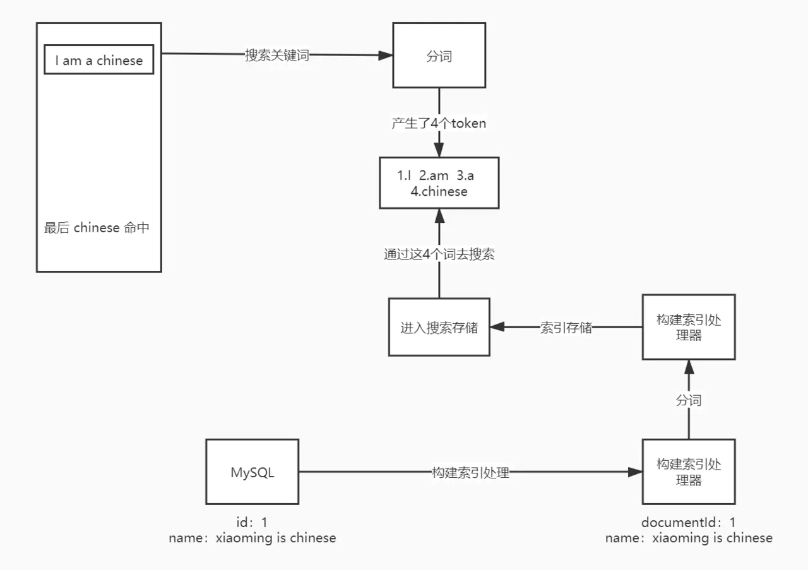
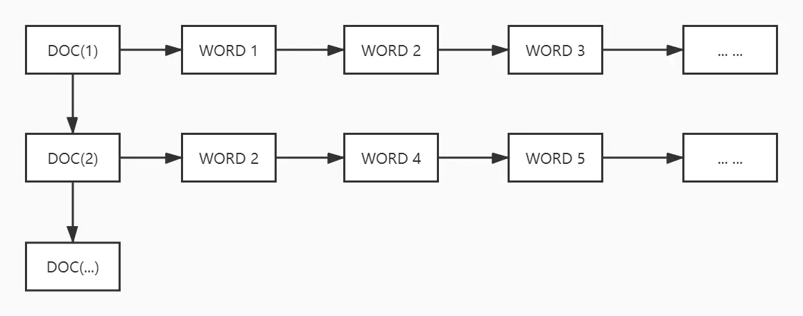
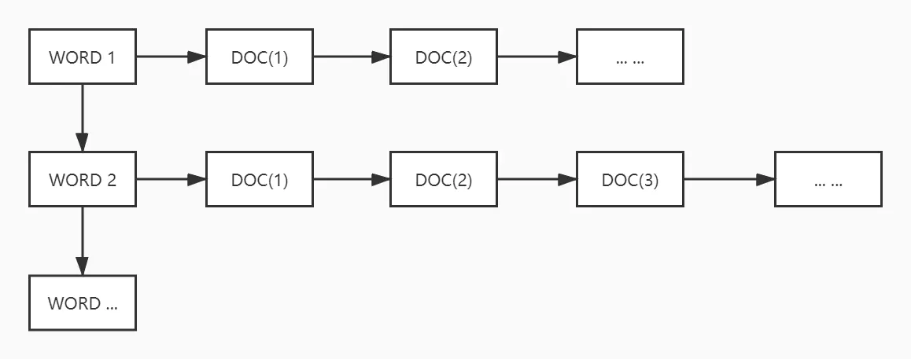

# ElasticSearch基本原理

### ElasticSearch 基本原理

#### 搜索原理

ElasticSearch简介

- `ElasticSearch`就是独立的网络上的一个或一组进程节点
- 它能对外提供搜索服务（使用`http`或`transport`协议），自从`ElasticSearch 7.0`开始，主要支持`http`协议
- `ElaticSearch`对内其实就是一个数据库

#### 分词

搜索是以词为单位做最基本单位的搜索单元，依赖分词器构建分词，用分词器倒排索引。



#### 倒排索引

- 正向索引

  ```html
  对文档中的所有分词进行遍历，获取与 keyword 中分词相同的词，命中一次，这种索引方法需要对每一个文档都进行遍历，性能上不是很好。
  ```

  ​

  

  ​

- 倒排索引

  ```html
  对文档的分词结果进行遍历，如果 keyword 命中该分词，那么通过该分词便可以找到所有含有这个分词的文档，性能相对较高。
  ```

  ​

  

  ​

### TF/IDF打分

```html
TF：词频，这个 document 文档包含了多少个这个词，包含越多表名越相关
DF：文档频率，包含该词的文档总数目
IDF：DF 取反
```

| 单词 ID | 单词     | 文档频率 | 倒排列表（DocID;TF;<POS>）                                   |
| ------- | -------- | -------- | ------------------------------------------------------------ |
| 1       | 谷歌     | 5        | （1;1;<1>），（2;1;<1>），（3;2;<1;6>），（4;1;<1>），（5;1;<1>） |
| 2       | 地图     | 5        | （1;1;<2>），（2;1;<2>），（3;1;<2>），（4;1;<2>），（5;1;<2>） |
| 3       | 之父     | 4        | （1;1;<3>），（2;1;<3>），（4;1;<3>），（5;1;<3>）           |
| 4       | 跳槽     | 2        | （1;1;<4>），（4;1;<4>）                                     |
| 5       | Facebook | 5        | （1;1;<5>），（2;1;<5>），（3;1;<8>），（4;1;<5>），（5;1;<8>） |
| 6       | 加盟     | 3        | （2;1;<4>），（3;1;<7>），（5;1;<5>）                        |
| 7       | 创始人   | 1        | （3;1;<3>）                                                  |
| 8       | 拉斯     | 2        | （3;1;<4>），（5;1;<4>）                                     |
| 9       | 离开     | 1        | （3;1;<5>）                                                  |
| 10      | 与       | 1        | （4;1;<6>）                                                  |

### 名词定义

在`ElasticSearch`中的`索引=数据库，类型=表，文档=行数据`，在`ElasticSearch 7.0`逐步的废弃了类型这样一个定义，也就是说索引和类型统称为索引，也就是说在`ElasticSearch 7.0`中只有索引和文档的定义，其中索引相当于索引和类型。

与关系型数据库的名词之间的类比：

| 关系型数据库            | ElasticSearch         |
| ----------------------- | --------------------- |
| Database                | Index                 |
| Table                   | Type                  |
| Row                     | Document              |
| Column                  | Field                 |
| Schema                  | Mapping               |
| Index                   | Everything is indexed |
| SQL                     | Query DSL             |
| SELECT * FROM table ... | GET http://...        |
| UPDATE table SET ...    | PUT http://...        |

### 分布式原理

#### 分片

ElasticSearch 中默认的主分片（num_of_shards）数量为 5，默认的副本（num_of_replicas）个数为 1
主分片数量一旦设置就不会再改变，但是副本个数可以进行改变

在单集群节点中，如果主分片数量为 1，副本也为 1，那么此时单节点集群的 health 为 yellow，因为单节点必然会存在副本和主分片在同一个节点，会导致该索引的 health 为 yellow。此时可以修改集群的副本个数为 0，则索引和集群的状态会变回到 green 状态。

#### 主从

>单节点集群中，如果创建了一个索引，默认会拥有副本，此时由于副本和主分片在一个节点，则单节点集群的 health 为 yellow。创建索引时，根据未来的扩展性，将主分片个数设置为合适的个数，但也不能太多，因为数量太多，如果数据量没有达到对应的瓶颈，在进行数据聚合时，就需要遍历所有的主分片，才能得到结果。
>
>**双节点集群**
>当新增一个集群节点的，此时节点集群会将副本全部存放到新增的节点上，此时如果索引的副本个数为 1 时，那么此时集群的状态会变成 green。
>
>**三节点集群**
>当继续新增一个集群节点时，此时节点集群会使用负载均衡，将某个索引的主分片会迁移到新增的节点上，会将部分的副本也迁移到新增的节点上
>
>**三台节点构成 es 集群**
>**副本个数为 2 时**
>此时 es 集群会将副本个数分别存放于另外两个节点之上，这两个节点中并没有改索引的主分片，此时主从分离，读写也分离。es 集群其实是一个对称的结构，es 集群的 master 用来管理所有负载的一个核心节点，也就是说如果要进行写操作，如果要写的索引的主分片就在 master 上，那么就可以直接进行写请求；如果写的索引在另一个节点上，那么 master 会将这个写请求进行转发，转发到要写的主分片所在的节点，由该节点进行写请求。
>
>**当关掉此时的 master 节点时**
>此时 es 集群会进行选举，选举一个新的 master 节点，会比较剩余的节点中的 metadata 是最新的，就会通过 paxos 方式从具备竞争主节点能力的机器中竞选主节点。此时被关掉的 master 上存在的主分片会均匀的分布到剩余的集群节点上，此时由于副本个数为 2，所以集群的状态又会变成 yellow，但是集群对外响应服务的能力还是有的。
>
>**三台节点构成 es 集群，并且状态为 green**
>**PUT 请求**
>当有操作请求集群进行新建索引操作时，无论请求的是 es 集群的那个节点，都会将该请求转发到 master 节点，因为只有 master 节点知道所有的 metadata 存储的位置，此时 master 会对进行写请求的操作进行识别，如果写请求的 documenId 识别是在 master 节点上，那么由 master 节点进行写操作，如果在 node3 上，就会将该写请求进行转发，转发到 node3，由 node3 完成写请求。写操作完成之后，node3 会异步的将数据改动同步回其对应的副本。
>**GET 请求**
>进行读请求时，master 会进行一次路由计算，计算出该读请求属于 R0 副本的操作，假设 master 节点上也存在 R0 副本，假设上一次的操作是在 master 节点上进行，那么 es 集群会根据负载均衡，将该读请求转发到另一个存在 R0 副本的节点上。如果读请求第一次命中在别的节点上，但是由于是读请求，可以由每个节点进行路由操作。
>**总结**
>也就是说，master 节点只路由读请求，所有的写请求可以由其命中的节点进行处理，此时整个 es 集群就做到了负载均衡和读写分离。

**思考:为什么es开始的时候特别慢,用一会儿就很快了?**

其实es的数据本来大部分存在磁盘上,操作系统存在一个系统缓存,加载使用后的数据会放在里面,访问速度远远大于直接从磁盘读取.