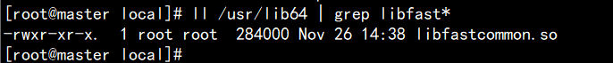
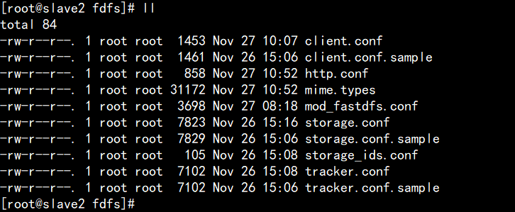
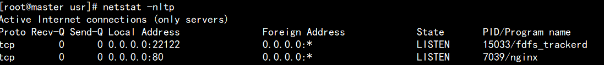
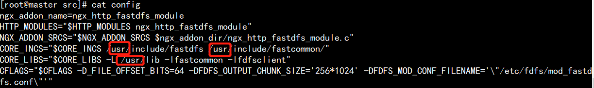
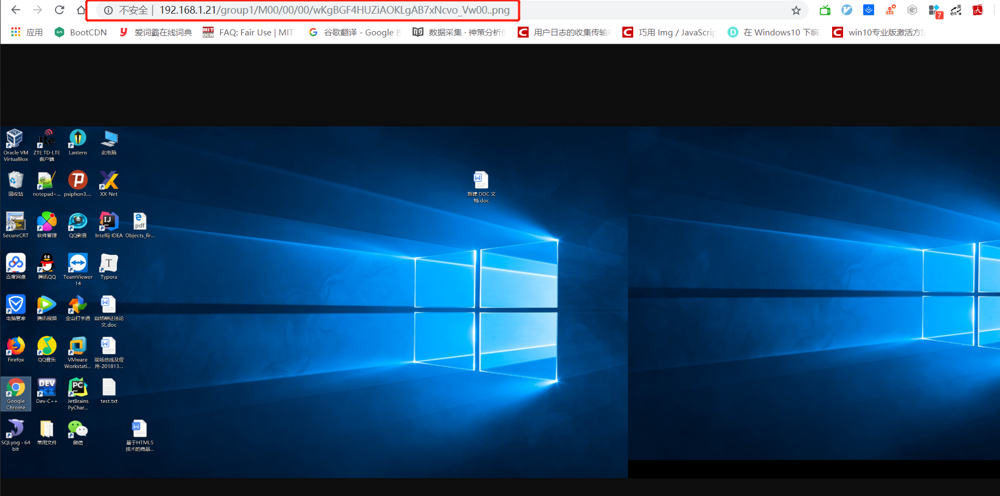

<div align="middle"><iframe frameborder="no" border="0" marginwidth="0" marginheight="0" width=330 height=86 src="//music.163.com/outchain/player?type=2&id=479553545&auto=1&height=66"></iframe></div>

# FastDFS分布式文件系统安装使用教程

### 使用场景
分布式文件系统用于**海量**文件存储及传输访问的瓶颈问题，对海量视频的管理、对**海量**图片的管理等,FastDFS与其他分布式文件系统相比的一个显著优点就是特别**适合大量小文件(图片等)的存储,因为它在存储时没有对文件切片分割.**

### 主流的分布式文件系统

#### ①NFS


#### ②GFS


#### ③HDFS


#### ④FastDFS

FastDFS是用c语言编写的一款开源的分布式文件系统，它是由淘宝资深架构师余庆编写并开源。FastDFS专为互联 网量身定制，充分考虑了冗余备份、负载均衡、线性扩容等机制，并注重高可用、高性能等指标，使用FastDFS很 容易搭建一套高性能的文件服务器集群提供文件上传、下载等服务。

**FastDFS架构包括 Tracker server和Storageserver。客户端请求Tracker server进行文件上传、下载，通过Tracker server调度最终由Storage server完成文件上传和下载。** 

### 安装 

#### 服务器环境

- CentOS6.9(CenttOS安装过程一致)


- IP: 192.168.1.21,192.168.1.23,192.168.1.24,192.168.1.25

#### 安装Linux基本环境

参见Hadoop的安装使用教程中Linux环境搭建

#### 安装gcc环境(FastDFS是由c语言编写)

```shell
yum install gcc-c++
```

#### 安装 libevent

```shell
yum -y install libevent
```

#### 安装 libfastcommon

```shell
# 将 libfastcommonV1.0.7.tar.gz 拷贝至/usr/local/下
cd /usr/local
tar -zxvf libfastcommonV1.0.7.tar.gz
cd libfastcommon-1.0.7
./make.sh
./make.sh install
```

注意：**libfastcommon 安装好后会自动将库文件拷贝至/usr/lib64 下，由于 FastDFS 程序引用 usr/lib 目录所以需要将/usr/lib64 下的库文件拷贝至/usr/lib 下。**

需要拷贝的文件



#### tracker 编译安装

```shell
# 将 FastDFS_v5.05.tar.gz 拷贝至/usr/local/下
tar -zxvf FastDFS_v5.05.tar.gz
cd FastDFS
./make.sh 编译
./make.sh install 安装
```

安装成功将安装目录下的 conf 下的文件拷贝到/etc/fdfs/下。

```shell
cp -r /usr/local/FastDFS/conf/ /etc/fdfs/
```

##### 配置

安装成功后进入/etc/fdfs目录



拷贝一份新的 tracker 配置文件：

```shell
cp tracker.conf.sample tracker.conf
```

修改 tracker.conf

```shell
vi tracker.conf

base_path=/home/yuqing/FastDFS #数据(日志等)存储路径,自己设置
http.server_port=80 #配置 http 端口：
```

##### 启动

```shell
/usr/bin/fdfs_trackerd /etc/fdfs/tracker.conf start
```

查看端口

```shell
netstat -nltp
```



#### storage 安装

- 安装 libevent
- 安装 libfastcommon
- 编译安装(与tracker相同)

##### 配置

```shell
vi storage.conf

group_name=group1 #分组,同一分组为设置冗余防止宕机不可用
base_path=/home/yuqing/FastDFS #数据存储路径,自己设置
store_path0=/home/yuqing/FastDFS #文件存储路径,自己设置
tracker_server=192.168.101.3:22122 #配置 tracker 服务器:IP
tracker_server=192.168.1.21:22122 #如果有多个则配置多个 tracker
http.server_port=80
```

##### 启动

```shell
/usr/bin/fdfs_storaged /etc/fdfs/storage.conf start
```

##### 分发配置

将FastDFS分发到各个节点,并修改配置,分发脚本如下

```shell
#!/bin/bash
pcount=$#
if((pcount=0));then
echo no args;
exit;
fi
p1=$1
fname=`basename $p1`
echo fname=$fname
pdir=`cd -P $(dirname $p1);pwd`
echo pdir=$pdir

user=`whoami`
echo user=$user
for((host=1;host<4;host++));do
echo ------------salve$host-------------
rsync -rvl $pdir/$fname $user@slave$host:$pdir
done
```

### 利用可通过/usr/bin/fdfs_test 程序测试

修改/etc/fdfs/client.conf

tracker_server 根据自己部署虚拟机的情况配置

```shell
base_path = /home/yuqing/fastdfs
tracker-server=192.168.1.21:22122
```

使用格式：

```shell
/usr/bin/fdfs_test 客户端配置文件地址 upload 上传文件
```

比如将/home 下的图片上传到 FastDFS 中：

```shell
/usr/bin/fdfs_test /etc/fdfs/client.conf upload /home/tomcat.png
```

打印日志如下:

```html
This is FastDFS client test program v5.05

Copyright (C) 2008, Happy Fish / YuQing

FastDFS may be copied only under the terms of the GNU General
Public License V3, which may be found in the FastDFS source kit.
Please visit the FastDFS Home Page http://www.csource.org/ 
for more detail.

[2019-12-28 20:13:02] DEBUG - base_path=/home/fastdfs, connect_timeout=30, network_timeout=60, tracker_server_count=1, anti_steal_token=0, anti_steal_secret_key length=0, use_connection_pool=0, g_connection_pool_max_idle_time=3600s, use_storage_id=0, storage server id count: 0

tracker_query_storage_store_list_without_group: 
        server 1. group_name=, ip_addr=192.168.1.24, port=23000

group_name=group1, ip_addr=192.168.1.24, port=23000
storage_upload_by_filename
group_name=group1, remote_filename=M00/00/00/wKgBGF4HRs6AOwJJAAId77F78II587.png
source ip address: 192.168.1.24
file timestamp=2019-12-28 20:13:02
file size=138735
file crc32=2977689730
example file url: http://192.168.1.24/group1/M00/00/00/wKgBGF4HRs6AOwJJAAId77F78II587.png
storage_upload_slave_by_filename
group_name=group1, remote_filename=M00/00/00/wKgBGF4HRs6AOwJJAAId77F78II587_big.png
source ip address: 192.168.1.24
file timestamp=2019-12-28 20:13:02
file size=138735
file crc32=2977689730
```

http://192.168.1.24/group1/M00/00/00/wKgBGF4HRs6AOwJJAAId77F78II587.png
就是文件的下载路径。对应服务器的base_path/fdfs_storage/data/00/00/wKgBGF4HRs6AOwJJAAId77F78II587.png文件

现在还没有和 nginx 整合无法使用 http 下载。

### Nginx整合FastDFS

#### FastDFS-nginx-module

将 FastDFS-nginx-module_v1.16.tar.gz 传 至 fastDFS 的 storage 服 务 器 的

/usr/local/下，执行如下命令：

```shell
cd /usr/local
tar -zxvf FastDFS-nginx-module_v1.16.tar.gz
cd FastDFS-nginx-module/src
vi config
```



将/usr/local修改为/usr，注意这里有三场，不要改漏了。

将 FastDFS-nginx-module/src 下的 mod_FastDFS.conf 拷贝至/etc/fdfs/下

```shell
cp mod_FastDFS.conf /etc/fdfs/
vi /etc/fdfs/mod_FastDFS.conf

base_path=/home/FastDFS # 保持和之前安装时一致
tracker_server=192.168.1.21:22122
url_have_group_name=true #url 中包含 group 名称
store_path0=/home/fastdfs/fdfs_storage #指定文件存储路径,和之前一致
```

将 libfdfsclient.so 拷贝至/usr/lib 下

```shell
cp /usr/lib64/libfdfsclient.so /usr/lib/
```

创建 nginx/client 目录

```shell
mkdir -p /var/temp/nginx/client
```


#### 安装nginx

详细教程可见nginx使用感悟

将 nginx-1.8.0.tar.gz 拷贝到/usr/local 下

解压 nginx-1.8.0.tar.gz

进入 nginx-1.8.0 目录，执行如下配置命令：

```shell
./configure --add-module=/usr/local/FastDFS-nginx-module/src
make make install
```


在nginx中增加如下虚拟机配置:

storage配置:

```xml
server {
 listen 80;
 server_name 192.168.1.23; 本机ip
 location /group1/M00/{
 root /home/FastDFS/fdfs_storage/data;  #以自己配置的地址为准
 ngx_FastDFS_module;
 } }
```

tracker配置:

```xml
#storage 群 group1 组
upstream storage_server_group1{
 server 192.168.1.23:80 weight=10;
server 192.168.1.24:80 weight=10;
 }
 #storage 群 group2 组
upstream storage_server_group2{
 server 192.168.1.25:80 weight=10;
 }
 server {
listen 80;
server_name ccc.test.com;
location /group1{
proxy_redirect off;
proxy_set_header Host $host;
proxy_set_header X-Real-IP $remote_addr;
proxy_set_header X-Forwarded-For $proxy_add_x_forwarded_for;
proxy_pass http://storage_server_group1;
}
location /group2{
proxy_redirect off;
proxy_set_header Host $host;
proxy_set_header X-Real-IP $remote_addr;
proxy_set_header X-Forwarded-For $proxy_add_x_forwarded_for;
proxy_pass http://storage_server_group2; } }
```

#### 测试

使用浏览器 http 访问文件，这里访问上传图片测试的文件：

访问 storage：http://192.168.1.24/group1/M00/00/00/wKgBGF4HRs6AOwJJAAId77F78II587.png


ip 地址改为 192.168.1.24也可以访问到文件，因为同一个分组的 storage 文件互相同步。

### 编写java代码上传下载文件

**SpringBoot测试方案**

引入依赖

```xml
<dependency>
    <groupId>net.oschina.zcx7878</groupId>
    <artifactId>fastdfs-client-java</artifactId>
    <version>1.27.0.0</version>
</dependency>
```


```java
@SpringBootTest
@RunWith(SpringRunner.class)
public class TestFastDFS {

    @Test
    public void upload() throws IOException, MyException {
        //加载fastdfs-client.properties配置文件
        ClientGlobal.initByProperties("config/fastdfs-client.properties");

        //定义TrackerClient,用于请求TrackerClient
        TrackerClient trackerClient = new TrackerClient();
        //创建TrackerServer
        TrackerServer trackerServer = trackerClient.getConnection();
        //通过TrackerServer获取storeServer
        StorageServer storeServer = trackerClient.getStoreStorage(trackerServer);
        //通过TrackerServer and storeServer 创建storageClient1
        StorageClient1 storageClient1 = new StorageClient1(trackerServer, storeServer);
        //fileId group1/M00/00/00/wKgBF13ebJuALXhqAAI6t5YoKLQ94..log
        String fileId = storageClient1.upload_file1("C:\\Users\\tiger\\Pictures\\Feedback\\{A687785D-19C3-4B2E-A00A-2667141271EB}\\Capture001.png", ".png", null);

        System.out.println(fileId);
        //获取tracker客户端
    }

    @Test
    public void download() throws IOException, MyException {
        //加载fastdfs-client.properties配置文件
        ClientGlobal.initByProperties("config/fastdfs-client.properties");

        //定义TrackerClient,用于请求TrackerClient
        TrackerClient trackerClient = new TrackerClient();
        //创建TrackerServer
        TrackerServer trackerServer = trackerClient.getConnection();
        //通过TrackerServer获取storeServer
        StorageServer storeServer = trackerClient.getStoreStorage(trackerServer);
        //通过TrackerServer and storeServer 创建storageClient1
        StorageClient1 storageClient1 = new StorageClient1(trackerServer, storeServer);
        //fileId group1/M00/00/00/wKgBF13ebJuALXhqAAI6t5YoKLQ94..log
        byte[] bytes = storageClient1.download_file1("group1/M00/00/00/wKgBF13ebJuALXhqAAI6t5YoKLQ94..log");
        FileOutputStream fos = new FileOutputStream(new File("hello"));
        fos.write(bytes);
    }
}
```

config/fastdfs-client.properties

```properties
fastdfs.connect_timeout_in_seconds = 5
fastdfs.network_timeout_in_seconds = 30
fastdfs.charset = UTF-8
fastdfs.tracker_servers = 192.168.1.21:22122
```

运行upload得到路径

```
group1/M00/00/00/wKgBGF4HUZiAOKLgAB7xNcvo_Vw00..png
根据自己配置的路径可以得到访问的http协议路径为:
http://192.168.1.21/group1/M00/00/00/wKgBGF4HUZiAOKLgAB7xNcvo_Vw00..png
```

效果如下



### 总结

**FastDFS相对于HDFS等分布式文件的优势在于它不切分文件,所以下载文件的时候没有拼装文件的过程,而且可以锁定一台机器进行网络I/O,所以速度很快.不过正所谓这也是它的缺点,这导致它不能用于存储大文件.所以FastDFS适合存储大量图片小视频之类的文件.**

### 安装过程遇到的一些问题

①安装nginx No rule to make target "/usr/local/fastdfs-nginx-module/src/ngx_http_fastdfs_module.c", needed by objs/addon/src/ngx_http_fastdfs_module.o . Stop. 修改fastdfs-nginx-module/src/config文件中的路径,删除local(注意一共有三个)

②nginx安装cp: `conf/koi-win' and `/usr/local/nginx/conf/koi-win' are the same file 解决 将./configure --prefix=/usr/local/nginx 改为 ./configure --prefix=/usr/local/nginx --conf-path=/usr/local/nginx/nginx.conf

③nginx编码严格.直接复制会出现nginx: [emerg] unknown directive " " in /usr/local/nginx-1.12.0-storage/conf/nginx.conf:49）：所以需要手动输入nginx.conf