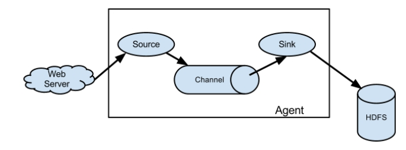
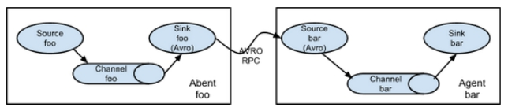
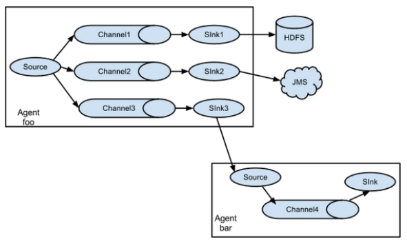
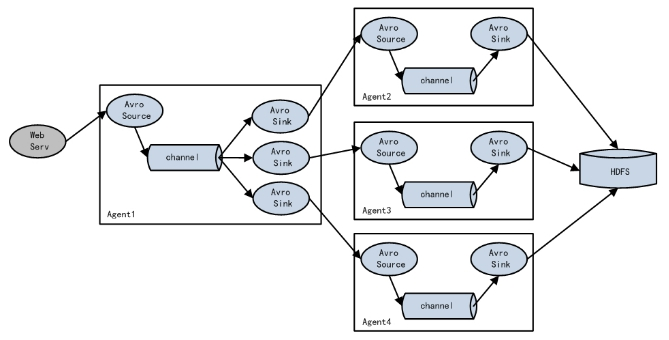
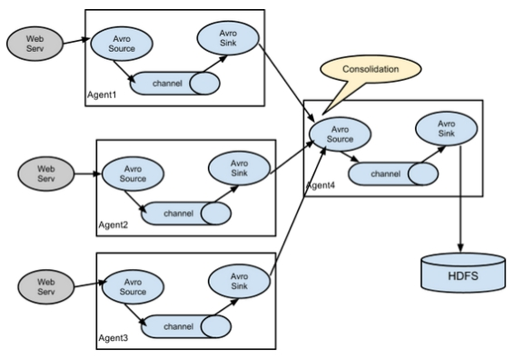
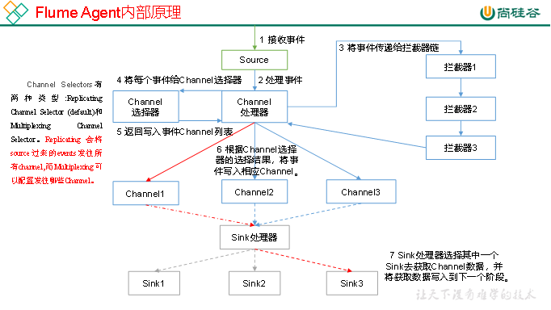
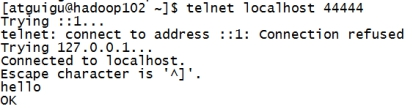
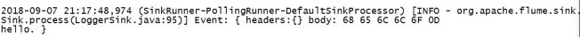
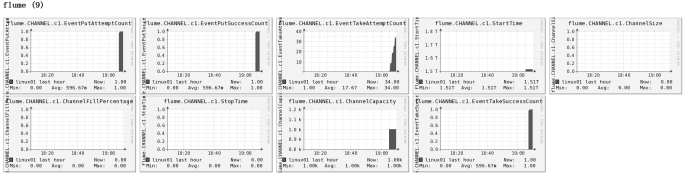

# 概述

## Flume定义

Flume是Cloudera提供的一个高可用的，高可靠的，分布式的海量日志采集、聚合和传输的系统。Flume基于流式架构，灵活简单。

## Flume组成架构

Flume组成架构如图所示：

 

### Agent

Agent是一个JVM进程，它以事件的形式将数据从源头送至目的，是Flume数据传输的基本单元。

Agent主要有3个部分组成，Source、Channel、Sink。

### Source

Source是负责接收数据到Flume Agent的组件。Source组件可以处理各种类型、各种格式的日志数据，包括avro、thrift、exec、jms、spooling directory、netcat、sequence generator、syslog、http、legacy。

###  Channel

Channel是位于Source和Sink之间的缓冲区。因此，Channel允许Source和Sink运作在不同的速率上。Channel是线程安全的，可以同时处理几个Source的写入操作和几个Sink的读取操作。

Flume自带两种Channel：Memory Channel和File Channel。

Memory Channel是内存中的队列。Memory Channel在不需要关心数据丢失的情景下适用。如果需要关心数据丢失，那么Memory Channel就不应该使用，因为程序死亡、机器宕机或者重启都会导致数据丢失。

File Channel将所有事件写到磁盘。因此在程序关闭或机器宕机的情况下不会丢失数据。

###  Sink

Sink不断地轮询Channel中的事件且批量地移除它们，并将这些事件批量写入到存储或索引系统、或者被发送到另一个Flume Agent。

Sink是完全事务性的。在从Channel批量删除数据之前，每个Sink用Channel启动一个事务。批量事件一旦成功写出到存储系统或下一个Flume Agent，Sink就利用Channel提交事务。事务一旦被提交，该Channel从自己的内部缓冲区删除事件。

Sink组件目的地包括hdfs、logger、avro、thrift、ipc、file、null、HBase、solr、自定义。

###  Event

传输单元，Flume数据传输的基本单元，以事件的形式将数据从源头送至目的地。

## Flume拓扑结构

Flume的拓扑结构如图所示：

 


 


 

 

##  Flume Agent内部原理



# 快速入门

## Flume安装地址

1） Flume官网地址

<http://flume.apache.org/>

2）文档查看地址

<http://flume.apache.org/FlumeUserGuide.html>

3）下载地址

http://archive.apache.org/dist/flume/

## 安装部署

**下载安装包解压配置环境变量即可**

1）解压

2)配置jdk路径

```shell
 vi flume-env.sh
 export JAVA_HOME=jdk路径
```


## 监控端口数据官方案例

1）案例需求：首先，Flume监控本机44444端口，然后通过telnet工具向本机44444端口发送消息，最后Flume将监听的数据实时显示在控制台。

2）实现步骤：

1．安装telnet工具

将rpm软件包(xinetd-2.3.14-40.el6.x86_64.rpm、telnet-0.17-48.el6.x86_64.rpm和telnet-server-0.17-48.el6.x86_64.rpm)拷入/opt/software文件夹下面。执行RPM软件包安装命令：

```shell
sudo rpm -ivh xinetd-2.3.14-40.el6.x86_64.rpm
sudo rpm -ivh telnet-0.17-48.el6.x86_64.rpm
sudo rpm -ivh telnet-server-0.17-48.el6.x86_64.rpm
```

2．判断44444端口是否被占用

```shell
sudo netstat -tunlp | grep 44444
```

功能描述：netstat命令是一个监控TCP/IP网络的非常有用的工具，它可以显示路由表、实际的网络连接以及每一个网络接口设备的状态信息。 

基本语法：netstat [选项]

选项参数：

​	-t或--tcp：显示TCP传输协议的连线状况； 

​      -u或--udp：显示UDP传输协议的连线状况；

​	-n或--numeric：直接使用ip地址，而不通过域名服务器； 

​	-l或--listening：显示监控中的服务器的Socket； 

​	-p或--programs：显示正在使用Socket的程序识别码和程序名称；

3．创建Flume Agent配置文件flume-telnet-logger.conf

在flume目录下创建job文件夹并进入job文件夹。

```shell
mkdir job

cd job/

touch flume-telnet-logger.conf

# Name the components on this agent
a1.sources = r1
a1.sinks = k1
a1.channels = c1

# Describe/configure the source
a1.sources.r1.type = netcat
a1.sources.r1.bind = localhost
a1.sources.r1.port = 44444

# Describe the sink
a1.sinks.k1.type = logger 

# Use a channel which buffers events in memory
a1.channels.c1.type = memory
a1.channels.c1.capacity = 1000
a1.channels.c1.transactionCapacity = 100

# Bind the source and sink to the channel
a1.sources.r1.channels = c1
a1.sinks.k1.channel = c1
```

4. 先开启flume监听端口

```

```

参数说明：

​	--conf conf/  ：表示配置文件存储在conf/目录

​	--name a1	：表示给agent起名为a1

​	--conf-file job/flume-telnet.conf ：flume本次启动读取的配置文件是在job文件夹下的flume-telnet.conf文件。

​	-Dflume.root.logger==INFO,console ：-D表示flume运行时动态修改flume.root.logger参数属性值，并将控制台日志打印级别设置为INFO级别。日志级别包括:log、info、warn、error。

5．使用telnet工具向本机的44444端口发送内容

[atguigu@hadoop102 ~]$ telnet localhost 44444

 

6．在Flume监听页面观察接收数据情况

 

**具体使用时可以根据自己的输入输出去官网查询对一个配置文件书写方式.**

# Flume监控之Ganglia

##  操作Flume测试监控

样式如图：

 

图例说明：

| 字段（图表名称）      | 字段含义                                                     |
| --------------------- | ------------------------------------------------------------ |
| EventPutAttemptCount  | source尝试写入channel的事件总数量                            |
| EventPutSuccessCount  | 成功写入channel且提交的事件总数量                            |
| EventTakeAttemptCount | sink尝试从channel拉取事件的总数量。这不意味着每次事件都被返回，因为sink拉取的时候channel可能没有任何数据。 |
| EventTakeSuccessCount | sink成功读取的事件的总数量                                   |
| StartTime             | channel启动的时间（毫秒）                                    |
| StopTime              | channel停止的时间（毫秒）                                    |
| ChannelSize           | 目前channel中事件的总数量                                    |
| ChannelFillPercentage | channel占用百分比                                            |
| ChannelCapacity       | channel的容量                                                |