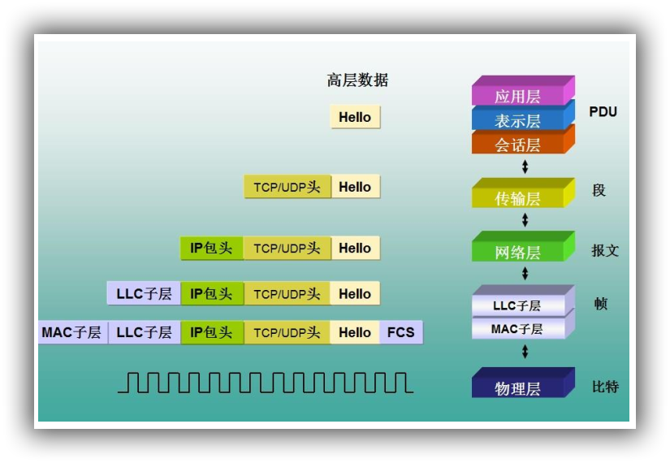
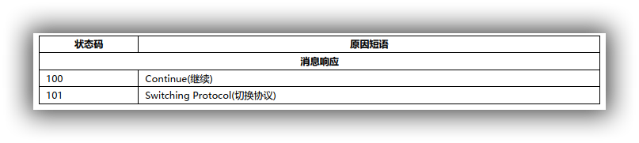
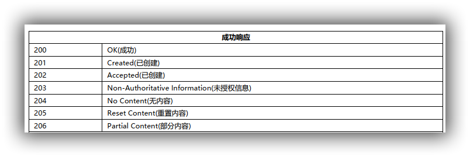
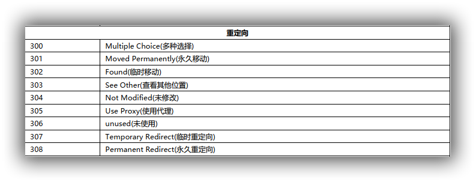
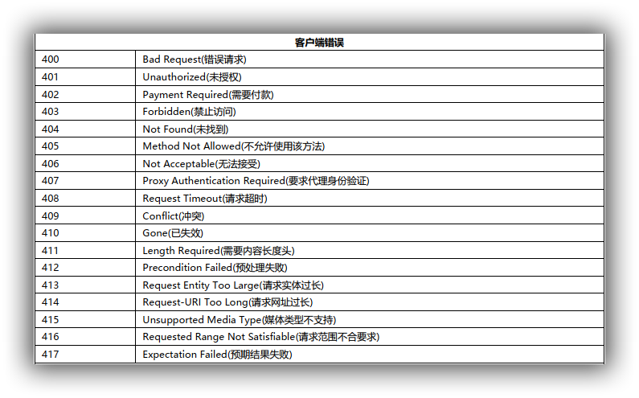
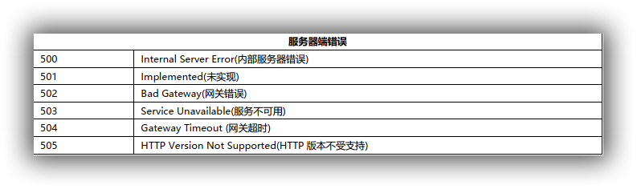

### 概述

HTTP 是一个无状态的协议。无状态是指客户机（Web 浏览器）和服务器之间不需要建立持久的连接，这意味着当一个客户端向服务器端发出请求，然后服务器返回响应(response)，连接就被关闭了，在服务器端不保留连接的有关信息.HTTP 遵循请求(Request)/应答(Response)模型。客户机（浏览器）向服务器发送请求，服务器处理请求并返回适当的应答。所有 HTTP 连接都被构造成一套请求和应答。

### 传输流程

#### 地址解析

如用客户端浏览器请求这个页面： http://localhost.com:8080/index.htm 从中分解出协议名、主机名、端口、对象路径等部分，对于我们的这个地址，解析得到的结果如下：

- 协议名： http
- 主机名： localhost.com
- 端口： 8080
- 对象路径： /index.htm

在这一步，需要域名系统 DNS 解析域名 localhost.com,得主机的 IP 地址。

#### 封装 HTTP 请求数据包

把以上部分结合本机自己的信息，封装成一个 HTTP 请求数据包

#### 封装成 TCP 包并建立连接

封装成 TCP 包，建立 TCP 连接（TCP 的三次握手）

#### 客户机发送请求命令

建立连接后，客户机发送一个请求给服务器，请求方式的格式为：统一资源标识符（URL）、协议版本号，后边是 MIME 信息包括请求修饰符、客户机信息和可能的内容。

#### 服务器响应

服务器接到请求后，给予相应的响应信息， 其格式为一个状态行，包括信息的协议版本号、一个成功或错误的代码，后边是 MIME 信息包括服务器信息、实体信息和可能的内容。

#### 服务器关闭 TCP 连接

服务器关闭 TCP 连接： 一般情况下，一旦 Web 服务器向浏览器发送了请求数据，它就要关闭 TCP 连接，然后如果浏览器或者服务器在其头信息加入了这行代码 Connection:keep-alive， TCP 连接在发送后将仍然保持打开状态，于是，浏览器可以继续通过相同的连接发送请求。保持连接节省了为每个请求建立新连接所需的时间，还节约了网络带宽。

#### HTTP响应状态

- 1XX

- 2XX

- 3XX

- 4XX

- 5XX

### 小插曲：301和302有啥区别

官方说法：

> 301，302 都是HTTP状态的编码，都代表着某个URL发生了转移，不同之处在于： 301 redirect: 301 代表永久性转移(Permanently Moved)。 302 redirect: 302 代表暂时性转移(Temporarily Moved )。

现实中的差异：

- **对于用户**：

301，302对用户来说没有区别，他们看到效果只是一个跳转，浏览器中旧的URL变成了新的URL。页面跳到了这个新的url指向的地方。

- **对于引擎及站长**：

1. 302：302转向可能会有URL规范化及网址劫持的问题。可能被搜索引擎判为可疑转向，甚至认为是作弊

**网址劫持**： 302重定向和网址劫持（URL hijacking）有什么关系呢？这要从搜索引擎如何处理302转向说起。从定义来说，从网址A做一个302重定向到网址B时，主机服务器的隐含意思是网址A随时有可能改主意，重新显示本身的内容或转向其他的地方。大部分的搜索引擎在大部分情况下，当收到302重定向时，一般只要去抓取目标网址就可以了，也就是说网址B。 实际上如果搜索引擎在遇到302转向时，百分之百的都抓取目标网址B的话，就不用担心网址URL劫持了。问题就在于，有的时候搜索引擎，尤其是Google，并不能总是抓取目标网址。为什么呢？比如说，有的时候A网址很短，但是它做了一个302重定向到B网址，而B网址是一个很长的乱七八糟的URL网址，甚至还有可能包含一些问号之类的参数。很自然的，A网址更加用户友好，而B网址既难看，又不用户友好。这时Google很有可能会仍然显示网址A。

由于搜索引擎排名算法只是程序而不是人，在遇到302重定向的时候，并不能像人一样的去准确判定哪一个网址更适当，这就造成了网址URL劫持的可能性。也就是说，一个不道德的人在他自己的网址A做一个302重定向到你的网址B，出于某种原因， Google搜索结果所显示的仍然是网址A，但是所用的网页内容却是你的网址B上的内容，这种情况就叫做网址URL劫持。你辛辛苦苦所写的内容就这样被别人偷走了。

1. 301：当网页A用301重定向转到网页B时，搜索引擎可以肯定网页A永久的改变位置，或者说实际上不存了，搜索引擎就会把网页B当作唯一有效目标。 **301的好处是**: 第一， 没有网址规范化问题。 第二， 也很重要的，网页A的PR网页级别会传到网页B。

### HTTPS

HTTPS（全称： Hypertext Transfer Protocol over Secure Socket Layer），是以安全为目标的HTTP 通道，简单讲是 HTTP 的安全版。**即 HTTP 下加入 SSL 层**， HTTPS 的安全基础是 SSL。其所用的端口号是 **443**。 过程大致如下：

#### 建立连接获取证书

SSL 客户端通过 TCP 和服务器建立连接之后（443 端口），并且在一般的 tcp 连接协商（握手）过程中请求证书。即客户端发出一个消息给服务器，这个消息里面包含了自己可实现的算法列表和其它一些需要的消息， SSL 的服务器端会回应一个数据包，这里面确定了这次通信所需要的算法，然后服务器向客户端返回证书。（**证书里面包含了服务器信息：域名。申请证书的公司，公共秘钥**）

#### 证书验证

Client 在收到服务器返回的证书后，判断签发这个证书的公共签发机构，并使用这个机构的公共秘钥确认签名是否有效，客户端还会确保证书中列出的域名就是它正在连接的域名。

#### 数据加密和传输

如果确认证书有效，那么生成对称秘钥并使用服务器的公共秘钥进行加密。然后发送给服务器，服务器使用它的私钥对它进行解密，这样两台计算机可以开始进行对称加密进行通信。

