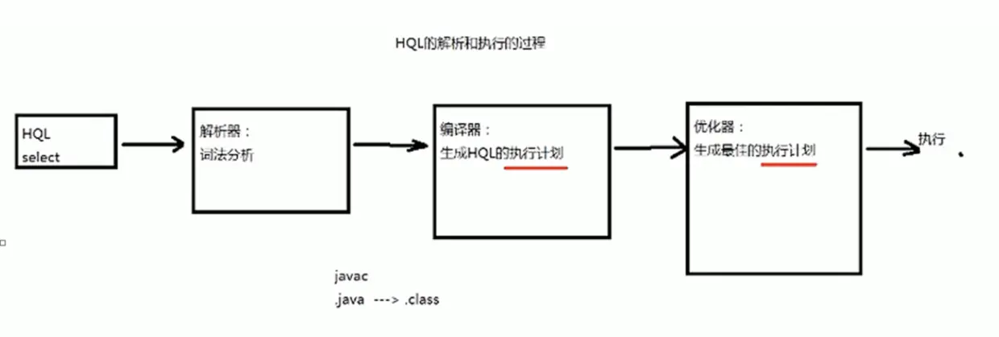
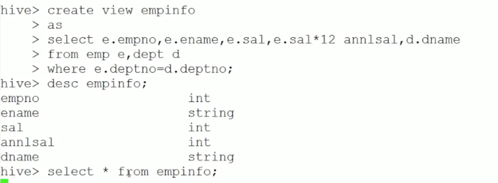

## Hive概述

Hive 的底层执行引擎有 ：MapReduce，Tez，Spark- Hive on MapReduce- Hive on Tez- Hive on spark

压缩：GZIP,LZO,Snappy,Bzip2...存储：Textfile，SequenceFile，RcFile，ORC，ParquetUDF：自定义函数


> 为什么要使用Hive：简单，容易上手(提供了类SQL的查询语言HQL)为超大数据集设计的计算/存储扩展能力（MR计算,HDFS存储）统一的元数据管理（可与Pretso/Impala/SparkSQL数据共享）

## Hive 的体系结构

### 1.Hive的元数据


### 2.HQL 的执行过程

- 解释器、编译器、优化器完成HQL查询语句从词法分析、语法分析、编译、优化以及查询计划（PLAN）的生产，生产的查询计划存储在HDFS中，并在随后有MapReduce调用执行



### 3.体系结构


### 4.Hive 生产环境部署架构


## Hive 安装


### 1.嵌入入模式(元数据保存在自己维护的dirbe数据库)

```shell
解压好文件夹后直接进入bin目录执行hive脚本
${HIVE_HOME}/bin/hive
```

### 2.本地模式或者远程模式(元数据保存在本地或者远程的mysql库)

修改hive-site.xml

```xml
<!-- jdbc 参数 -->
  <property>
    <name>javax.jdo.option.ConnectionURL</name>
    <value>jdbc:mysql://localhost:3306/hive</value>
  </property>
  <property>
    <name>javax.jdo.option.ConnectionDriverName</name>
    <value>com.mysql.jdbc.Driver</value>
  </property>
  <property>
    <name>javax.jdo.option.ConnectionUserName</name>
    <value>root</value>
  </property>
  <property>
    <name>javax.jdo.option.ConnectionPassword</name>
    <value>root</value>
  </property>
```

## Hive 管理

### 1.cli模式

```shell
# 进入cli
${HIVE_HOME}/bin/hive --service cli

# 1. Hive -S进入静默模式，不会打印MapReduce作业调试信息
# 2. 一般情况下，hive执行SQL都会转换成MapReduce作业进行执行，但是如果是使用select * 则不会转换成mr任务
${HIVE_HOME}/bin/hive -S

# 不进入交互模式
${HIVE_HOME}/bin/hive -e {sql语句}
```

### 2.web管理界面模式(只能做查询)

1. 进入hive的源代码目录的hwi目录 `${HIVE_SRC_HOME}/hwi`
2. 将其打包编译`mvn package(需要安装mvn环境)`
3. 将打好的包放入`${HIVE_HOME}/lib/` 目录下
4. 修改 hive_site.xml

```xml
<!-- web界面监听的主机地址 -->
  <property>
  <name>hive.hwi.listen.host</name>
  <value>0.0.0.0</value>
  <description>This is the host address the Hive Web Interface will listen on</description>
</property>
 
 <!-- web界面监听的端口 -->
<property>
  <name>hive.hwi.listen.port</name>
  <value>9999</value>
  <description>This is the port the Hive Web Interface will listen on</description>
</property>
 
 <!-- war包的位置 -->
<property>
  <name>hive.hwi.war.file</name>
  <value>${HIVE_HOME}/lib/hive-hwi-<version>.war</value>
  <description>This is the WAR file with the jsp content for Hive Web Interface</description>
</property>
```

6.拷贝jdk目录下的tools.jar 到hive的lib下

```shell
cp ${JAVA_HOME}/lib/tools.jar ${HIVE_HOME}/lib
```

1. 启动web服务

```shell
${HIVE_HOME}/bin/hive --service hwi
```

验证：浏览器访问 <http://localhost:9999/hwi/>

### 3.远程连接

```shell
${HIVE_HOME}/bin/hive --service hiveserver
```

## 数据类型

### 1.基本数据类型


```html
hive新版本中，新增了两种字符串类型 varchar和char
varchar(20) 最大长度是20 ，可伸缩
char(20) 固定长度20
```

### 2.复杂数据类型


```sql
create table student1
( sid int ,
  sname string,
  score array<float>
)

create table studetnt2
( sid int ,
  sname string,
  score map<string,float>
)

create table student3
( sid int ,
  info struct<name:string,age:int,sex:string>
)
```

### 3.时间类型


```
timestamp 与时区无关，是自从有了unix以来的偏移量
date 描述的是特定的日期 YYYY-MM-DD
```

## 数据模型

### 1.数据存储

- 基于HDFS的默认存储在 `/user/hive/warehouse/` 下
- 没有专门的数据存储格式

| sid  | sname |
| ---- | ----- |
| 1    | Tom   |
| 2    | Mary  |

这张表在文件中默认存储为文件，使用垂直制表符分割

```html
1 Tom
2 Mary
```

- 存储结构主要包括：数据库 文件 表 视图
- 可以直接加载文本文件（.txt等）进行数据添加
- 创建表时，可以指定Hive数据的列分隔符和行分隔符
- 表

```html
· Table 内部表
· Partition 分区表
· External 外部表
· Bucket Table 桶表
```

### 2.详解表

- #### Table 内部表


```sql
create table student1
( sid int ,
  sname string
)
location '${目录}' 
row format  delimited fields terminated by '列分隔符'
```

- #### 分区表


```sql
create table partition_table
(
    sid int,
    sname string
) 
partitioned by (gender string)
row format  delimited fields terminated by ',';
```

- #### 外部表


```sql
create external table partition_table
(
    sid int,
    sname string
) 
row format  delimited fields terminated by ','
location '/input';

-- input 目录中有相关数据
```

- #### 桶表


```sql
create external table partition_table
(
    sid int,
    sname string
) 
clustered by({hash的字段}) into {桶的数量} buckets

-- input 目录中有相关数据
```

### 3.视图




## Hive 的数据导入

### 使用load语句导入

```sql
LOAD DATE [LOCAL] INPATH 'filepath' [OVERWRITE] INTO TABLE tablename [PARTITION (partcol1=val1,partcol2=val2)]
-- [LOCAL] 代表从本地文件系统导入，否则从HDFS中导入
-- [OVERWRITE] 代表覆盖原有的数据
-- [PARTITION] 代表分区
-- 如果filepah是一个文件则导入一个文件的数据，如果是一个目录，则导入该目录下所有的文件
```

## Hive 调优

```shell
-- 动态分区，根据插入的记录自动分区
SET hive.exec.dynamic.partition=true;
SET hive.exec.dynamic.partition.mode=nonstrict;
-- 并行执行，子查询可以并行执行
SET hive.exec.parallel=true;
-- 计算结束以后将小文件合并
SET hive.merge.mapredfiles=true;
-- 如果某个维表小于100000000B（100M),就做MAP关联，不用到reduce阶段
SET hive.mapjoin.smalltable.filesize=100000000;
-- 超时时间
SET mapred.task.timeout=1800000;
-- 添加自定义jar包
ADD jar viewfs://hadoop-meituan/user/hadoop-hotel/user_upload/gaowenfeng02_hive-udf-zhaoxiang.jar;
-- 创建UDF
CREATE TEMPORARY FUNCTION get_tag_list as 'com.meituan.hive.udf.common.ResolveTagUdf';

-- map jvm内存设置3G
-- SET mapred.map.child.java.opts="-Xmx3072m"; 
-- map task 的内存 约等于4G
-- SET mapreduce.map.memory.mb=4000;
-- reduce jvm内存设置3G
-- SET mapred.reduce.child.java.opts="-Xmx3072m";
-- reduce task 的内存 约等于4G
```

Hive教程：[www.yiibai.com/hive/](https://www.yiibai.com/hive/)

## ETL的优化

hive.exec.reducers.bytes.per.reducer    这个参数控制一个job会有多少个reducer来处理，依据的是输入文件的总大小。默认1GB。（即每个reduce任务处理的数据量。）

hive.exec.reducers.max     这个参数控制最大的reducer的数量， 如果 input / bytes per reduce > max  则会启动这个参数所指定的reduce个数。  这个并不会影响mapre.reduce.tasks参数的设置。默认的max是999。

mapred.reduce.tasks  这个参数如果指定了，hive就不会用它的estimation函数来自动计算reduce的个数，而是用这个参数来启动reducer。默认是-1.

reduce的个数设置其实对执行效率有很大的影响：1、如果reduce太少： 如果数据量很大，会导致这个reduce异常的慢，从而导致这个任务不能结束，也有可能会OOM2、如果reduce太多： 产生的小文件太多，合并起来代价太高，namenode的内存占用也会增大。

如果我们不指定mapred.reduce.tasks， hive会自动计算需要多少个reducer。计算的公式：  reduce个数 =  InputFileSize   /   bytes per reducer

mapreduce.map.memory.mb    每个Map Task需要的内存量mapreduce.reduce.memory.mb    每个Reduce Task需要的内存量

查看任务执行的日志：XT平台生产运维栏目中，调度管理下的执行日志测试参数：

- -delta 1 -v

测试的表名：ba_hotel_test.topic_log_mt_order_trade_entrance线上的表名：ba_hotel.topic_log_mt_order_trade_entrance测试流量：页面流量，模块流量（某个页面之前前的页面流量一定是大于该页面的流量）

任务流程—测试及上线：测试完再上线，测试包括线下测试和线上测试提交审核，审核通过后就自动上线了在XT平台中，该任务下点执行计划，再进行线上测试

map、reduce java代码讲解ba_hotel.topic_log_mt_order_trade_entrance.mpt_trackba_hotel.topic_log_mt_order_trade_entrance.patch_trackba_hotel.topic_log_mt_order_trade_entrance.mge_track

ba_travel.topic_log_tag_moudlefact_log_tag_pv

优化排查：1.最后一个map少，时间长2.reduce一直在99%，发生了数据倾斜3.job交接时间长，说明碎片多

优化：1.ETL语句执行问题：问Hadoop小客服2.子查询，精简数据3.子查询之间的关联，是否数据倾斜4.参数调高
