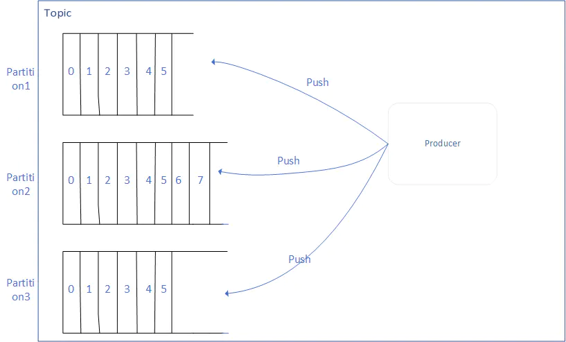
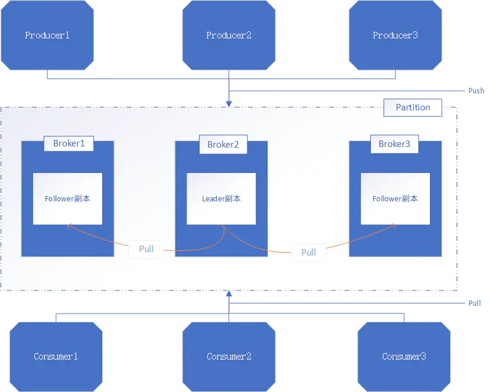

## 基本概念

> 消息队列中的基本概念尤为重要,当对基本概念有了深入的理解之后,消息队列的原理以及常见的问题都将更浅显明了。

1. Broker:一个单独的Kafka server就是一个Broker,Broker的主要工作就是接收生产者发送来的消息,分配offset,然后将包装过的数据保存到磁盘上;此外,Broker还会接收消费者和其他Broker的请求,根据请求的类型进行相应的处理然后返回响应。多个Broker可以做成一个Cluster(集群)对外提供服务,每个Cluster当中会选出一个Broker来担任Controller,Controller是Kafka集群的指挥中心,其他的Broker则听从Controller指挥实现相应的功能。Controller负责管理分区的状态、管理每个分区的副本状态、监听zookeeper中数据的变化等。Controller也是一主多从的实现,所有的Broker都会监听Controller Leader的状态,当Leader Controller出现了故障的时候就重新选举新的Controller Leader。

2. 消息:消息是Kafka中最基本的消息单元。消息由一串字节组成,其中主要由key和value构成,key和value都是字节数组。key的主要作用是根据一定的策略,将这个消息路由到指定的分区中,这样就可以保证包含同一个key的消息全部写入同一个分区

3. Topic:Topic是用于存储消息的逻辑概念,Topic可以看做是一个消息的集合。每个Topic可以有多个生产者向其中push消息,也可以有多个消费者向其中pull消息。

4. 分区(partition):每一个Topic都可以划分成多个分区(每一个Topic都至少有一个分区),不同的分区会分配在不同的Broker上以对Kafka进行水平扩展从而增加Kafka的并行处理能力。同一个Topic下的不同分区包含的消息是不同的。每一个消息在被添加到分区的时候,都会被分配一个offset,他是消息在此分区中的唯一编号,此外,Kafka通过offset保证消息在分区中的顺序,offset的顺序性不跨分区,也就是说在Kafka的同一个分区中的消息是有序的,不同分区的消息可能不是有序的。Partitions概念图

   ​

   

   ​

5. Log:分区在逻辑上对应着一个Log,当生产者将消息写入分区的时候,实际上就是写入到了一个Log中。Log是一个逻辑概念,对应的是一个磁盘上的文件夹。Log由多个Segment组成,每一个Segment又对应着一个日志文件和一个索引文件。

6. 副本:Kafka对消息进行了冗余备份,每一个分区都可以有多个副本,每一个副本中包含的消息是相同的(但不保证同一时刻下完全相同)。副本的类型分为Leader和Follower,当分区只有一个副本的时候,该副本属于Leader,没有Follower。Kafka的副本具有一定的同步机制,在每个副本集合中,都会选举出一个副本作为Leader副本,Kafka在不同的场景中会采用不同的选举策略。Kafka中所有的读写请求都由选举出的Leader副本处理,其他的都作为Follower副本,Follower副本仅仅是从Leader副本中把数据拉取到本地之后,同步更新到自己的Log中。

   分区副本:

   ​

   

   ​

7. 生产者:生产者主要是生产消息,并将消息按照一定的规则推送到Topic的分区中

8. 消费者:消费者主要是从Topic中拉取消息,并对消息进行消费。Consumer维护消费者消费者消费到Partition的哪一个位置(offset的值)这一信息。**在Kafka中,多个Consumer可以组成一个Consumer Group,一个Consumer只能属于一个Consumer Group。Consumer Group保证其订阅的Topic中每一个分区只被分配给此Consumer Group中的一个消费者处理,所以如果需要实现消息的广播消费,则将消费者放在多个不同的Consumer Group中即可实现。**通过向Consumer Group中动态的添加适量的Consumer,可以出发Kafka的Rebalance操作重新分配分区与消费者的对应关系,从而实现了水平扩展的能力。

9. ISR集合:ISR集合表示的是目前可用(alive)且消息量与Leader相差不多的副本集合,即整个副本集合的子集。ISR集合中副本所在的节点都与ZK保持着连接,此外,副本的最后一条消息的offset与Leader副本的最后一条消息的offset之间的差值不能超出指定的阈值。每一个分区的Leader副本都维护此分区的ISR集合。如上面所述,Leader副本进行了消息的写请求,Follower副本会从Leader上拉取写入的消息,第二个过程中会存在Follower副本中的消息数量少于Leader副本的状态,只要差值少于指定的阈值,那么此时的副本集合就是ISR集合。

## 基本使用

### Java调用API使用Kafka:

```java
public class ProducerDemo {
	public static void main(String[] args) {
    //构造Kafka的配置项
    Properties properties=new Properties();
    //定义Kafka服务端的主机名和端口号
    properties.put("bootstrap.servers", "localhost:9092");
    //定义客户端的ID
    properties.put("client.id", "DemoProducer");
    //定义消息的key和value的数据类型都是字节数组
	properties.put("key.serializer","org.apache.kafka.common.serialization.IntegerSerializer");
				properties.put("value.serializer","org.apache.kafka.common.serialization.StringSerializer");
	//创建生产者的核心类
	KafkaProducer producer=new KafkaProducer<>(properties);
    //指定topic的名称
    String topic = "demo";
    //定义消息的key
    int messageNo=1;
    while(true){
        //定义消息的value
        String messageStr="Message_"+messageNo;
        long startTime=System.currentTimeMillis();
        //异步的发送消息
		producer.send(new ProducerRecord<>(topic, messageNo,messageStr,new Callback() {
            //消息发送成功之后收到了Kafka服务端发来的ACK确认消息之后,就回调下面的方法
            //metadata保存着生产者发送过来的消息的元数据,如果消息的发送过程中出现了异常,则改参数的值为null
            @Override
            public void onCompletion(RecordMetadata metadata, Exception exception) {
                long elapsedTime=System.currentTimeMillis()-startTime;
                if(null!=metadata){
                    System.out.println("消息发送给的分区是:"+metadata.partition()+",消息的发送一共用了:"+elapsedTime+"ms");
                }else{
                    exception.printStackTrace();
                }
            }
        	}));
    	}			
	}
}
	
public class ConsumerDemo {
    public static void main(String[] args) {
        Properties properties=new Properties();
        properties.put("bootstrap.servers","localhost:9092");
        //指定Consumer Group的id
        properties.put("group.id", "BeautifulSoup");
        //自动提交offset
        properties.put("enable.auto.commit", "true");
        //自动提交offset的时间间隔
        properties.put("auto.commit.interval.ms","1000");
        properties.put("session.timeout.ms", "30000");
        properties.put("key.deserializer","org.apache.kafka.common.serialization.IntegerDeserializer");
        properties.put("value.deserializer","org.apache.kafka.common.serialization.StringDeserializer");
        KafkaConsumer consumer=new KafkaConsumer<>(properties);
        //指定消费者订阅的topic
        consumer.subscribe(Arrays.asList("demo","test"));
        try{
            while(true){
                //从服务端开始拉取消息,每次的poll都会拉取多个消息
                ConsumerRecords<String, String> records=consumer.poll(100);
                for (ConsumerRecord<String,String> consumerRecord : records) {
                    System.out.println("消息记录的位置:"+consumerRecord.offset()+",消息的键:"+consumerRecord.key()+",消息的值:"+consumerRecord.value());
                }
            }
        }finally{
            //关闭consumer
            consumer.close();
        }
    }
}
```
