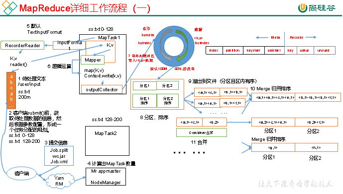
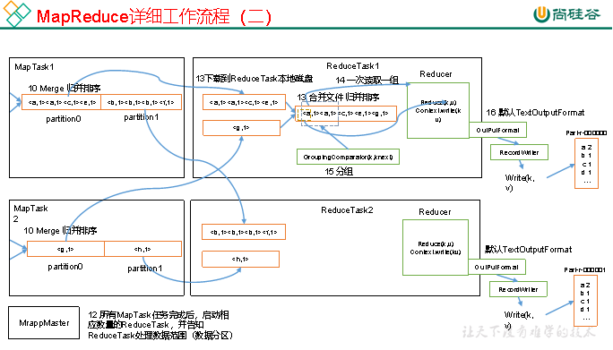

MapReduce的流程相对来说比较复杂,这里借用尚硅谷的两张图来描述其流程.

上面两张图对MapReduce有比较详细的描述,通过这个图我们就能够发现一些MapReduce的优化方法.

#### 数据输入小文件处理

**HDFS小文件会因为文件元数据存储在NameNode的内存中影响NameNode的寿命;还会影响计算引擎的任务数量，比如每个小的文件都会生成一个Map任务.**以下有三种方式可以优化:

（1）合并小文件：对小文件进行归档（Har）、自定义Inputformat将小文件存储成SequenceFile文件。

（2）采用ConbinFileInputFormat来作为输入，解决输入端大量小文件场景。

（3）对于大量小文件Job，可以开启JVM重用。

#### Map阶段

（1）增大环形缓冲区大小。由100m扩大到200m

（2）增大环形缓冲区溢写的比例。由80%扩大到90%

（3）减少对溢写文件的merge次数。

（4）不影响实际业务的前提下，采用Combiner提前合并，减少 I/O。

#### Reduce阶段

（1）合理设置Map和Reduce数：两个都不能设置太少，也不能设置太多。太少，会导致Task等待，延长处理时间；太多，会导致 Map、Reduce任务间竞争资源，造成处理超时等错误。

（2）设置Map、Reduce共存：调整slowstart.completedmaps参数，使Map运行到一定程度后，Reduce也开始运行，减少Reduce的等待时间。

（3）规避使用Reduce，因为Reduce在用于连接数据集的时候将会产生大量的网络消耗。

（4）增加每个Reduce去Map中拿数据的并行数

（5）集群性能可以的前提下，增大Reduce端存储数据内存的大小。 

#### IO传输

（1）采用数据压缩的方式，减少网络IO的的时间。安装Snappy和LZOP压缩编码器。

（2）使用SequenceFile二进制文件

#### 整体

（1）可以增加MapTask的cpu核数，增加ReduceTask的CPU核数

（2）增加每个Container的CPU核数和内存大小

（3）调整每个Map Task和Reduce Task最大重试次数