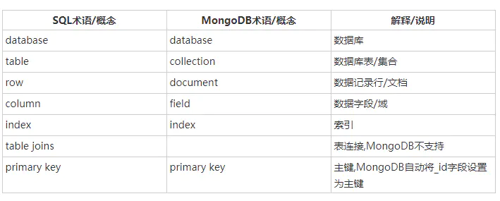

## mongoDB起步

- 1.安装mongoDB

  安装这里，我就不详细介绍，大家可以根据官网选择匹配自己电脑系统的版本安装即可。

  mongoDB download地址： [download](https://www.mongodb.com/download-center)

  下载下来之后，点击打开直接下一步，下一步就 `ok` 了。

- 2.初体验

  1. 配置环境变量

  安装完成后，会在安装目录下面生成一个 `mongoDB` 的文件夹，打开文件夹，进入 `bin` 文件夹中，把这里的路径配置成环境变量。

  1. 创建存储数据库文件 `data`

  在任意盘符根目录下创建一个 `data` 目录，用来存放数据库文件。 `mongoDB` 会自动把自己安装位置的盘符根目录下的 `data` 文件夹作为自己的数据存储目录，这里也可以直接在安装位置所在盘符创建。

  1. 启动 mongoDB 数据库

  如果 `data` 目录创建在安装位置的盘符根目录下，直接打开命令行，敲入：

  ```shell
   mongod
  ```

  如果是其他位置，则需要指定数据存放的位置:

  ```shell
   mongod --dbpath 文件路径
  ```

  如果看到输出： `waiting for connections on port 27017` 说明启动数据库成功。

  1. 连接数据库

  再打开一个命令行，敲入 `mongo` ，则会默认连接到本地开启的数据库。好了，到这里我们就完成了如何开启一个 `mongoDB`  数据库了，接下来只需往数据库里存数据，操作数据即可。

## MongoDB 概念解析

`mongoDB` 作为一个 `NoSQL` 数据库，对于我们前端学习成本非常低，后期会结合node一起使用。mongoDB 中存储的都是 键值对（`key` - `value`），格式类似于 `JSON` ，操作起来也是非常爽，完全不需要我们有什么 `SQL` 语言的基础。

在`mongodb`中有三个基本核心的概念：

- 文档
- 集合
- 数据库

它们之间是逐层包含的关系，一个集合可以包含多个文档，一个数据库可以有多个集合，下面听我逐一道来：

`文档` ： 文档是一个键值(`key-value`)对(即`BSON`)，本质类似于`json`对象 的键值对。

```json
{"name":"pubdreamcc", "age": 24}
```

`集合`：集合就是 MongoDB 文档组，实质上就是包含多个对象的数组。

比如，我们可以将以下不同数据结构的文档插入到集合中：

```json
{"name":"pubdreamcc"}
{"name":"pubdreamcc1","name":"pubdreamcc2"}
{"name":"pubdreamcc3","name":"pubdreamcc4","num":5}
```

`数据库（dataBase）`

这里的数据库概念同 关系型数据库中的数据库概念一致，数据库可以包含多个集合。

下面给出一张图用来表示 `mongoDB` 中的一些概念同 `SQL` 概念 的 对比，辅助理解。



## mongoDB基本操作

在刚才我们连接上本地数据库之后，在这个命令行，我们可以进行很多  `mongoDB`  提供的增删改查等的基本操作，且听我一一道来。

- 1.创建数据库 : `use 数据库名称`。

  *如果数据库不存在，则创建数据库，否则切换到指定数据库。*

  *MongoDB 中默认的数据库为 test，如果你没有创建新的数据库，集合将存放在 test 数据库中。*

- 2.查看所有数据库： `show dbs`

- 3.删除数据库： `db.dropDatabase()`，你可以使用 db 命令查看当前数据库名。

- 4.创建集合：  `db.createCollection(集合名称)`

- 5.查看已有集合： `show collections`

- 6.删除集合：`db.集合名称.drop()`

  *如果成功删除选定集合，则 drop() 方法返回 true，否则返回 false。*

- 7.插入文档：`db.集合名称.insert(document)`。往指定集合插入文档，文档的数据结构和 `JSON` 基本一样。

- 8.更新文档： `update()` 方法用于更新已存在的文档，语法格式：

  ```sql
     db.collection.update(
       <query>,
       <update>,
       {
         upsert: <boolean>,
         multi: <boolean>,
         writeConcern: <document>
       }
     )
  ```

  **参数说明**：

  - `query` : update的查询条件，类似sql update查询内where后面的。
  - `update` : update的对象和一些更新的操作符（如inc），也可以理解为sql update查询内set后面的。
  - `upsert` : 可选，这个参数的意思是，如果不存在update的记录，是否插入objNew,true为插入，默认是false，不插入。
  - `multi` : 可选，mongodb 默认是false,只更新找到的第一条记录，如果这个参数为true,就把按条件查出来多条记录全部更新。
  - `writeConcern` :可选，抛出异常的级别。

- 9.删除文档：

  ```sql
  db.collection.remove(
    <query>,
    <justOne>
  )
  ```

  **参数说明**

  - `query` :（可选）删除的文档的条件。
  - `justOne` : （可选）如果设为 true 或 1，则只删除一个文档，如果不设置该参数，或使用默认值 false，则删除所有匹配条件的文档。
  - `writeConcern` :（可选）抛出异常的级别。

- 10.删除集合所有数据：`db.collection.remove({})`

- 11.查询文档：`db.collection.find(query, projection)`

  **参数说明**

  - `query` ：可选，使用查询操作符指定查询条件。
  - `projection` ：可选，使用投影操作符指定返回的键。查询时返回文档中所有键值， 只需省略该参数即可（默认省略）。

  ```sql
  # 如果你需要以易读的方式来读取数据，可以使用 `pretty()` 方法，语法格式如下：

  db.col.find().pretty()
  ```
  `pretty()` 方法以格式化的方式来显示所有文档。

- 12.查询一个文档（匹配条件的第一个）：`db.collection.findOne()`
