对于高性能的 RPC 框架，Netty 作为异步通信框架，几乎成为必备品。例如，Dubbo 框架中通信组件，还有 RocketMQ 中生产者和消费者的通信，都使用了 Netty。今天，我们来看看 Netty 的基本架构和原理。

Netty 的特点与 NIO

Netty 是一个异步的、基于事件驱动的网络应用框架，它可以用来开发高性能服务端和客户端。

以前编写网络调用程序的时候，我们都会在客户端创建一个 Socket，通过这个 Socket 连接到服务端。

服务端根据这个 Socket 创建一个 Thread，用来发出请求。客户端在发起调用以后，需要等待服务端处理完成，才能继续后面的操作。这样线程会出现等待的状态。

如果客户端请求数越多，服务端创建的处理线程也会越多，JVM 如此多的线程并不是一件容易的事。

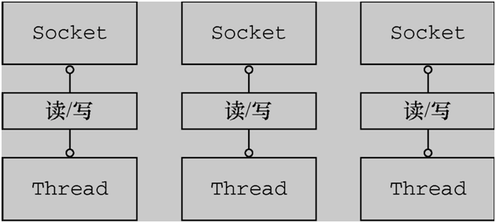

为了解决上述的问题，推出了 NIO 的概念，也就是（Non-blocking I/O）。其中，Selector 机制就是 NIO 的核心。

当每次客户端请求时，会创建一个 Socket Channel，并将其注册到 Selector 上（多路复用器）。

然后，Selector 关注服务端 IO 读写事件，此时客户端并不用等待 IO 事件完成，可以继续做接下来的工作。

一旦，服务端完成了 IO 读写操作，Selector 会接到通知，同时告诉客户端 IO 操作已经完成。

接到通知的客户端，就可以通过 SocketChannel 获取需要的数据了。

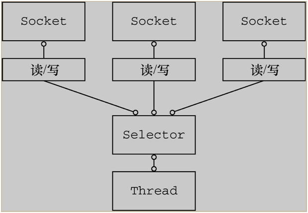

上面描述的过程有点异步的意思，不过，Selector 实现的并不是真正意义上的异步操作。

因为 Selector 需要通过线程阻塞的方式监听 IO 事件变更，只是这种方式没有让客户端等待，是 Selector 在等待 IO 返回，并且通知客户端去获取数据。真正“异步 IO”（AIO）这里不展开介绍，有兴趣可以自行查找。

说好了 NIO 再来谈谈 Netty，Netty 作为 NIO 的实现，它适用于服务器/客户端通讯的场景，以及针对于 TCP 协议下的高并发应用。

对于开发者来说，它具有以下特点：

- 对 NIO 进行封装，开发者不需要关注 NIO 的底层原理，只需要调用 Netty 组件就能够完成工作。
- 对网络调用透明，从 Socket 建立 TCP 连接到网络异常的处理都做了包装。
- 对数据处理灵活， Netty 支持多种序列化框架，通过“ChannelHandler”机制，可以自定义“编/解码器”。
- 对性能调优友好，Netty 提供了线程池模式以及 Buffer 的重用机制（对象池化），不需要构建复杂的多线程模型和操作队列。

## 组件作用与之间关系

开篇讲到了，为了满足高并发下网络请求，引入了 NIO 的概念。Netty 是针对 NIO 的实现，在 NIO 封装，网络调用，数据处理以及性能优化等方面都有不俗的表现。

学习架构最容易的方式就是从实例入手，从客户端访问服务端的代码来看看 Netty 是如何运作的。再一次介绍代码中调用的组件以及组件的工作原理。

假设有一个客户端去调用一个服务端，假设服务端叫做 EchoServer，客户端叫做 EchoClient，用 Netty 架构实现代码如下。

**服务端代码**

构建服务器端，假设服务器接受客户端传来的信息，然后在控制台打印。首先，生成 EchoServer，在构造函数中传入需要监听的端口号。

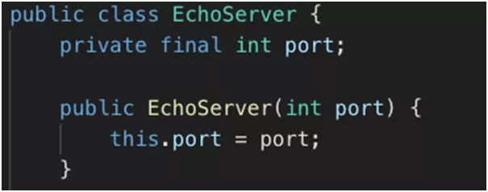

接下来就是服务的启动方法：

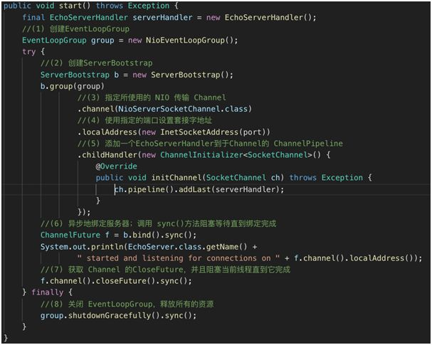

Server 的启动方法涉及到了一些组件的调用，例如 EventLoopGroup，Channel。这些会在后面详细讲解。

这里有个大致的印象就好：

- 创建 EventLoopGroup。
- 创建 ServerBootstrap。
- 指定所使用的 NIO 传输 Channel。
- 使用指定的端口设置套接字地址。
- 添加一个 ServerHandler 到 Channel 的 ChannelPipeline。
- 异步地绑定服务器；调用 sync() 方法阻塞等待直到绑定完成。
- 获取 Channel 的 CloseFuture，并且阻塞当前线程直到它完成。
- 关闭 EventLoopGroup，释放所有的资源。

NettyServer 启动以后会监听某个端口的请求，当接受到了请求就需要处理了。在 Netty 中客户端请求服务端，被称为“入站”操作。

可以通过 ChannelInboundHandlerAdapter 实现，具体内容如下：

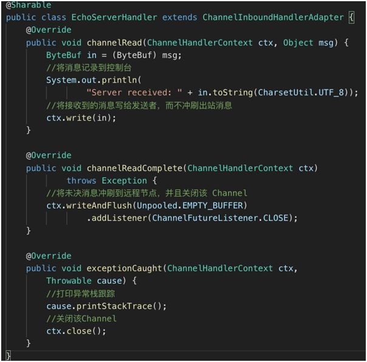

从上面的代码可以看出，服务端处理的代码包含了三个方法。这三个方法都是根据事件触发的。

他们分别是：

- 当接收到消息时的操作，channelRead。
- 消息读取完成时的方法，channelReadComplete。
- 出现异常时的方法，exceptionCaught。

**客户端代码**

客户端和服务端的代码基本相似，在初始化时需要输入服务端的 IP 和 Port。

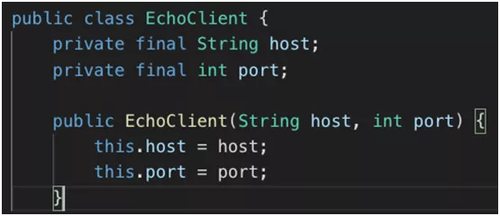

同样在客户端启动函数中包括以下内容：

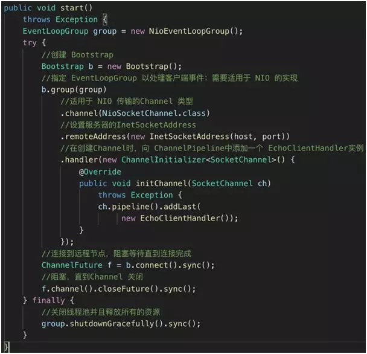

客户端启动程序的顺序：

- 创建 Bootstrap。
- 指定 EventLoopGroup 用来监听事件。
- 定义 Channel 的传输模式为 NIO（Non-BlockingInputOutput）。
- 设置服务器的 InetSocketAddress。
- 在创建 Channel 时，向 ChannelPipeline 中添加一个 EchoClientHandler 实例。
- 连接到远程节点，阻塞等待直到连接完成。
- 阻塞，直到 Channel 关闭。
- 关闭线程池并且释放所有的资源。

客户端在完成以上操作以后，会与服务端建立连接从而传输数据。同样在接受到 Channel 中触发的事件时，客户端会触发对应事件的操作。

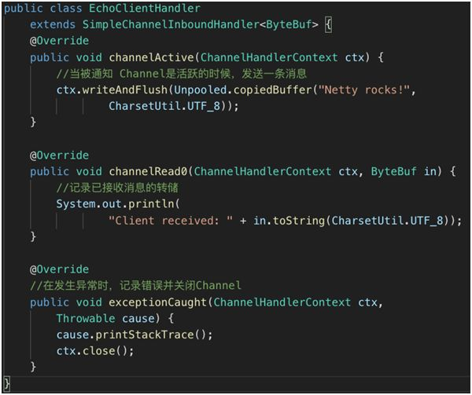

例如 Channel 激活，客户端接受到服务端的消息，或者发生异常的捕获。

从代码结构上看还是比较简单的。服务端和客户端分别初始化创建监听和连接。然后分别定义各自的 Handler 处理对方的请求。

*服务端/客户端初始化和事件处理*

Netty 核心组件

通过上面的简单例子，发现有些 Netty 组件在服务初始化以及通讯时被用到，下面就来介绍一下这些组件的用途和关系。

### Channel

通过上面例子可以看出，当客户端和服务端连接的时候会建立一个 Channel。

这个 Channel 我们可以理解为 Socket 连接，它负责基本的 IO 操作，例如：bind（），connect（），read（），write（） 等等。

简单的说，Channel 就是代表连接，实体之间的连接，程序之间的连接，文件之间的连接，设备之间的连接。同时它也是数据入站和出站的载体。

### EventLoop 和 EventLoopGroup

既然有了 Channel 连接服务，让信息之间可以流动。如果服务发出的消息称作“出站”消息，服务接受的消息称作“入站”消息。那么消息的“出站”/“入站”就会产生事件（Event）。

例如：连接已激活；数据读取；用户事件；异常事件；打开链接；关闭链接等等。

顺着这个思路往下想，有了数据，数据的流动产生事件，那么就有一个机制去监控和协调事件。

这个机制（组件）就是 EventLoop。在 Netty 中每个 Channel 都会被分配到一个 EventLoop。一个 EventLoop 可以服务于多个 Channel。

每个 EventLoop 会占用一个 Thread，同时这个 Thread 会处理 EventLoop 上面发生的所有 IO 操作和事件（Netty 4.0）。

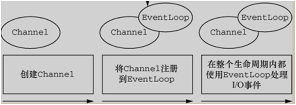

理解了 EventLoop，再来说 EventLoopGroup 就容易了，EventLoopGroup 是用来生成 EventLoop 的，还记得例子代码中第一行就 new 了 EventLoopGroup 对象。

一个 EventLoopGroup 中包含了多个 EventLoop 对象。

EventLoopGroup 要做的就是创建一个新的 Channel，并且给它分配一个 EventLoop。

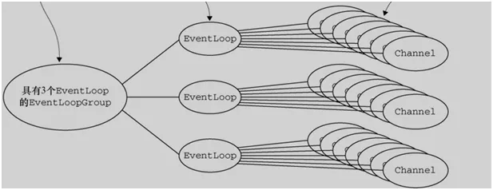

在异步传输的情况下，一个 EventLoop 是可以处理多个 Channel 中产生的事件的，它主要的工作就是事件的发现以及通知。

相对于以前一个 Channel 就占用一个 Thread 的情况。Netty 的方式就要合理多了。

客户端发送消息到服务端，EventLoop 发现以后会告诉服务端：“你去获取消息”，同时客户端进行其他的工作。

当 EventLoop 检测到服务端返回的消息，也会通知客户端：“消息返回了，你去取吧“。客户端再去获取消息。整个过程 EventLoop 就是监视器+传声筒。

### ChannelHandler，ChannelPipeline 和ChannelHandlerContext

如果说 EventLoop 是事件的通知者，那么 ChannelHandler 就是事件的处理者。

在 ChannelHandler 中可以添加一些业务代码，例如数据转换，逻辑运算等等。

正如上面例子中展示的，Server 和 Client 分别都有一个 ChannelHandler 来处理，读取信息，网络可用，网络异常之类的信息。

并且，针对出站和入站的事件，有不同的 ChannelHandler，分别是：

- **ChannelInBoundHandler（入站事件处理器）**
- **ChannelOutBoundHandler（出站事件处理器）**

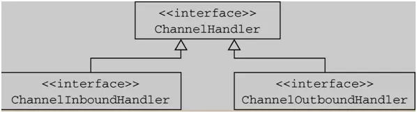

假设每次请求都会触发事件，而由 ChannelHandler 来处理这些事件，这个事件的处理顺序是由 ChannelPipeline 来决定的。

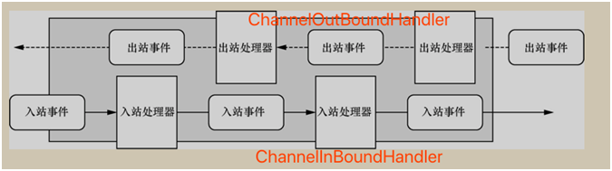

ChannelPipeline 为 ChannelHandler 链提供了容器。到 Channel 被创建的时候，会被 Netty 框架自动分配到 ChannelPipeline 上。

ChannelPipeline 保证 ChannelHandler 按照一定顺序处理事件，当事件触发以后，会将数据通过 ChannelPipeline 按照一定的顺序通过 ChannelHandler。

说白了，ChannelPipeline 是负责“排队”的。这里的“排队”是处理事件的顺序。

同时，ChannelPipeline 也可以添加或者删除 ChannelHandler，管理整个队列。

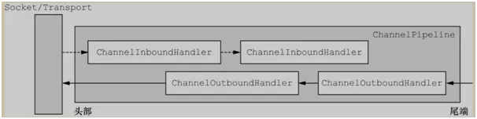

如上图，ChannelPipeline 使 ChannelHandler 按照先后顺序排列，信息按照箭头所示方向流动并且被 ChannelHandler 处理。

说完了 ChannelPipeline 和 ChannelHandler，前者管理后者的排列顺序。那么它们之间的关联就由 ChannelHandlerContext 来表示了。

每当有 ChannelHandler 添加到 ChannelPipeline 时，同时会创建 ChannelHandlerContext 。

ChannelHandlerContext 的主要功能是管理 ChannelHandler 和 ChannelPipeline 的交互。

不知道大家注意到没有，开始的例子中 ChannelHandler 中处理事件函数，传入的参数就是 ChannelHandlerContext。

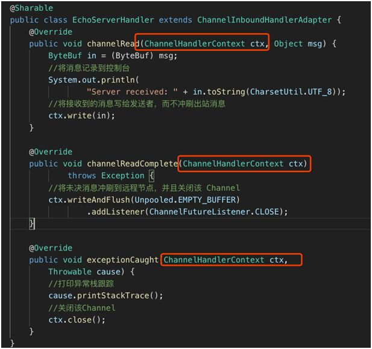

ChannelHandlerContext 参数贯穿 ChannelPipeline，将信息传递给每个 ChannelHandler，是个合格的“通讯员”。

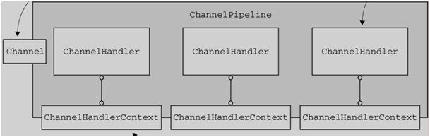

把上面提到的几个核心组件归纳一下，用下图表示方便记忆他们之间的关系。

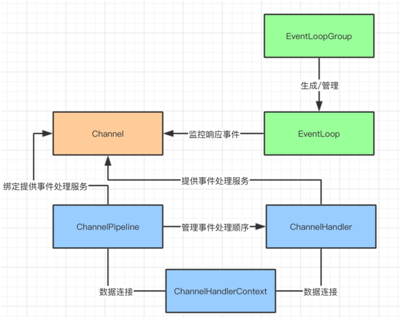

Netty 的数据容器

前面介绍了 Netty 的几个核心组件，服务器在数据传输的时候，产生事件，并且对事件进行监控和处理。

接下来看看数据是如何存放以及是如何读写的。Netty 将 ByteBuf 作为数据容器，来存放数据。

## **ByteBuf 工作原理**

从结构上来说，ByteBuf 由一串字节数组构成。数组中每个字节用来存放信息。

ByteBuf 提供了两个索引，一个用于读取数据，一个用于写入数据。这两个索引通过在字节数组中移动，来定位需要读或者写信息的位置。

当从 ByteBuf 读取时，它的 readerIndex（读索引）将会根据读取的字节数递增。

同样，当写 ByteBuf 时，它的 writerIndex 也会根据写入的字节数进行递增。

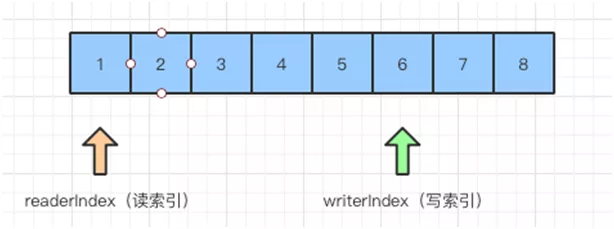

需要注意的是极限的情况是 readerIndex 刚好读到了 writerIndex 写入的地方。

如果 readerIndex 超过了 writerIndex 的时候，Netty 会抛出 IndexOutOf-BoundsException 异常。

### ByteBuf 使用模式

谈了 ByteBuf 的工作原理以后，再来看看它的使用模式。

根据存放缓冲区的不同分为三类：

- **堆缓冲区，**ByteBuf 将数据存储在 JVM 的堆中，通过数组实现，可以做到快速分配。

  由于在堆上被 JVM 管理，在不被使用时可以快速释放。可以通过 ByteBuf.array() 来获取 byte[] 数据。

- **直接缓冲区，**在 JVM 的堆之外直接分配内存，用来存储数据。其不占用堆空间，使用时需要考虑内存容量。

  它在使用 Socket 传递时性能较好，因为间接从缓冲区发送数据，在发送之前 JVM 会先将数据复制到直接缓冲区再进行发送。

  由于，直接缓冲区的数据分配在堆之外，通过 JVM 进行垃圾回收，并且分配时也需要做复制的操作，因此使用成本较高。

- **复合缓冲区，**顾名思义就是将上述两类缓冲区聚合在一起。Netty 提供了一个 CompsiteByteBuf，可以将堆缓冲区和直接缓冲区的数据放在一起，让使用更加方便。

### ByteBuf 的分配

聊完了结构和使用模式，再来看看 ByteBuf 是如何分配缓冲区的数据的。

Netty 提供了两种 ByteBufAllocator 的实现，他们分别是：

- **PooledByteBufAllocator，**实现了 ByteBuf 的对象的池化，提高性能减少内存碎片。
- **Unpooled-ByteBufAllocator，**没有实现对象的池化，每次会生成新的对象实例。

对象池化的技术和线程池，比较相似，主要目的是提高内存的使用率。池化的简单实现思路，是在 JVM 堆内存上构建一层内存池，通过 allocate 方法获取内存池中的空间，通过 release 方法将空间归还给内存池。

对象的生成和销毁，会大量地调用 allocate 和 release 方法，因此内存池面临碎片空间回收的问题，在频繁申请和释放空间后，内存池需要保证连续的内存空间，用于对象的分配。

基于这个需求，有两种算法用于优化这一块的内存分配：伙伴系统和 slab 系统。

伙伴系统，用完全二叉树管理内存区域，左右节点互为伙伴，每个节点代表一个内存块。内存分配将大块内存不断二分，直到找到满足所需的最小内存分片。

内存释放会判断释放内存分片的伙伴（左右节点）是否空闲，如果空闲则将左右节点合成更大块内存。

slab 系统，主要解决内存碎片问题，将大块内存按照一定内存大小进行等分，形成相等大小的内存片构成的内存集。

按照内存申请空间的大小，申请尽量小块内存或者其整数倍的内存，释放内存时，也是将内存分片归还给内存集。

Netty 内存池管理以 Allocate 对象的形式出现。一个 Allocate 对象由多个 Arena 组成，每个 Arena 能执行内存块的分配和回收。

Arena 内有三类内存块管理单元：

- **TinySubPage**
- **SmallSubPage**
- **ChunkList**

Tiny 和 Small 符合 Slab 系统的管理策略，ChunkList 符合伙伴系统的管理策略。

当用户申请内存介于 tinySize 和 smallSize 之间时，从 tinySubPage 中获取内存块。

申请内存介于 smallSize 和 pageSize 之间时，从 smallSubPage 中获取内存块；介于 pageSize 和 chunkSize 之间时，从 ChunkList 中获取内存；大于 ChunkSize（不知道分配内存的大小）的内存块不通过池化分配。

## Netty 的 Bootstrap

说完了 Netty 的核心组件以及数据存储。再回到最开始的例子程序，在程序最开始的时候会 new 一个 Bootstrap 对象，后面所有的配置都是基于这个对象展开的。

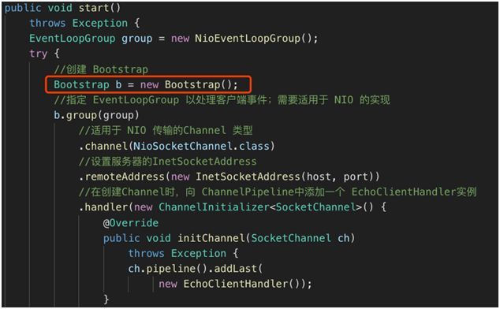

Bootstrap 的作用就是将 Netty 核心组件配置到程序中，并且让他们运行起来。

从 Bootstrap 的继承结构来看，分为两类分别是 Bootstrap 和 ServerBootstrap，一个对应客户端的引导，另一个对应服务端的引导。

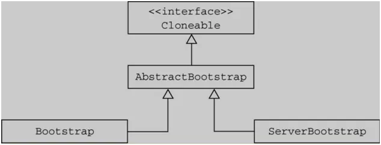

客户端引导 Bootstrap，主要有两个方法 bind（） 和 connect（）。Bootstrap 通过 bind（） 方法创建一个 Channel。

在 bind（） 之后，通过调用 connect（） 方法来创建 Channel 连接。

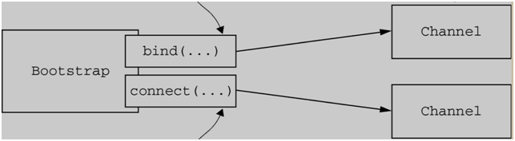

服务端引导 ServerBootstrap，与客户端不同的是在 Bind（） 方法之后会创建一个 ServerChannel，它不仅会创建新的 Channel 还会管理已经存在的 Channel。

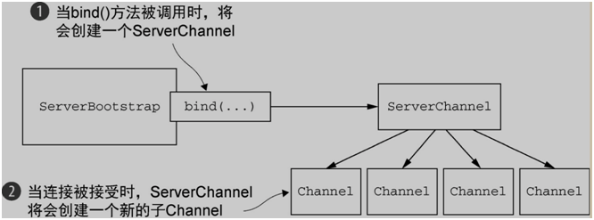

ServerBootstrap 通过 bind 方法创建/管理连接

通过上面的描述，服务端和客户端的引导存在两个区别：

- ServerBootstrap（服务端引导）绑定一个端口，用来监听客户端的连接请求。而 Bootstrap（客户端引导）只要知道服务端 IP 和 Port 建立连接就可以了。

- Bootstrap（客户端引导）需要一个 EventLoopGroup，但是 ServerBootstrap（服务端引导）则需要两个 EventLoopGroup。

  因为服务器需要两组不同的 Channel。第一组 ServerChannel 自身监听本地端口的套接字。第二组用来监听客户端请求的套接字。

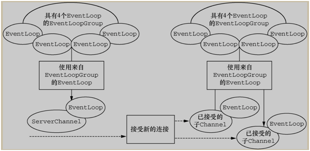

## 总结

我们从 NIO 入手，谈到了 Selector 的核心机制。然后通过介绍 Netty 客户端和服务端源代码运行流程，让大家对 Netty 编写代码有基本的认识。

在 Netty 的核心组件中，Channel 提供 Socket 的连接通道，EventLoop 会对应 Channel 监听其产生的事件，并且通知执行者。EventloopGroup 的容器，负责生成和管理 EventLoop。

ChannelPipeline 作为 ChannelHandler 的容器会绑定到 Channel 上，然后由 ChannelHandler 提供具体事件处理。另外，ChannelHandlerContext 为 ChannelHandler 和 ChannelPipeline 提供信息共享。

ByteBuf 作为 Netty 的数据容器，通过字节数组的方式存储数据，并且通过读索引和写索引来引导读写操作。

上述的核心组件都是通过 Bootstrap 来配置并且引导启动的，Bootstrap 启动方式虽然一致，但是针对客户端和服务端有些许的区别。
