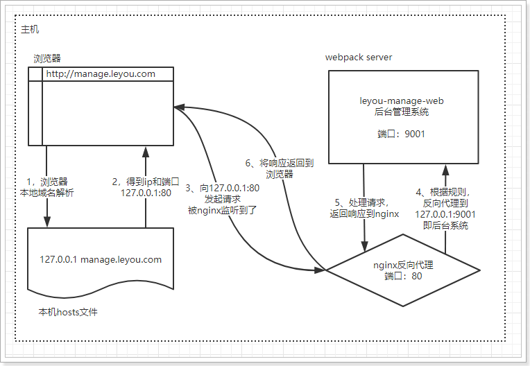

### 什么是Nginx


nginx可以作为web服务器，但更多的时候，我们把它作为网关，因为它具备网关必备的功能：

- 反向代理
- 负载均衡
- 动态路由
- 请求过滤

### nginx作为web服务器

Web服务器分2类：

- web应用服务器，如：
  - tomcat
  - resin
  - jetty
- web服务器，如：
  - Apache 服务器
  - Nginx
  - IIS

区分：web服务器不能解析jsp等页面，只能处理js、css、html等静态资源。 并发：web服务器的并发能力远高于web应用服务器。

### nginx作为反向代理

什么是反向代理？

- 代理：通过客户机的配置，实现让一台服务器(代理服务器)代理客户机，客户的所有请求都交给代理服务器处理。
- 反向代理：用一台服务器，代理真实服务器，用户访问时，不再是访问真实服务器，而是代理服务器。

nginx可以当做反向代理服务器来使用：

- 我们需要提前在nginx中配置好反向代理的规则，不同的请求，交给不同的真实服务器处理
- 当请求到达nginx，nginx会根据已经定义的规则进行请求的转发，从而实现路由功能

利用反向代理，就可以解决我们前面所说的端口问题，如图


### 安装和使用

> ### 安装

安装非常简单，把课前资料提供的nginx直接解压即可，绿色免安装!

解压后，目录结构：


1. conf：配置目录
2. contrib：第三方依赖
3. html：默认的静态资源目录，类似于tomcat的webapps
4. logs：日志目录
5. nginx.exe：启动程序。可双击运行，但不建议这么做。

> ### 反向代理配置

示例：


nginx中的每个server就是一个反向代理配置，可以有多个server

完整配置：

```xml
#user  nobody;
worker_processes  1;

events {
    worker_connections  1024;
}

http {
    include       mime.types;
    default_type  application/octet-stream;
    sendfile        on;
   
    keepalive_timeout  65;

    gzip  on;
	server {
        listen       80;
        server_name  manage.leyou.com;

        proxy_set_header X-Forwarded-Host $host;
        proxy_set_header X-Forwarded-Server $host;
        proxy_set_header X-Forwarded-For $proxy_add_x_forwarded_for;

        location / {
			proxy_pass http://127.0.0.1:9001;
			proxy_connect_timeout 600;
			proxy_read_timeout 600;
        }
    }
	server {
        listen       80;
        server_name  api.leyou.com;

        proxy_set_header X-Forwarded-Host $host;
        proxy_set_header X-Forwarded-Server $host;
        proxy_set_header X-Forwarded-For $proxy_add_x_forwarded_for;

        location / {
			proxy_pass http://127.0.0.1:10010;
			proxy_connect_timeout 600;
			proxy_read_timeout 600;
        }
    }
}
```

> ### 使用

nginx可以通过命令行来启动，操作命令：

- 启动：`start nginx.exe`
- 停止：`nginx.exe -s stop`
- 重新加载：`nginx.exe -s reload`

启动过程会闪烁一下，启动成功后，任务管理器中会有两个nginx进程：


现在实现了域名访问网站了，中间的流程是怎样的呢？



1. 浏览器准备发起请求，访问http://mamage.leyou.com，但需要进行域名解析

2. 优先进行本地域名解析，因为我们修改了hosts，所以解析成功，得到地址：127.0.0.1

3. 请求被发往解析得到的ip，并且默认使用80端口：http://127.0.0.1:80

   本机的nginx一直监听80端口，因此捕获这个请求

4. nginx中配置了反向代理规则，将manage.leyou.com代理到127.0.0.1:9001，因此请求被转发

5. 后台系统的webpack server监听的端口是9001，得到请求并处理，完成后将响应返回到nginx

6. nginx将得到的结果返回到浏览器使用场景

### 使用场景

平时开发分布式系统的时候,作为自己的调试环境往往是只有一台电脑的,这个时候为了配置和实际生产环境一致,我们的配置都是和线上一致,这个时候就需要使用hosts文件中的映射和nginx配合使用实现一台电脑上部署一个分布式的系统的多个部分的效果.如下配置文件:

```xml
#cms页面预览
	upstream cms_server_pool{
		server 127.0.0.1:31001 weight=10;
	}

	upstream static_server_pool{
		server 127.0.0.1:91 weight=10;
	}	
	
	#前端动态门户 
	upstream dynamic_portal_server_pool{ 
		server 127.0.0.1:10000 weight=10; 
	}
	#前端ucenter 
	upstream ucenter_server_pool{ 
		#server 127.0.0.1:7081 weight=10; 
		server 127.0.0.1:13000 weight=10; 
	}
	
	#后台搜索（公开api） 
	upstream search_server_pool{
		server 127.0.0.1:40100 weight=10; 
	}
	
	#媒体服务
	upstream video_server_pool {
		server 127.0.0.1:90 weight=10;
	}
	#认证服务 
	upstream auth_server_pool{
		server 127.0.0.1:40400 weight=10;
	}
	
	server {
		listen       91;	
		server_name  localhost;
		ssi on;
		ssi_silent_errors on;

		location /static/company/ {
			alias	D:/皇家java教程/04-java项目/xcEduUI01/static/company/;
		}
		location /static/teacher/ {
			alias	D:/皇家java教程/04-java项目/xcEduUI01/static/teacher/;
		}
		location /static/stat/ {
			alias	D:/皇家java教程/04-java项目/xcEduUI01/static/stat/;
		}
		location /course/detail/ {
			alias   D:/皇家java教程/04-java项目/xcEduUI01/static/course/detail/;
		}
		#分类信息 
		location /static/category {
			default_type application/json;
			alias   D:/皇家java教程/04-java项目/xcEduUI01/static/category/;
		}
	}
    server {
        listen       80;	
        server_name  www.xuecheng.com;
		ssi on;
		ssi_silent_errors on;
        location / {
            alias   D:/皇家java教程/04-java项目/xcEduUI01/xc-ui-pc-static-portal/;
            index  index.html;
        }
	   
		location /cms/preview/{
			proxy_pass http://cms_server_pool/cms/preview/;
		}		
		location /static/company/{
			proxy_pass http://static_server_pool;
		}
		location /static/teacher/{
			proxy_pass http://static_server_pool;
		}
		location /static/stat/{
			proxy_pass http://static_server_pool;
		}
		location /static/course/detail/{
			proxy_pass http://static_server_pool;
		}
		location /static/img/{
			alias D:/皇家java教程/04-java项目/xcEduUI01/xc-ui-pc-static-portal/img/;
		}
		location /static/css/{
			alias D:/皇家java教程/04-java项目/xcEduUI01/xc-ui-pc-static-portal/css/;
		}
		location /static/js/{
			alias D:/皇家java教程/04-java项目/xcEduUI01/xc-ui-pc-static-portal/js/;
		}
		location /static/plugins/{
			alias D:/皇家java教程/04-java项目/xcEduUI01/xc-ui-pc-static-portal/plugins/;
			add_header Access-Control-Allow-Origin http://ucenter.xuecheng.com;
			add_header Access-Control-Allow-Credentials true;
			add_header Access-Control-Allow-Methods GET;
		}
		#前端门户页面搜索
		location ^~ /course/search {
			proxy_pass http://dynamic_portal_server_pool;
		}
		#后端搜索服务
		location /openapi/search/ {
		proxy_pass http://search_server_pool/search/;
		}
		#分类信息 
		location /static/category/ {
			proxy_pass http://static_server_pool;
		}
		#开发环境webpack定时加载此文件 
		location ^~ /__webpack_hmr {
			proxy_pass http://dynamic_portal_server_pool/__webpack_hmr;
		}
		#开发环境nuxt访问_nuxt 
		location ^~ /_nuxt/ {
			proxy_pass http://dynamic_portal_server_pool/_nuxt/;
		}	
    }
	#学成网媒体服务代理 
	map $http_origin $origin_list{
		default http://www.xuecheng.com;
		"~http://www.xuecheng.com" http://www.xuecheng.com;
		"~http://ucenter.xuecheng.com" http://ucenter.xuecheng.com;
	}
	#学成网媒体服务代理
	server {
		listen 80;
		server_name video.xuecheng.com;
		location /video {
			proxy_pass http://video_server_pool;
			add_header Access‐Control‐Allow‐Origin $origin_list;
			#add_header Access‐Control‐Allow‐Origin *;
			add_header Access‐Control‐Allow‐Credentials true;
			add_header Access‐Control‐Allow‐Methods GET;
		}
	}
	server{
		listen		90;
		server_name	localhost;
		
		#视频目录
		location /video/ {
			alias	D:/皇家java教程/04-java项目/xcEduUI01/video/;
		}
	}
	#学成网用户中心
	server {
		listen 80;
		server_name ucenter.xuecheng.com;
		
		#认证 
		location ^~ /openapi/auth/ {
			proxy_pass http://auth_server_pool/auth/;
		}
		#个人中心 
		location / { 
			proxy_pass http://ucenter_server_pool;
		}
	}

```

