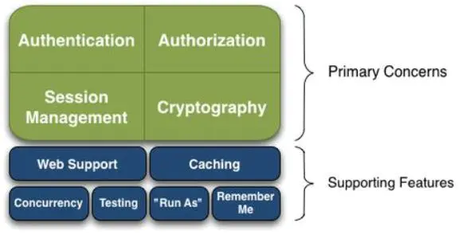
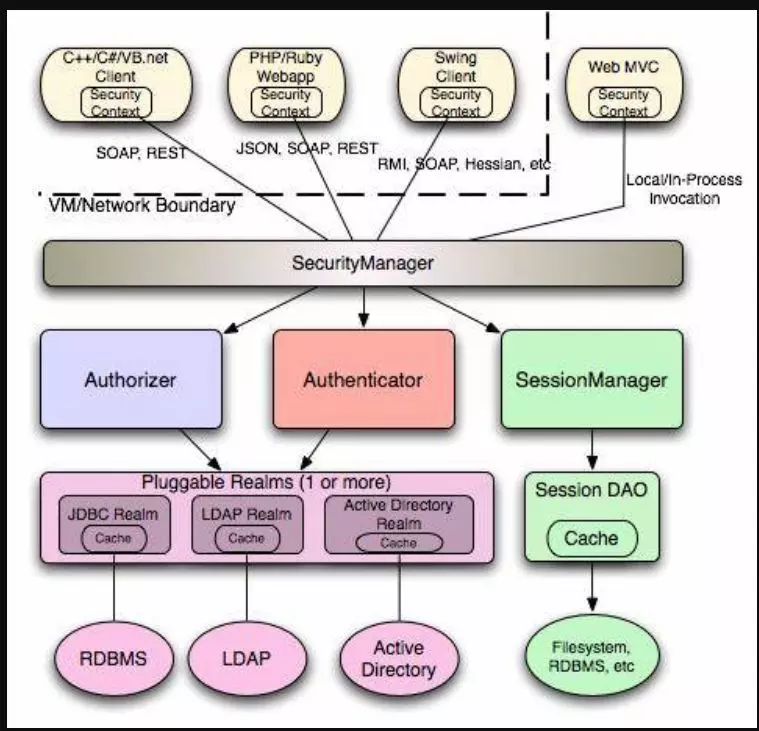
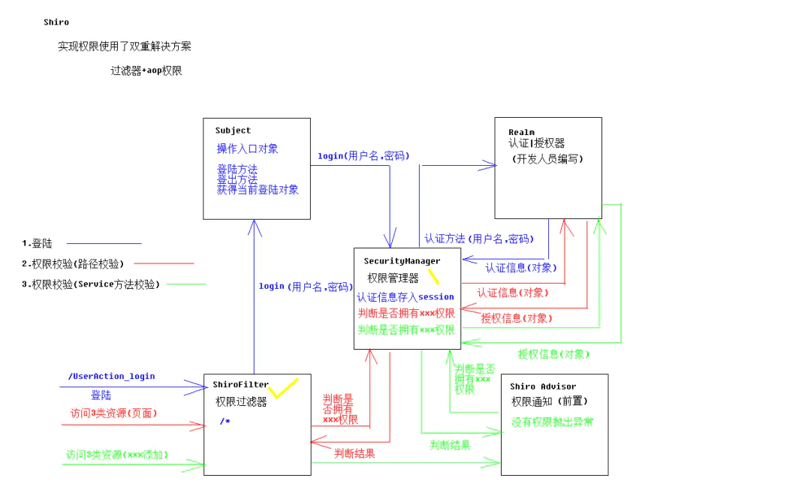

## **Shiro是什么？**

Apache Shiro是Java的一个安全框架，一个强大而灵活的开源安全框架，它干净利落地处理身份认证，授权，企业会话管理和加密。

目前，使用Apache Shiro的人越来越多，因为它相当简单，对比Spring Security，可能没有Spring Security做的功能强大，但是在实际工作时可能并不需要那么复杂的东西，所以使用小而简单的Shiro就足够了。

功能:1.验证用户来核实他们的身份2.对用户执行访问控制

我们可以看一下Apache官网上对Shiro，它都包含哪些功能。



Authentication：认证，有时也简称为“登录”，这是一个证明用户是他们所说的他们是谁的行为。

Authorization：授权，访问控制的过程，也就是决定“谁”去访问“什么” 授权用于回答安全问题，例如“用户是否允许编辑帐户”，“该用户是否允许查看此网页”，“该用户是否可以访问”到这个按钮？“这些都是决定用户有权访问的决定，因此都代表授权检查。

Cryptography：密码术是通过隐藏信息或将其转换为无意义来保护信息免受不良访问的做法，因此没有其他人可以阅读它。Shiro专注于密码学的两个核心要素：使用公钥或私钥加密数据的密码，以及对密码等数据进行不可逆转加密的哈希（也称为消息摘要）。

Shiro Cryptography的主要目标是采用传统上非常复杂的领域，并在提供强大的密码学功能的同时使其他人轻松实现。

Session Management：Session会话，会话是您的用户在使用您的应用程序时携带一段时间的数据桶。传统上，会话专用于Web或EJB环境。不再！Shiro支持任何应用程序环境的会话。此外，Shiro还提供许多其他强大功能来帮助您管理会话。

Web Support：Shiro的web支持的API能够轻松地帮助保护 Web 应用程序。主要就是用来对Web程序进行一个好的支持的。

Caching：缓存，他是Apache Shiro中的第一层公民，来确保安全操作快速而又高效。

Concurrency：shiro利用它的并发特性来支持多线程应用程序。

Testing：测试支持的存在来帮助你编写单元测试和集成测试，并确保你的能够如预期的一样安全。

"Run As"：其实这个就是有是有允许一个用户假设为另外一个用户身份的功能，有时候在管理脚本的时候很有效果。

Remember Me：在会话中记住用户的身份，所以他们只需要在强制时候登录。

## Shiro核心

Shiro其实是有三大核心组件的，Subject、SecurityManager和Realms。

Subject：Subject实质上是一个当前执行用户的特定的安全“视图”。鉴于"User"一词通常意味着一个人，而一个Subject可以是一个人， 但它还可以代表第三方服务，daemon account，cron job，或其他类似的任何东西——基本上是当前正与软件进行交互的任何东西。 

所有Subject实例都被绑定到（且这是必须的）一个SecurityManager上。当你与一个Subject交互时，那些交互作用转化为与SecurityManager交互的特定subject的交互作用。 我们可以把Subject认为是一个门面，SecurityManager才是真正的执行者。

SecurityManager：安全管理器，也就是说所有与安全有关的操作都会与SecurityManager进行交互，而且他管理着Subject，它其实是Shiro的核心 是Shiro架构的心脏。并作为一种“保护伞”对象来协调内部的安全组件共同构成一个对象图。

Realms： 域，Shiro从Realm获取安全数据（如用户、角色、权限），就是说SecurityManager要验证用户身份，那么它需要从Realm获取相应的用户进行比较以确定用户身份是否合法；也需要从Realm得到用户相应的角色/权限进行验证用户是否能进行操作；可以把Realm看成DataSource，即安全数据源。

当配置Shiro时，你必须指定至少一个Realm用来进行身份验证和/或授权。SecurityManager可能配置多个Realms，但至少有一个是必须的。



**我们看一下它具体的登录图解**

****

****

**1、登陆操作 携带用户名密码给subject，subject调用自己的登陆方法传递用户名和密码给权限管理器，权限管理器将用户名密码传递给开发人员编写的realm的认证方法，realm根据用户名到数据库中查找是否存在该用户，若存在将认证信息存入到session中**

**2、权限管理器会自动判断传递的密码与正确密码是否一致**

**3、访问3类资源（页面） 过滤器寻找权限管理器判断该用户是否拥有xxx权限，权限管理器从session中取出认证信息对象，返回给realm，realm判断该用户拥有什么权限，封装到授权信息中返回给权限管理器，权限管理器将判断的结果返回给过滤器**

**4、访问3类资源（xxx添加需要访问service）（对于过滤器来说属于2类资源），在执行方法时，会到达前置通知（esrvice方法上添加注解@RequiresPermissions("courier:list")），权限通知寻找权限管理器判断该用户是否拥有xxx权限，权限管理器从session中取出认证信息对象，返回给realm，realm判断该用户拥有什么权限，封装到授权信息中返回给权限管理器，权限管理器将判断的结果返回给权限通知**

**其实简单来说 /userAction_login ---------->请求先到达权限过滤器shiroFilter，先判断是几类资源**

**登录属于一类资源直接放行到——------>userActon中（userAction中调用执行subject对象（使用入口是一个操作入口对象，里面有登陆方法，登出方法，获取当前对象方法）的登陆方法subject.login方法（携带着用户名，密码）**

**————>subject对象调用 securityManager的login方法 权限管理器不能判断用户和密码是对的需要**

**————>ream认证|授权器（开发人员编写，判断用户名是否存在，拥有什么权限）————>处理完后把认证信息对象返回给securityManager（）如果认证信息没有问题，权限管理器会把认证信息存入session（证明认证登陆过了）**

**可以自定义一个Realm；**

```java
public class LoginRelam extends AuthorizingRealm {

    @Autowired
    private UserDao userDao;

    @Override
    protected AuthorizationInfo doGetAuthorizationInfo(PrincipalCollection principalCollection) {
        return null;
    }

    @Override
    protected AuthenticationInfo doGetAuthenticationInfo(AuthenticationToken authenticationToken) throws AuthenticationException {
        UsernamePasswordToken upToken = (UsernamePasswordToken) authenticationToken;
        String username = upToken.getUsername();
        User user = userDao.QueryUser(username);
        if(user == null){
            throw new UnknownAccountException("不存在用户名");
        }
        return new SimpleAuthenticationInfo(user.getUsername(),user.getPassword(),getName());
    }
}
```

**登陆完以后访问页面资源（页面资源属于三类资源需要权限），**

**shiroFilter（已经配置了哪些资源是一类哪些资源是三类）**

**————>访问权限管理器，找权限管理器判断是否有xxx权限（权限管理器本身不能做出判断），权限管理器把之前登陆时保存在session中的认证信息取出**

**交给————>realm判断(realm中认证方法是登陆时候调用的)，realm查询数据库获得权限，把权限信息返还给————>权限管理器。**

**权限管理器根据realm的授权信息判断是否拥有xxx权限， 判断后把结果通知给————>权限管理器，权限管理器ShiraFilter 如果没有权限跳转到响应页面。**

## Shiro集成Spring

- 导入jar包（shiro的jar有很多，针对不同的项目导入不同的jar包，但是为了防止第一次学习的时候出错，所有使用的是shiro-all-版本号.jar的jar包）；

**步骤一： 在web.xml中配置一个过滤器，是由spring提供的，用于整合shiro：** 
**web.xml文件（一定要注意配置shiro框架以及Spring，Struts之间的顺序问题，否则报错！**

```xml
<!DOCTYPE web-app PUBLIC
        "-//Sun Microsystems, Inc.//DTD Web Application 2.3//EN"
        "http://java.sun.com/dtd/web-app_2_3.dtd" >

<web-app>
    <display-name>Archetype Created Web Application</display-name>

    <!-- 配置前端控制器：服务器启动必须加载，需要加载springmvc.xml配置文件 -->
    <servlet>
        <servlet-name>dispatcherServlet</servlet-name>
        <servlet-class>org.springframework.web.servlet.DispatcherServlet
        </servlet-class>        <!-- 配置初始化参数，创建完DispatcherServlet对象，加载springmvc.xml配置文件 -->
        <init-param>
            <param-name>contextConfigLocation</param-name>
            <param-value>classpath:springmvc.xml</param-value>
        </init-param>        <!-- 服务器启动的时候，让DispatcherServlet对象创建 -->
        <load-on-startup>1</load-on-startup>
    </servlet>
    <servlet-mapping>
        <servlet-name>dispatcherServlet</servlet-name>
        <url-pattern>/</url-pattern>
    </servlet-mapping>

    <!-- 配置Spring的监听器 -->
    <listener>
        <listener-class>org.springframework.web.context.ContextLoaderListener</listener-class>
    </listener>    <!-- 配置加载类路径的配置文件 -->
    <context-param>
        <param-name>contextConfigLocation</param-name>
        <param-value>classpath:applicationContext.xml</param-value>
    </context-param>
    <!-- 配置解决中文乱码的过滤器 -->
    <filter>
        <filter-name>characterEncodingFilter</filter-name>
        <filter-class>org.springframework.web.filter.CharacterEncodingFilter</filter-class>
        <init-param>
            <param-name>encoding</param-name>
            <param-value>UTF-8</param-value>
        </init-param>
    </filter>
    <filter-mapping>
        <filter-name>characterEncodingFilter</filter-name>
        <url-pattern>/*</url-pattern>
    </filter-mapping>
    <!-- 配置Shiro-->
    <filter>
        <filter-name>shiroFilter</filter-name>
        <filter-class>org.springframework.web.filter.DelegatingFilterProxy</filter-class>
        <init-param>
            <param-name>targetFilterLifecycle</param-name>
            <param-value>true</param-value>
        </init-param>
    </filter>
    <filter-mapping>
        <filter-name>shiroFilter</filter-name>
        <url-pattern>/*</url-pattern>
    </filter-mapping>
</web-app>
```

**步骤二： 在applicationContext.xml中配置bean，ID必须为shiroFilter：**

**applicationContext.xml文件配置**
**shiro 框架由于大量的使用了代理模式，所以在使用的过程中如果配置不当，可能会出现问题，另外在使用注解开发时候尽量的使用Spring的注解，不要使用JDK自带的原生注解，减少出错的几率**

```xml
<?xml version="1.0" encoding="UTF-8"?>
<beans xmlns="http://www.springframework.org/schema/beans"
       xmlns:xsi="http://www.w3.org/2001/XMLSchema-instance"
       xmlns:task="http://www.springframework.org/schema/task"
       xmlns:context="http://www.springframework.org/schema/context"
       xsi:schemaLocation="http://www.springframework.org/schema/beans
          http://www.springframework.org/schema/beans/spring-beans.xsd
           http://www.springframework.org/schema/context
           http://www.springframework.org/schema/context/spring-context.xsd
            http://www.springframework.org/schema/task http://www.springframework.org/schema/task/spring-task-3.0.xsd">
    <!-- 开启注解扫描，要扫描的是service和dao层的注解，要忽略web层注解，因为web层让SpringMVC框架 去管理 -->
    <context:component-scan base-package="cqu">        <!-- 配置要忽略的注解 -->
        <context:exclude-filter type="annotation" expression="org.springframework.stereotype.Controller"/>
    </context:component-scan>
    <!--
    1. 配置 SecurityManager!
    -->
    <bean id="securityManager" class="org.apache.shiro.web.mgt.DefaultWebSecurityManager">
        <property name="cacheManager" ref="cacheManager"/>
        <property name="realm" ref="loginRealm"/>
    </bean>
    <!--
    2. 配置 CacheManager.
    2.1 需要加入 ehcache 的 jar 包及配置文件.
    -->
    <bean id="cacheManager" class="org.apache.shiro.cache.ehcache.EhCacheManager">
        <property name="cacheManagerConfigFile" value="classpath:ehcache.xml"/>
    </bean>

    <!-- 配置C3P0的连接池对象 -->
    <bean id="dataSource" class="org.springframework.jdbc.datasource.DriverManagerDataSource">
        <property name="driverClassName" value="com.mysql.jdbc.Driver"/>
        <property name="url" value="jdbc:mysql:///ssm"/>
        <property name="username" value="root"/>
        <property name="password" value="root"/>
    </bean>
    <!--
    3. 配置 Realm
    3.1 直接配置实现了 org.apache.shiro.realm.Realm 接口的 bean
    -->
    <bean id="loginRealm" class="cqu.controller.LoginRelam"></bean>
    <!--
  4. 配置 LifecycleBeanPostProcessor. 可以自定的来调用配置在 Spring IOC 容器中 shiro bean 的生命周期方法.
    -->
    <bean id="lifecycleBeanPostProcessor" class="org.apache.shiro.spring.LifecycleBeanPostProcessor"/>
    <!--
    5. 启用 IOC 容器中使用 shiro 的注解. 但必须在配置了 LifecycleBeanPostProcessor 之后才可以使用.
    -->
    <bean class="org.springframework.aop.framework.autoproxy.DefaultAdvisorAutoProxyCreator"
          depends-on="lifecycleBeanPostProcessor"/>
    <bean class="org.apache.shiro.spring.security.interceptor.AuthorizationAttributeSourceAdvisor">
        <property name="securityManager" ref="securityManager"/>
    </bean>

    <!--
    6. 配置 ShiroFilter.
    6.1 id 必须和 web.xml 文件中配置的 DelegatingFilterProxy 的 <filter-name> 一致.
                      若不一致, 则会抛出: NoSuchBeanDefinitionException. 因为 Shiro 会来 IOC 容器中查找和 <filter-name> 名字对应的 filter bean.
    -->
    <bean id="shiroFilter" class="org.apache.shiro.spring.web.ShiroFilterFactoryBean">
        <property name="securityManager" ref="securityManager"/>
        <property name="loginUrl" value="/index.jsp"/>
        <property name="successUrl" value="/list.jsp"/>
        <property name="unauthorizedUrl" value="/unauthorized.jsp"/>
        <!--
        	配置哪些页面需要受保护.
        	以及访问这些页面需要的权限.
        	1). anon 可以被匿名访问
        	2). authc 必须认证(即登录)后才可能访问的页面.
        	3). logout 登出.
        	4). roles 角色过滤器
        -->
        <property name="filterChainDefinitions">
            <value>
                /index.jsp = anon
                /css/** = anon
                /js/** = anon
                /images/** = anon
                /media/** = anon
                /res/** = anon
                /index.css = anon
                # everything else requires authentication:
                /* = authc
            </value>
        </property>
    </bean>

    <!-- 配置SqlSession的工厂 -->
    <bean id="sqlSessionFactory" class="org.mybatis.spring.SqlSessionFactoryBean">
        <property name="dataSource" ref="dataSource"/>
    </bean>        <!-- 配置扫描dao的包 -->
    <bean id="mapperScanner" class="org.mybatis.spring.mapper.MapperScannerConfigurer">
        <property name="basePackage" value="cqu.dao"/>
    </bean>

    <bean id="taskExecutor" class="org.springframework.scheduling.concurrent.ThreadPoolTaskExecutor">
        <!-- 核心线程数 -->
        <property name="corePoolSize" value="5" />
        <!-- 最大线程数 -->
        <property name="maxPoolSize" value="10" />
        <!-- 队列最大长度 -->
        <property name="queueCapacity" value="20" />
        <!-- 线程池维护线程所允许的空闲时间，默认为60s -->
        <property name="keepAliveSeconds" value="60" />
    </bean>
    <!-- 注解式 -->
    <task:annotation-driven />
</beans>
```

**步骤三： 登录系统使用shrio框架管理，修改Action中login方法：**

```java
 Subject currentUser = SecurityUtils.getSubject();
 if(!currentUser.isAuthenticated()){
 	UsernamePasswordToken token = new UsernamePasswordToken(username, password);
 	token.setRememberMe(true);
 try {
 	currentUser.login(token);
 } catch (AuthenticationException e) {
 	return null;
 }
}
```

**步骤四： 开发属于自己的realm类：**

```java
public class LoginRelam extends AuthorizingRealm {

    @Autowired
    private UserDao userDao;

    @Override
    protected AuthenticationInfo doGetAuthenticationInfo(AuthenticationToken authenticationToken) throws AuthenticationException {
        UsernamePasswordToken upToken = (UsernamePasswordToken) authenticationToken;
        String username = upToken.getUsername();
        User user = userDao.QueryUser(username);
        if(user == null){
            throw new UnknownAccountException("不存在用户名");
        }
        return new SimpleAuthenticationInfo(user.getUsername(),user.getPassword(),getName());
    }
}
```


## 总结

**Shiro是一个功能很齐全的框架，使用起来也很容易，总结一下 三大核心内容：**

**1.Subject2.SecurityManager3.Realms**

**Shiro 功能强大、且 简单、灵活。是Apache 下的项目比较可靠，且不跟任何的框架或者容器绑定，可以独立运行(JavaSE环境也可以使用)**