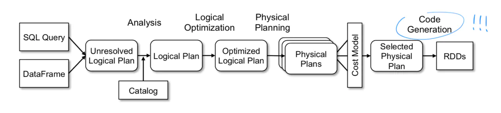

## Spark简介

Apache Spark 是当今最流行的开源大数据处理框架。和人们耳熟能详的 MapReduce 一样，Spark 用于进行分布式、大规模的数据处理，但 Spark 作为 MapReduce 的接任者，提供了更高级的编程接口、更高的性能。除此之外，Spark 不仅能进行常规的批处理计算，还提供了流式计算支持。

Apache Spark 诞生于大名鼎鼎的 AMPLab（这里还诞生过 Mesos 和 Alluxio），从创立之初就带有浓厚的学术气质，其设计目标是为各种大数据处理需求提供一个统一的技术栈。如今 Spark 背后的商业公司 Databricks 创始人也是来自 AMPLab 的博士毕业生。

Spark 本身使用 Scala 语言编写，Scala 是一门融合了面向对象与函数式的“双范式”语言，运行在 JVM 之上。Spark 大量使用了它的函数式、即时代码生成等特性。Spark 目前提供了 Java、Scala、Python、R 四种语言的 API，前两者因为同样运行在 JVM 上可以达到更原生的支持。

## MapReduce 的问题所在

Hadoop 是大数据处理领域的开创者。严格来说，Hadoop 不只是一个软件，而是一整套生态系统，例如 MapReduce 负责进行分布式计算，而 HDFS 负责存储大量文件。

MapReduce 模型的诞生是大数据处理从无到有的飞跃。但随着技术的进步，对大数据处理的需求也变得越来越复杂，MapReduce 的问题也日渐凸显。通常，我们将 MapReduce 的输入和输出数据保留在 HDFS 上，很多时候，**复杂的 ETL、数据清洗等工作无法用一次 MapReduce 完成，所以需要将多个 MapReduce 过程连接起来**：


▲ *上图中只有两个 MapReduce 串联，实际上可能有几十个甚至更多，依赖关系也更复杂。*

这种方式下，**每次中间结果都要写入 HDFS 落盘保存，代价很大**（别忘了，HDFS 的每份数据都需要冗余若干份拷贝）。另外，由于本质上是多次 MapReduce 任务，调度也比较麻烦，实时性无从谈起。

## Spark 与 RDD 模型

针对上面的问题，如果能把中间结果保存在内存里，岂不是快的多？之所以不能这么做，最大的障碍是：分布式系统必须能容忍一定的故障，所谓 fault-tolerance。如果只是放在内存中，一旦某个计算节点宕机，其他节点无法恢复出丢失的数据，只能重启整个计算任务，这对于动辄成百上千节点的集群来说是不可接受的。

一般来说，想做到 fault-tolerance 只有两个方案：要么存储到外部（例如 HDFS），要么拷贝到多个副本。**Spark 大胆地提出了第三种——重算一遍。但是之所以能做到这一点，是依赖于一个额外的假设：所有计算过程都是确定性的（deterministic）。**Spark 借鉴了函数式编程思想，提出了 RDD（Resilient Distributed Datasets），译作“弹性分布式数据集”。


**RDD 是一个只读的、分区的（partitioned）数据集合**。RDD 要么来源于不可变的外部文件（例如 HDFS 上的文件），要么由确定的算子由其他 RDD 计算得到。**RDD 通过算子连接构成有向无环图（DAG）**，上图演示了一个简单的例子，其中节点对应 RDD，边对应算子。

回到刚刚的问题，RDD 如何做到 fault-tolerance？很简单，RDD 中的每个分区都能被确定性的计算出来，所以**一旦某个分区丢失了，另一个计算节点可以从它的前继节点出发、用同样的计算过程重算一次，即可得到完全一样的 RDD 分区**。这个过程可以递归的进行下去。


▲ *上图演示了 RDD 分区的恢复。为了简洁并没有画出分区，实际上恢复是以分区为单位的。*

Spark 的编程接口和 Java 8 的 Stream 很相似：RDD 作为数据，在多种算子间变换，构成对执行计划 DAG 的描述。最后，一旦遇到类似 `collect()` 这样的输出命令，执行计划会被发往 Spark 集群、开始计算。不难发现，算子分成两类：

- `map()`、`filter()`、`join()` 等算子称为 Transformation，它们输入一个或多个 RDD，输出一个 RDD。
- `collect()`、`count()`、`save()` 等算子称为 Action，它们通常是将数据收集起来返回；


▲ *上图的例子用来收集包含“HDFS”关键字的错误日志时间戳。当执行到 collect() 时，右边的执行计划开始运行。*

像之前提到的，RDD 的数据由多个分区（partition）构成，这些分区可以分布在集群的各个机器上，这也就是 RDD 中 “distributed” 的含义。熟悉 DBMS 的同学可以把 RDD 理解为逻辑执行计划，partition 理解为物理执行计划。

此外，RDD 还包含它的每个分区的依赖分区（dependency），以及一个函数指出如何计算出本分区的数据。Spark 的设计者发现，依赖关系依据执行方式的不同可以很自然地分成两种：**窄依赖（Narrow Dependency）和宽依赖（Wide Dependency）**，举例来说：

- `map()`、`filter()` 等算子构成窄依赖：生产的每个分区只依赖父 RDD 中的一个分区。
- `groupByKey()` 等算子构成宽依赖：生成的每个分区依赖父 RDD 中的多个分区（往往是全部分区）。


▲ *左图展示了宽依赖和窄依赖，其中 Join 算子因为 Join key 分区情况不同二者皆有；右图展示了执行过程，由于宽依赖的存在，执行计划被分成 3 个阶段。*

在执行时，窄依赖可以很容易的按流水线（pipeline）的方式计算：对于每个分区从前到后依次代入各个算子即可。**然而，宽依赖需要等待前继 RDD 中所有分区计算完成；换句话说，宽依赖就像一个栅栏（barrier）会阻塞到之前的所有计算完成。**整个计算过程被宽依赖分割成多个阶段（stage），如上右图所示。

> 了解 MapReduce 的同学可能已经发现，宽依赖本质上就是一个 MapReduce 过程。但是相比 MapReduce 自己写 Map 和 Reduce 函数的编程接口，Spark 的接口要容易的多；并且在 Spark 中，多个阶段的 MapReduce 只需要构造一个 DAG 即可。

## 声明式接口：Spark SQL

Spark 诞生后，大幅简化了 MapReduce 编程模型，但人们并不满足于此。我们知道，**与命令式（imperative）编程相对的是声明式（declarative）编程，前者需要告诉程序怎样得到我需要的结果，后者则是告诉程序我需要的结果是什么**。举例而言：你想知道，各个部门 `<dept_id, dept_name>` 中性别为女 `'female'` 的员工分别有多少？

命令式编程中，你需要编写一个程序。下面给出了一种伪代码实现：

```scala
employees = db.getAllEmployees()
countByDept = dict() // 统计各部门女生人数 (dept_id -> count)
for employee in employees:
    if (employee.gender == 'female')
        countByDept[employee.dept_id] += 1
results = list() // 加上 dept.name 列
depts = db.getAllDepartments()
for dept in depts:
    if (countByDept containsKey dept.id)
        results.add(row(dept.id, dept.name, countByDept[dept.id]))
return results;
```

声明式编程中，你只要用关系代数的运算表达出结果：

```scala
employees.join(dept, employees.deptId == dept.id)
         .where(employees.gender == 'female')
         .groupBy(dept.id, dept.name)
         .agg()
```

> 等价地，如果你更熟悉 SQL，也可以写成这样：
>
> ```sql
> SELECT dept.id, dept.name, COUNT(*)
> FROM employees JOIN dept ON employees.dept_id == dept.id
> WHERE employees.gender = 'female'
> GROUP BY dept.id, dept.name
> ```

显然，声明式的要简洁的多！但声明式编程依赖于执行者产生真正的程序代码，所以除了上面这段程序，还需要把数据模型（即 schema）一并告知执行者。声明式编程最广为人知的形式就是 SQL。

Spark SQL 就是这样一个基于 SQL 的声明式编程接口。**你可以将它看作在 Spark 之上的一层封装，在 RDD 计算模型的基础上，提供了 DataFrame API 以及一个内置的 SQL 执行计划优化器 Catalyst。**


▲ *上图黄色部分是 Spark SQL 中新增的部分。*

**DataFrame 就像数据库中的表，除了数据之外它还保存了数据的 schema 信息。**计算中，schema 信息也会经过算子进行相应的变换。DataFrame 的数据是行（row）对象组成的 RDD，对 DataFrame 的操作最终会变成对底层 RDD 的操作。

**Catalyst 是一个内置的 SQL 优化器，负责把用户输入的 SQL 转化成执行计划。**Catelyst 强大之处是它利用了 Scala 提供的代码生成（codegen）机制，物理执行计划经过编译，产出的执行代码效率很高，和直接操作 RDD 的命令式代码几乎没有分别。



▲ *上图是 Catalyst 的工作流程，与大多数 SQL 优化器一样是一个 Cost-Based Optimizer (CBO)，但最后使用代码生成（codegen）转化成直接对 RDD 的操作。*

## 流计算框架：Spark Streaming

以往，批处理和流计算被看作大数据系统的两个方面。我们常常能看到这样的架构——以 Kafka、Storm 为代表的流计算框架用于实时计算，而 Spark 或 MapReduce 则负责每天、每小时的数据批处理。在 ETL 等场合，这样的设计常常导致同样的计算逻辑被实现两次，耗费人力不说，保证一致性也是个问题。

Spark Streaming 正是诞生于此类需求。传统的流计算框架大多注重于低延迟，采用了持续的（continuous）算子模型；而 Spark Streaming 基于 Spark，另辟蹊径提出了 **D-Stream（Discretized Streams）方案：将流数据切成很小的批（micro-batch），用一系列的短暂、无状态、确定性的批处理实现流处理。**


Spark Streaming 的做法在流计算框架中很有创新性，它虽然牺牲了低延迟（一般流计算能做到 100ms 级别，Spark Streaming 延迟一般为 1s 左右），但是带来了三个诱人的优势：

- 更高的吞吐量（大约是 Storm 的 2-5 倍）
- 更快速的失败恢复（通常只要 1-2s），因此对于 straggler（性能拖后腿的节点）直接杀掉即可
- 开发者只需要维护一套 ETL 逻辑即可同时用于批处理和流计算


▲ *上左图中，为了在持续算子模型的流计算系统中保证一致性，不得不在主备机之间使用同步机制，导致性能损失，Spark Streaming 完全没有这个问题；右图是 D-Stream 的原理示意图。*

你可能会困惑，流计算中的状态一直是个难题。但我们刚刚提到 D-Stream 方案是无状态的，那诸如 word count 之类的问题，怎么做到保持 count 算子的状态呢？

答案是通过 RDD：**将前一个时间步的 RDD 作为当前时间步的 RDD 的前继节点，就能造成状态不断更替的效果**。实际上，新的状态 RDD 总是不断生成，而旧的 RDD 并不会被“替代”，而是作为新 RDD 的前继依赖。对于底层的 Spark 框架来说，并没有时间步的概念，有的只是不断扩张的 DAG 图和新的 RDD 节点。


▲ *上图是流式计算 word count 的例子，count 结果在不同时间步中不断累积。*

那么另一个问题也随之而来：随着时间的推进，上图中的状态 RDD `counts` 会越来越多，他的祖先（lineage）变得越来越长，极端情况下，恢复过程可能溯源到很久之前。这是不可接受的！**因此，Spark Streming 会定期地对状态 RDD 做 checkpoint，将其持久化到 HDFS 等存储中，这被称为 lineage cut**，在它之前更早的 RDD 就可以没有顾虑地清理掉了。

## 流计算与 SQL：Spark Structured Streaming

Spark 通过 Spark Streaming 拥有了流计算能力，那 Spark SQL 是否也能具有类似的流处理能力呢？答案是肯定的，只要将**数据流建模成一张不断增长、没有边界的表**，在这样的语义之下，很多 SQL 操作等就能直接应用在流数据上。

> 出人意料的是，Spark Structured Streaming 的流式计算引擎并没有复用 Spark Streaming，而是在 Spark SQL 上设计了新的一套引擎。因此，从 Spark SQL 迁移到 Spark Structured Streaming 十分容易，但从 Spark Streaming 迁移过来就要困难得多。

很自然的，基于这样的模型，Spark SQL 中的大部分接口、实现都得以在 Spark Structured Streaming 中直接复用。将用户的 SQL 执行计划转化成流计算执行计划的过程被称为**增量化**（incrementalize），这一步是由 Spark 框架自动完成的。对于用户来说只要知道：每次计算的输入是某一小段时间的流数据，而输出是对应数据产生的计算结果。


▲ *左图是 Spark Structured Streaming 模型示意图；右图展示了同一个任务的批处理、流计算版本，可以看到，除了输入输出不同，内部计算过程完全相同。*

与 Spark SQL 相比，流式 SQL 计算还有两个额外的特性，分别是窗口（window）和水位（watermark）。

**窗口（window）是对过去某段时间的定义。**批处理中，查询通常是全量的（例如：总用户量是多少）；而流计算中，我们通常关心近期一段时间的数据（例如：最近24小时新增的用户量是多少）。用户通过选用合适的窗口来获得自己所需的计算结果，常见的窗口有滑动窗口（Sliding Window）、滚动窗口（Tumbling Window）等。

**水位（watermark）用来丢弃过早的数据。**在流计算中，上游的输入事件可能存在不确定的延迟，而流计算系统的内存是有限的、只能保存有限的状态，一定时间之后必须丢弃历史数据。以双流 A JOIN B 为例，假设窗口为 1 小时，那么 A 中比当前时间减 1 小时更早的数据（行）会被丢弃；如果 B 中出现 1 小时前的事件，因为无法处理只能忽略。


▲ *上图为水位的示意图，“迟到”太久的数据（行）由于已经低于当前水位无法处理，将被忽略。*

水位和窗口的概念都是因时间而来。在其他流计算系统中，也存在相同或类似的概念。

> 关于 SQL 的流计算模型，常常被拿来对比的还有另一个流计算框架 [Apache Flink](https://flink.apache.org/)。与 Spark 相比，它们的实现思路有很大不同，但在模型上是很相似的。

## 系统架构

Spark 中有三个角色：Driver, Worker 和 Cluster Manager。


**驱动程序（Driver）**即用户编写的程序，对应一个 `SparkContext`，负责任务的构造、调度、故障恢复等。驱动程序可以直接运行在客户端，例如用户的应用程序中；也可以托管在 Master 上，这被称为集群模式（cluster mode），通常用于流计算等长期任务。

**Cluster Manager** 顾名思义负责集群的资源分配，Spark 自带的 Spark Master 支持任务的资源分配，并包含一个 Web UI 用来监控任务运行状况。多个 Master 可以构成一主多备，通过 ZooKeeper 进行协调和故障恢复。通常 Spark 集群使用 Spark Master 即可，但如果用户的集群中不仅有 Spark 框架、还要承担其他任务，官方推荐使用 Mesos 作为集群调度器。

**Worker** 节点负责执行计算任务，上面保存了 RDD 等数据。