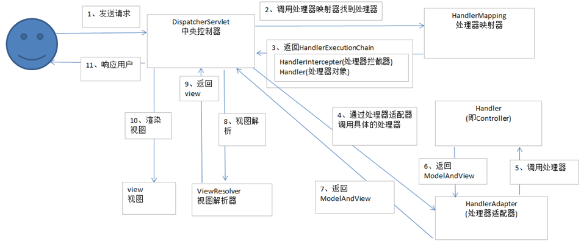
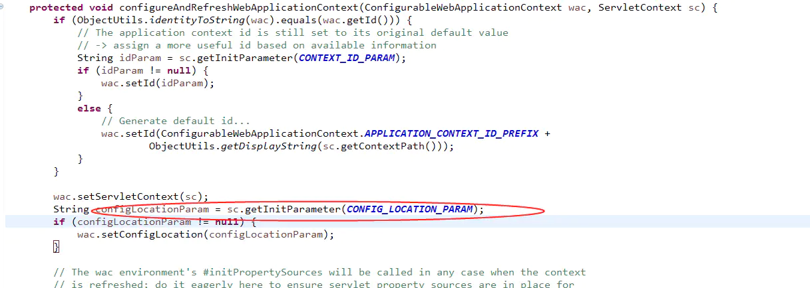
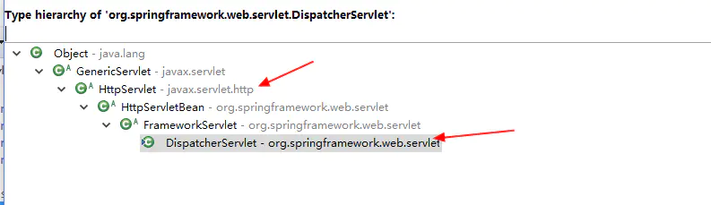
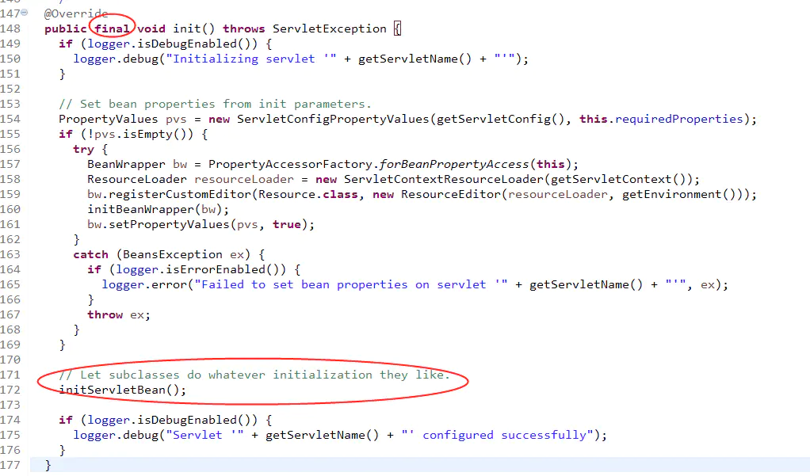
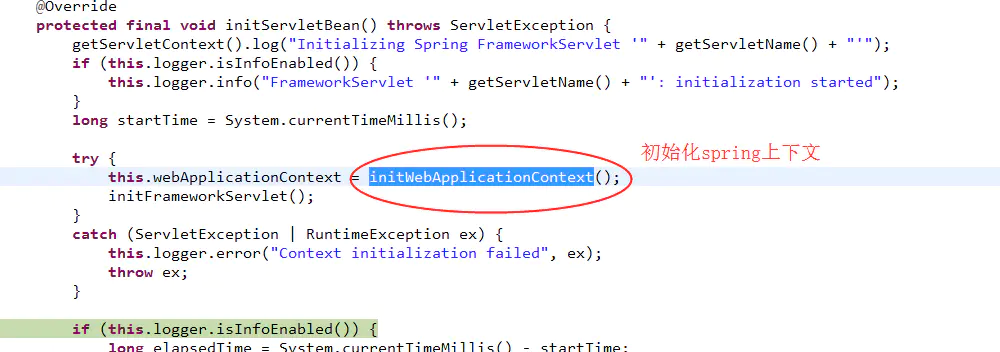

## 概述

[spring](http://lib.csdn.net/base/javaee) MVC主要由DispatcherServlet、处理器映射、处理器(控制器)、视图解析器、视图组成。他的两个核心是:

**处理器映射：** 选择使用哪个控制器来处理请求。 
**视图解析器：** 选择结果应该如何渲染。

## 运行原理

下图是在Spring官网开发手册上找到的，它清晰的诠释了Spring MVC的运行原理



①客户端的所有请求都交给前端控制器DispatcherServlet来处理，它会负责调用系统的其他模块来真正处理用户的请求。

② DispatcherServlet收到请求后，将根据请求的信息（包括URL、HTTP协议方法、请求头、请求参数、Cookie等）以及HandlerMapping的配置找到处理该请求的Handler（任何一个对象都可以作为请求的Handler）。

③在这个地方Spring会通过HandlerAdapter对该处理器进行封装。

④ HandlerAdapter是一个适配器，它用统一的接口对各种Handler中的方法进行调用。

⑤ Handler完成对用户请求的处理后，会返回一个ModelAndView对象给DispatcherServlet，ModelAndView顾名思义，包含了数据模型以及相应的视图的信息。

⑥ ModelAndView的视图是逻辑视图，DispatcherServlet还要借助ViewResolver完成从逻辑视图到真实视图对象的解析工作。⑦ 当得到真正的视图对象后，DispatcherServlet会利用视图对象对模型数据进行渲染。

⑧ 客户端得到响应，可能是一个普通的HTML页面，也可以是XML或JSON字符串，还可以是一张图片或者一个PDF文件。


## 接口的解释

| 接口名称          | 功能                                                         |
| ----------------- | ------------------------------------------------------------ |
| DispatcherServlet | Spring提供的前端控制器，客户端的所有请求都由DispatcherServlet负责分发，当然在DispatcherServlet分发之前，还需要一个匹配请求的过程，这个由HandlerMapping来完成。 |
| HandlerMapping    | 完成客户端请求到Controller映射的工作                         |
| Controller        | 用于处理用户请求，返回处理结果                               |
| ViewResolver      | Web应用中查找View对象，从而将相应结果渲染给客户端            |

## DispatcherServlet：

是整个Spring MVC的核心。它负责接收HTTP请求组织协调Spring MVC的各个组成部分。

其主要工作有以下三项：

1. 截获符合特定格式的URL请求。
2. 初始化DispatcherServlet上下文对应WebApplicationContext，并将其与业务层、持久化层的WebApplicationContext建立关联。
3. 初始化Spring MVC的各个组成组件，并装配到DispatcherServlet中。

## SpringMVC启动流程

#### 前置知识

大家都知道，我们在使用spring mvc时通常会在`web.xml`文件中做如下配置：

`web.xml`

```xml
<?xml version="1.0" encoding="UTF-8"?>
<web-app version="3.0" xmlns="http://java.sun.com/xml/ns/javaee"
    xmlns:xsi="http://www.w3.org/2001/XMLSchema-instance"
    xsi:schemaLocation="http://java.sun.com/xml/ns/javaee http://java.sun.com/xml/ns/javaee/web-app_3_0.xsd">
    
    
    <!-- 上下文参数，在监听器中被使用 -->
    <context-param>
    	<param-name>contextConfigLocation</param-name>
    	<param-value>
        	classpath:applicationContext.xml
        </param-value>
    </context-param>
    
    
    <!-- 监听器配置 -->
    <listener>
    	<listener-class>org.springframework.web.context.ContextLoaderListener</listener-class>
    </listener>
    
    <!-- 前端控制器配置 -->
    <servlet>
    	<servlet-name>dispatcher</servlet-name>
    	<servlet-class>org.springframework.web.servlet.DispatcherServlet</servlet-class>
    	<init-param>
    		<param-name>contextConfigLocation</param-name>
    		<param-value>classpath:applicationContext-mvc.xml</param-value>
    	</init-param>
    	<load-on-startup>1</load-on-startup>
    </servlet>
    <servlet-mapping>
    	<servlet-name>dispatcher</servlet-name>
    	<url-pattern>/</url-pattern>
    </servlet-mapping>

</web-app>
```

上面的配置总结起来有几点内容，分别是：

- 1、配置Spring Web上下文监听器，该监听器同时是Spring mvc启动的入口，至于为什么，后面第二节将会讲到
- 2、前端控制器`DispatcherServlet`,该控制器是Spring mvc处理各种请求的入口及处理器

当我们将spring mvc应用部署到tomcat时，当你不配置任何的`context-param`和`listener`参数,只配置一个`DispatcherServlet`时，那么tomcat在启动的时候是不会初始化spring web上下文的，换句话说，tomcat是不会初始化spring框架的，因为你并没有告诉它们spring的配置文件放在什么地方，以及怎么去加载。所以`listener`监听器帮了我们这个忙，那么为什么配置监听器之后就可以告诉tomcat怎么去加载呢？因为`listener`是实现了servlet技术规范的监听器组件，tomcat在启动时会先加载`web.xml`中是否有servlet监听器存在，有则启动它们。`ContextLoaderListener`是spring框架对servlet监听器的一个封装，本质上还是一个servlet监听器，所以会被执行，但由于`ContextLoaderListener`源码中是基于`contextConfigLocation`和`contextClass`两个配置参数去加载相应配置的，因此就有了我们配置的`context-param`参数了，`servlet`标签里的初始化参数也是同样的道理，即告诉web服务器在启动的同时把spring web上下文（`WebApplicationContext`）也给初始化了。

上面讲了下tomcat加载spring mvc应用的大致流程，接下来将从源码入手分析启动原理。

#### Spring MVC web 上下文启动源码分析

假设现在我们把上面`web.xml`文件中的`<load-on-startup>1</load-on-startup>`给去掉，那么默认tomcat启动时只会初始化spring web上下文，也就是说只会加载到`applicationContext.xml`这个文件，对于`applicationContext-mvc.xml`这个配置文件是加载不到的，`<load-on-startup>1</load-on-startup>`的意思就是让`DispatcherServlet`延迟到使用的时候(`也就是处理请求的时候`)再做初始化。

我们已经知道spring web是基于`servlet`标准去封装的，那么很明显，servlet怎么初始化，`WebApplicationContext`web上下文就应该怎么初始化。我们先看看`ContextLoaderListener`的源码是怎样的。

```java
public class ContextLoaderListener extends ContextLoader implements ServletContextListener {
    // 初始化方法
    @Override
    public void contextInitialized(ServletContextEvent event) {
    	initWebApplicationContext(event.getServletContext());
    }
    // 销毁方法
    @Override
    public void contextDestroyed(ServletContextEvent event) {
    	closeWebApplicationContext(event.getServletContext());
    	ContextCleanupListener.cleanupAttributes(event.getServletContext());
    }
}
```

`ContextLoaderListener`类实现了`ServletContextListener`，本质上是一个servlet监听器，tomcat将会优先加载servlet监听器组件，并调用`contextInitialized`方法,在`contextInitialized`方法中调用`initWebApplicationContext`方法初始化Spring web上下文，看到这焕然大悟，原来Spring mvc的入口就在这里，哈哈~~~赶紧跟进去`initWebApplicationContext`方法看看吧！

`initWebApplicationContext()`方法：

```java
// 创建web上下文，默认是XmlWebApplicationContext
if (this.context == null) {
    this.context = createWebApplicationContext(servletContext);
}

if (this.context instanceof ConfigurableWebApplicationContext) {
    ConfigurableWebApplicationContext cwac = (ConfigurableWebApplicationContext) this.context;
    // 如果该容器还没有刷新过
    if (!cwac.isActive()) {
    	if (cwac.getParent() == null) {
    		ApplicationContext parent = loadParentContext(servletContext);
    		cwac.setParent(parent);
    	}
    	// 配置并刷新容器
    	configureAndRefreshWebApplicationContext(cwac, servletContext);
    }
}
```

上面的方法只做了两件事：

- 1、如果spring web容器还没有创建，那么就创建一个全新的spring web容器，并且该容器为root根容器，下面第三节讲到的servlet spring web容器是在此根容器上创建起来的
- 2、配置并刷新容器

上面代码注释说到默认创建的上下文容器是`XmlWebApplicationContext`,为什么不是其他web上下文呢？为啥不是下面上下文的任何一种呢？


我们可以跟进去`createWebApplicationContext`后就可以发现默认是从一个叫`ContextLoader.properties`文件加载配置的，该文件的内容为：

```html
org.springframework.web.context.WebApplicationContext=org.springframework.web.context.support.XmlWebApplicationContext
```

具体实现为：

```java
protected Class<?> determineContextClass(ServletContext servletContext) {
    // 自定义上下文，否则就默认创建XmlWebApplicationContext
    String contextClassName = servletContext.getInitParameter(CONTEXT_CLASS_PARAM);
    if (contextClassName != null) {
        try {
        	return ClassUtils.forName(contextClassName, ClassUtils.getDefaultClassLoader());
        }
        catch (ClassNotFoundException ex) {
        	throw new ApplicationContextException(
        			"Failed to load custom context class [" + contextClassName + "]", ex);
        }
    }
    else {
        // 从属性文件中加载类名，也就是org.springframework.web.context.support.XmlWebApplicationContext
        contextClassName = defaultStrategies.getProperty(WebApplicationContext.class.getName());
        try {
        	return ClassUtils.forName(contextClassName, ContextLoader.class.getClassLoader());
        }
        catch (ClassNotFoundException ex) {
        	throw new ApplicationContextException(
        			"Failed to load default context class [" + contextClassName + "]", ex);
        }
    }
}
```

上面可以看出其实我们也可以自定义spring web的上下文的，那么怎么去指定我们自定义的上下文呢？答案是通过在`web.xml`中指定`contextClass`参数，因此第一小结结尾时说`contextClass`参数和`contextConfigLocation`很重要~~至于`contextConfigLocation`参数，我们跟进`configureAndRefreshWebApplicationContext`即可看到，如下图：



**总结：**

spring mvc启动流程大致就是从一个叫`ContextLoaderListener`开始的，它是一个servlet监听器，能够被web容器发现并加载，初始化监听器`ContextLoaderListener`之后，接着就是根据配置如`contextConfigLocation`和`contextClass`创建web容器了，如果你不指定`contextClass`参数值，则默认创建的spring web容器类型为`XmlWebApplicationContext`,最后一步就是根据你配置的`contextConfigLocation`文件路径去配置并刷新容器了。

#### DispatcherServlet控制器的初始化

好了，上面我们简单地分析了Spring mvc容器初始化的源码，我们永远不会忘记，我们默认创建的容器类型为`XmlWebApplicationContext`,当然我们也不会忘记，在`web.xml`中，我们还有一个重要的配置，那就是`DispatcherServlet`。下面我们就来分析下`DispatcherServlet`的初始化过程。

`DispatcherServlet`，就是一个servlet，一个用来处理request请求的servlet，它是spring mvc的核心，所有的请求都经过它，并由它指定后续操作该怎么执行，咋一看像一扇门，因此我管它叫“闸门”。在我们继续之前，我们应该共同遵守一个常识，那就是-------无论是监听器还是servlet，都是servlet规范组件，web服务器都可以发现并加载它们。

下面我们先看看`DispatcherServlet`的继承关系：



看到这我们是不是一目了然了，`DispatcherServlet`继承了`HttpServlet`这个类，`HttpServlet`是servlet技术规范中专门用于处理http请求的servlet，这就不难解释为什么spring mvc会将`DispatcherServlet`作为统一请求入口了。

因为一个servlet的生命周期是`init()`->`service()`->`destory()`，那么`DispatcherServlet`怎么初始化呢？看上面的继承图，我们进到`HttpServletBean`去看看。

果不其然，`HttpServletBean`类中有一个`init()`方法，`HttpServletBean`是一个抽象类，`init()`方法如下：



可以看出方法采用`final`修饰，因为`final`修饰的方法是不能被子类继承的，也就是子类没有同样的`init()`方法了，这个`init`方法就是`DispatcherServlet`的初始化入口了。

接着我们跟进`FrameworkServlet`的`initServletBean()`方法：



在方法中将会初始化不同于第一小节的web容器，请记住，这个新的spring web 容器是专门为`dispactherServlet`服务的，而且这个新容器是在第一小节根ROOT容器的基础上创建的，我们在`<servlet>`标签中配置的初始化参数被加入到新容器中去。

至此，`DispatcherSevlet`的初始化完成了，听着有点蒙蔽，但其实也是这样，上面的分析仅仅只围绕一个方法，它叫`init()`，所有的servlet初始化都将调用该方法。

**总结:**

`dispactherServlet`的初始化做了两件事情，第一件事情就是根据根web容器，也就是我们第一小节创建的`XmlWebApplicationContext`，然后创建一个专门为`dispactherServlet`服务的web容器，第二件事情就是将你在web.xml文件中对`dispactherServlet`进行的相关配置加载到新容器当中。

发现其实大致流程就差不多了。