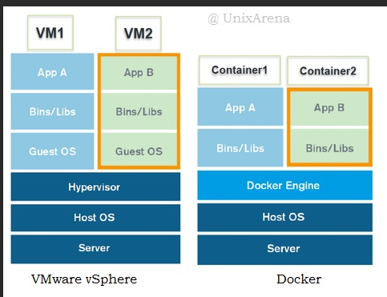
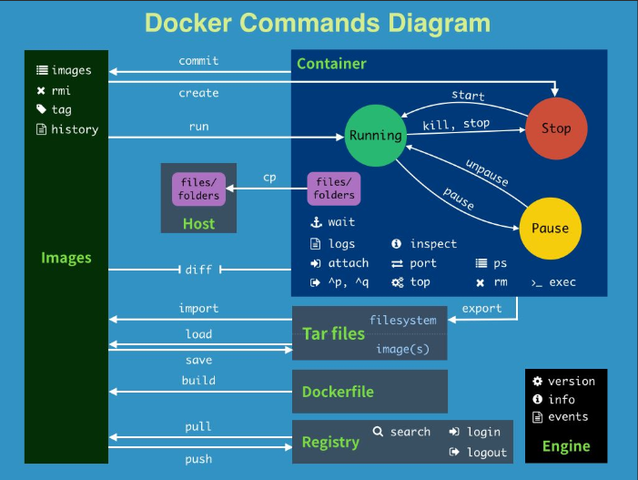

### Docker安装

- 环境要求,Linux要求内核3.0以上

  ```shell
  #系统信息
  [root@master ~]# cat /etc/os-release 
  NAME="CentOS Linux"
  VERSION="7 (Core)"
  ID="centos"
  ID_LIKE="rhel fedora"
  VERSION_ID="7"
  PRETTY_NAME="CentOS Linux 7 (Core)"
  ANSI_COLOR="0;31"
  CPE_NAME="cpe:/o:centos:centos:7"
  HOME_URL="https://www.centos.org/"
  BUG_REPORT_URL="https://bugs.centos.org/"

  CENTOS_MANTISBT_PROJECT="CentOS-7"
  CENTOS_MANTISBT_PROJECT_VERSION="7"
  REDHAT_SUPPORT_PRODUCT="centos"
  REDHAT_SUPPORT_PRODUCT_VERSION="7"

  [root@master ~]# uname -r
  3.10.0-862.el7.x86_64
  ```

- 安装步骤,[官方文档地址](https://docs.docker.com/engine/install/)

  ```shell
  #1.卸载旧版本
   sudo yum remove docker \
                    docker-client \
                    docker-client-latest \
                    docker-common \
                    docker-latest \
                    docker-latest-logrotate \
                    docker-logrotate \
                    docker-engine
  #2.需要的安装包
   sudo yum install -y yum-utils
  #3.设置镜像的仓库,默认是国外的,推荐使用国内的
   sudo yum-config-manager \
      --add-repo \
      https://download.docker.com/linux/centos/docker-ce.repo
      
      https://mirrors.aliyun.com/docker-ce/linux/centos/docker-ce.repo #阿里云镜像
  #4.更新yum软件包索引,非必须操作
    yum makecache fast
  #5.安装docker相关的docker-ce社区版
   sudo yum install docker-ce docker-ce-cli containerd.io
  #6.使用docker version查看安装是否成功
    docker version
  #7.测试
    docker run hello-world`
  ```

- 卸载docker

  ```shell
  #1.卸载依赖
  yum remove docker-ce docker-ce-cli containerd.io
  #2.删除资源
  rm -rf /var/lib/docker
  ```

  ​

**note:运行`docker run xxx`命令启动容器时出现错误如下:**

**Error response from daemon: Get <https://registry-1.docker.io/v2/>: x509: certificate has expired or is not yet valid**

则是系统时间未同步,需要同步时间,执行如下命令

```shell
ntpdate -u cn.pool.ntp.org
```

### Docker底层原理

Docker是怎么工作的？

Docker是一个Client-Server结构的系统，Docker的守护进程运行在主机上。通过Socket从客户端访问！

Docker-Server接收到Docker-Client的指令，就会执行这个命令！

**为什么Docker比Vm快**

1、docker有着比虚拟机更少的抽象层。由于docker不需要Hypervisor实现硬件资源虚拟化,运行在docker容器上的程序直接使用的都是实际物理机的硬件资源。因此在CPU、内存利用率上docker将会在效率上有明显优势。
2、docker利用的是宿主机的内核,而不需要Guest OS。

> ```shell
> GuestOS： VM（虚拟机）里的的系统（OS）;
> HostOS：物理机里的系统（OS）；
> ```
>
> 

因此,==当新建一个容器时,**docker不需要和虚拟机一样重新加载一个操作系统内核**。从而避免引导、加载操作系统内核返个比较费时费资源的过程==,当新建一个虚拟机时,虚拟机软件需要加载GuestOS,返个新建过程是分钟级别的。而==docker由于直接利用宿主机的操作系统==,则省略了这个复杂的过程,因此新建一个docker容器只需要几秒钟。

### Docker常用命令

#### **帮助命令**

```shell
docker version		#显示docker的版本信息
docker info			#显示docker的系统信息,包括镜像和容器的数量
docker xxx --help	#帮助命令
```

#### **镜像命令**

```shell
docker images		#查看所有本地主机上的镜像,可以使用docker image ls 代替
docker search		#搜索镜像
docker pull 镜像名[:tag]	#下载镜像,如果不写tag,默认latest,即最新版 docker pull mysql:5.7
docker rmi -f		#删除镜像,-f为强制删除,即可以删除正在运行的镜像
docker rmi -f $(docker images -aq)	#删除全部镜像
```

**docker pull** 下载镜像

```shell
# 下载镜像 docker pull 镜像名[:tag]
[root@master ~]# docker pull nginx
Using default tag: latest # 如果不写,tag默认就是latest
latest: Pulling from library/nginx
f7ec5a41d630: Already exists #分层下载,docker image的核心 联合文件系统(镜像间重复的部分不重复下载)
aa1efa14b3bf: Pull complete 
b78b95af9b17: Pull complete 
c7d6bca2b8dc: Pull complete 
cf16cd8e71e0: Pull complete 
0241c68333ef: Pull complete 
Digest: sha256:75a55d33ecc73c2a242450a9f1cc858499d468f077ea942867e662c247b5e412 #签名
Status: Downloaded newer image for nginx:latest #真实地址
docker.io/library/nginx:latest

#等价于它
docker pull mysql
docker pull docker.io/library/nginx:latest
```

#### 容器命令

```shell
docker run 镜像id		#新建容器并启动
docker run [可选参数] image | docker container run [可选参数] image
#参数说明
--name="Name"		容器名字 nginx01 nginx02 用来区分容器
-d					后台方式运行
-it					使用交互式方式运行,进入容器查看内容
-p					指定容器的端口 -p 8080(宿主机):8080(容器)
			-p ip:主机端口:容器端口
			-p 主机端口:容器端口
			-p 容器端口
-P			随即指定端口		
docker ps                 # 列出所有运行的容器 docker container list
  -a, --all             Show all containers (default shows just running)
  -n, --last int        Show n last created containers (includes all states) (default -1)
  -q, --quiet           Only display numeric IDs
docker rm                 # 容器id 删除指定容器
docker start 容器id         #启动容器
docker restart 容器id     #重启容器
docker stop 容器id         #停止当前正在运行的容器
docker kill 容器id         #强制停止当前容器

exit #容器直接退出
ctrl +P +Q #容器不停止退出
```

#### 常用其他命令

> **后台启动命令**

```shell
#命令 docker run -d 镜像名
[root@master ~]# docker run -d centos
#问题 docker ps.发现centos停止了

#常见的坑,docker 容器使用后台运行,就必须要有一个前台进程,docker发现没有应用,就会停止
#nginx,容器启动后,发现自己没有提供服务,就会立刻停止,就没有程序了
```

> **查看日志**

```shell
docker logs --help
Options:
      --details        Show extra details provided to logs
  -f, --follow         Follow log output
      --since string   Show logs since timestamp (e.g. 2013-01-02T13:23:37Z) or relative (e.g. 42m for 42 minutes)
  -n, --tail string    Number of lines to show from the end of the logs (default "all")
  -t, --timestamps     Show timestamps
      --until string   Show logs before a timestamp (e.g. 2013-01-02T13:23:37Z) or relative (e.g. 42m for 42 minutes)
[root@master ~]# docker run -d centos /bin/sh -c "while true;do echo 6666;sleep 1;done" #模拟日志      
#显示日志
-tf        #显示日志信息（一直更新）
--tail number #需要显示日志条数
docker logs -t --tail n 容器id #查看n行日志
docker logs -ft 容器id #跟着日志
```

> **查看镜像元数据**

```shell
docker inspect 容器id
```

> 进入当前正在运行的容器

```shell
 # 我们通常容器都是使用后台方式运行的，需要进入容器，修改一些配置
 
 docker exec -it 容器id bash
 
 #测试
 [root@master ~]# docker ps
CONTAINER ID   IMAGE     COMMAND                  CREATED       STATUS       PORTS     NAMES
a40effcf407c   centos    "bash -c 'while true…"   5 hours ago   Up 5 hours             gifted_matsumoto
#方式一
[root@master ~]# docker exec -it a40effcf407c bash
# 方式二
[root@master ~]# docker attach a40effcf407c

# 区别
#docker exec     # 进入当前容器后开启一个新的终端，可以在里面操作。（常用）
#docker attach     # 进入容器正在执行的终端
```

> **从容器内拷贝文件到主机上**

```shell
docker cp 容器id:容器内路径 主机目标路径
#进入docker容器内部
[root@master tiger]# docker exec -it a40effcf4 bash
[root@a40effcf407c /]# ls
bin  dev  etc  home  lib  lib64  lost+found  media  mnt  opt  proc  root  run  sbin  srv  sys  tmp  usr  var
[root@a40effcf407c /]# cd /home/
#新建一个文件
[root@a40effcf407c home]# touch test.go 
[root@a40effcf407c home]# read escape sequence
[root@master tiger]# docker cp a40effcf4:/home/test.go /home/tiger/
[root@master tiger]# ls #可以看见test.go的存在
# 拷贝是一个手动过程,未来我们使用-v卷的技术,可以实现自动同步
```

#### **小结**

```shell
 attach      Attach local standard input, output, and error streams to a running container #当前shell下 attach连接指定运行的镜像
  build       Build an image from a Dockerfile # 通过Dockerfile定制镜像
  commit      Create a new image from a container's changes #提交当前容器为新的镜像
  cp          Copy files/folders between a container and the local filesystem #拷贝文件
  create      Create a new container #创建一个新的容器
  diff        Inspect changes to files or directories on a container's filesystem #查看docker容器的变化
  events      Get real time events from the server # 从服务获取容器实时时间
  exec        Run a command in a running container # 在运行中的容器上运行命令
  export      Export a container's filesystem as a tar archive #导出容器文件系统作为一个tar归档文件[对应import]
  history     Show the history of an image # 展示一个镜像形成历史
  images      List images #列出系统当前的镜像
  import      Import the contents from a tarball to create a filesystem image #从tar包中导入内容创建一个文件系统镜像
  info        Display system-wide information # 显示全系统信息
  inspect     Return low-level information on Docker objects #查看容器详细信息
  kill        Kill one or more running containers # kill指定docker容器
  load        Load an image from a tar archive or STDIN #从一个tar包或标准输入中加载一个镜像[对应save]
  login       Log in to a Docker registry #
  logout      Log out from a Docker registry
  logs        Fetch the logs of a container
  pause       Pause all processes within one or more containers
  port        List port mappings or a specific mapping for the container
  ps          List containers
  pull        Pull an image or a repository from a registry
  push        Push an image or a repository to a registry
  rename      Rename a container
  restart     Restart one or more containers
  rm          Remove one or more containers
  rmi         Remove one or more images
  run         Run a command in a new container
  save        Save one or more images to a tar archive (streamed to STDOUT by default)
  search      Search the Docker Hub for images
  start       Start one or more stopped containers
  stats       Display a live stream of container(s) resource usage statistics
  stop        Stop one or more running containers
  tag         Create a tag TARGET_IMAGE that refers to SOURCE_IMAGE
  top         Display the running processes of a container
  unpause     Unpause all processes within one or more containers
  update      Update configuration of one or more containers
  version     Show the Docker version information
  wait        Block until one or more containers stop, then print their exit codes
```



#### 作业练习

> docker安装nginx

```shell
[root@master tiger]# docker pull nginx
Using default tag: latest
latest: Pulling from library/nginx
Digest: sha256:75a55d33ecc73c2a242450a9f1cc858499d468f077ea942867e662c247b5e412
Status: Image is up to date for nginx:latest
docker.io/library/nginx:latest
[root@master tiger]# docker images
REPOSITORY   TAG       IMAGE ID       CREATED        SIZE
mysql        latest    0627ec6901db   10 days ago    556MB
nginx        latest    62d49f9bab67   2 weeks ago    133MB
centos       latest    300e315adb2f   4 months ago   209MB
[root@master tiger]# docker run -d -p 8080:8080 nginx
8b1ade9ca03a86942261182fab9541d433a81ed7332f12d9a9e9cd5acb459828
[root@master tiger]# docker run -d -p 8080:80 nginx
[[root@master tiger]# docker ps
CONTAINER ID   IMAGE     COMMAND                  CREATED          STATUS          PORTS                                               NAMES
8b1ade9ca03a   nginx     "/docker-entrypoint.…"   42 seconds ago   Up 29 seconds   80/tcp, 0.0.0.0:8080->80/tcp, :::8080->8080/tcp   wizardly_northcutt

[root@master tiger]# curl localhost:8080
```

> docker安装tomcat

```shell
# 官方建议
$ docker run -it --rm tomcat:9.0 # 之前的方式都是后台启动,停止了容器之后,容器还可以查到  docker run -it --rm 一般用来测试,用完之后直接删除镜像与容器

# 下载启动tomcat
docker pull tomcat
docker run -d -p 8081:8080 tomcat #测试会是一个404界面,因为webapp里面没有东西
```

- 思考问题

  > 每次部署项目，如果都要进入容器会很麻烦，如果可以通过在容器外部提供一个映射路径webapps，在外部放入项目，就自动同步到内部就很方便。

> docker部署 es + kibana

```shell
# es 暴露的端口很多
# es 十分的耗内存
# es 的数据一般需要放置到安全目录！挂载
# --net somenetwork 网络配置
docker run -d --name elasticsearch --net somenetwork -p 9200:9200 -p 9300:9300 -e "discovery.type=single-node" elasticsearch:tag
# 启动后linux就卡住了，docker status查看状态，可以看出es非常耗费内存，普通机器（阿里云低配）带不动
CONTAINER ID   NAME            CPU %     MEM USAGE / LIMIT     MEM %     NET I/O       BLOCK I/O        PIDS
b0573b79879e   elasticsearch   1.28%     1.254GiB / 2.763GiB   45.39%    2.41kB / 0B   52.3MB / 807kB   44


# 增加内存限制，修改配置文件 -e 环境修改
docker run -d --name elasticsearch -p 9200:9200 -p 9300:9300 -e "discovery.type=single-node" -e ES_JAVA_OPTS="-Xms64m -Xms512m" elasticsearch:7.6.2
```

### Docker镜像

> #### 什么是镜像

镜像是一种轻量级、可执行的独立软件包，用来打包软件运行环境和基于运行环境开发的软件，它包含运行某个软件所需的所有内容，包含代码、运行时、库、环境变量和配置文件，镜像可以通过远程仓库下载或拷贝获取，也可以使用DockerFile自己制作镜像。

> #### 联合文件系统

Union文件系统（UnionFS）是一种分层、轻量级并且高性能的文件系统，它支持对文件系统的修改作为一次提交来一层一层的叠加，同时可以将不同目录挂载到同一个虚拟文件系统下。镜像可以通过分层来进行继承，基于基础镜像（没有父镜像，类似java类中的Object对象），可以制作各种具体的应用镜像。

- UnionFS特性

一次同时加载多个文件系统，但从外面看起来，只能看到一个文件系统，联合加载会把各层文件系统叠加起来，这样最终的文件系统会包含所有底层的文件和目录。

> #### 镜像加载原理


> 使用常遇到的坑

1.Cannot connect to the Docker daemon at unix:///var/run/docker.sock. Is the docker daemon running?重启电脑后使用docker命令出现上述提示。

解决思路：因为没有设置开机自启动docker服务，所以需要重新启动 运行`service docker start`即可