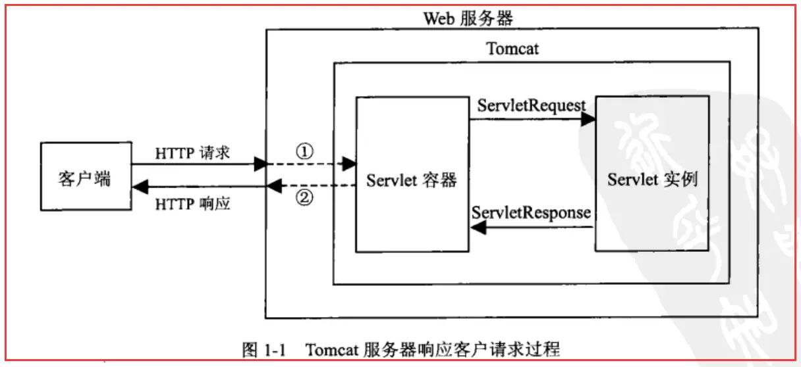
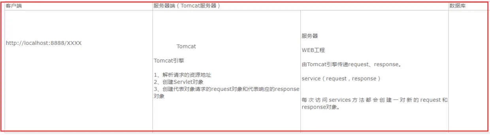

# javaWeb三大核心组件之Servlet

### 什么是Servlet

Java Servlet 是运行在 Web 服务器或应用服务器上的程序，它是作为来自 Web 浏览器或其他 HTTP 客户端的请求和 HTTP 服务器上的数据库或应用程序之间的中间层。

使用 Servlet，您可以收集来自网页表单的用户输入，呈现来自数据库或者其他源的记录，还可以动态创建网页。

Java Servlet 通常情况下与使用 CGI（Common Gateway Interface，公共网关接口）实现的程序可以达到异曲同工的效果。但是相比于 CGI，Servlet 有以下几点优势：

性能明显更好。

Servlet 在 Web 服务器的地址空间内执行。这样它就没有必要再创建一个单独的进程来处理每个客户端请求。

Servlet 是独立于平台的，因为它们是用 Java 编写的。

服务器上的 Java 安全管理器执行了一系列限制，以保护服务器计算机上的资源。因此，Servlet 是可信的。

Java 类库的全部功能对 Servlet 来说都是可用的。它可以通过 sockets 和 RMI 机制与 applets、数据库或其他软件进行交互。

### Tomcat与Servlet的关系

Tomcat 是Web应用服务器,是一个Servlet/JSP容器. Tomcat 作为Servlet容器,负责处理客户请求,把请求传送给Servlet,并将Servlet的响应传送回给客户.而Servlet是一种运行在支持Java语言的服务器上的组件.。

Servlet最常见的用途是扩展Java Web服务器功能,提供非常安全的,可移植的,易于使用的CGI替代品。从http协议中的请求和响应可以得知，浏览器发出的请求是一个请求文本，而浏览器接收到的也应该是一个响应文本。

1. Tomcat将http请求文本接收并解析，然后封装成HttpServletRequest类型的request对象，所有的HTTP头数据读可以通过request对象调用对应的方法查询到。
2. Tomcat同时会要响应的信息封装为HttpServletResponse类型的response对象，通过设置response属性就可以控制要输出到浏览器的内容，然后将response交给tomcat，tomcat就会将其变成响应文本的格式发送给浏览器。

Java Servlet API 是Servlet容器(tomcat)和servlet之间的接口，它定义了serlvet的各种方法，还定义了Servlet容器传送给Servlet的对象类，其中最重要的就是ServletRequest和ServletResponse。所以说我们在编写servlet时，需要实现Servlet接口，按照其规范进行操作。

### Servlet执行过程

 在浏览器的地址栏输入：http://ip:port/appNames/servlet

  1）通过浏览器和ip：port和这个服务器建立连接。
  2） 浏览器会生成一个请求数据包（路径appNames/servlet）向服务器发送请求。
  3） 服务器收到请求数据包，分析请求资源路径做精准定位，通过请求的appName查找webapps文件下面的appName做匹配，匹配上了需要获取web.xml中的servlet(mapping)。 
  4） 服务器创建两个对象：
    第一个对象：请求对象，该对象实现了HttpServletRequest接口，服务器会将请求数据包中的数据解析出来,存储在该对象里。这样做的好处是没有必要理解http协议，只需要读取request。
    第二个对象：响应对象，实现了HttpServletResponse接口，作用是servlet处理完成后的结果可以存放到该对象上，然后服务器依据该对象的数据生成响应数据包。
  5） servlet在执行servlet()方法时，可以通过request获取请求数据，也可以将处理结果存放到response上。然后服务器与响应对象直接形成一个默契，生成一个响应数据包给浏览器。
  6）浏览器解析服务器返回的响应数据包，生成响应的结果。

  

Servlet访问的过程：
Http请求---->web.xml-------->  url -pattern----->servlet-name----->servlet-class----->   QuickStratServlet(对应的Class文件)

### Servlet生命周期

SpringMVC是基于servlet，控制器基于方法级别的拦截，处理器设计为单实例，所以应该了解一下Servlet的生命周期。

Servlet 加载—>实例化—>服务—>销毁。

**init**（）：

在Servlet的生命周期中，仅执行一次init()方法。它是在服务器装入Servlet时执行的，负责初始化Servlet对象。可以配置服务器，以在启动服务器或客户机首次访问Servlet时装入Servlet。无论有多少客户机访问Servlet，都不会重复执行init（）。

**service**（）：

它是Servlet的核心，负责响应客户的请求。每当一个客户请求一个HttpServlet对象，该对象的Service()方法就要调用，而且传递给这个方法一个“请求”（ServletRequest）对象和一个“响应”（ServletResponse）对象作为参数。在HttpServlet中已存在Service()方法。默认的服务功能是调用与HTTP请求的方法相应的do功能。

**destroy**（）：

仅执行一次，在服务器端停止且卸载Servlet时执行该方法。当Servlet对象退出生命周期时，负责释放占用的资源。一个Servlet在运行service()方法时可能会产生其他的线程，因此需要确认在调用destroy()方法时，这些线程已经终止或完成。