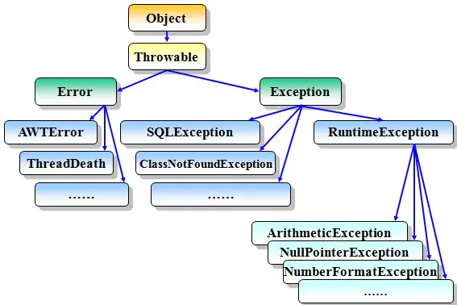

## Java异常介绍

异常时什么？就是指阻止当前方法或作用域继续执行的问题,当程序运行时出现异常时,系统就会自动生成一个Exception对象来通知程序进行相应的处理。Java异常的类型有很多种，下面我们就使用一张图来看一下Java异常的继承层次结构：



### Java异常中的Error

Error一般表示编译时或者系统错误，例如：虚拟机相关的错误，系统崩溃（例如：我们开发中有时会遇到的OutOfMemoryError）等。这种错误无法恢复或不可捕获,将导致应用程序中断,通常应用程序无法处理这些错误,因此也不应该试图用catch来进行捕获。

### Java异常中的Exception

上面我们有介绍，Java异常的中的Exception分为受检查异常和运行时异常（不受检查异常）。下面我们展开介绍。

#### Java中的受检查异常

相信大家在写IO操作的代码的时候，一定有过这样的记忆，对File或者Stream进行操作的时候一定需要使用try-catch包起来，否则编译会失败，这是因为这些异常类型是受检查的异常类型。编译器在编译时，对于受检异常必须进行try...catch或throws处理,否则无法通过编译。常见的受检查异常包括：IO操作、ClassNotFoundException、线程操作等。

#### Java中的非受检查异常（运行时异常）

RuntimeException及其子类都统称为非受检查异常，例如：NullPointExecrption、NumberFormatException（字符串转换为数字）、ArrayIndexOutOfBoundsException（数组越界）、ClassCastException（类型转换错误）、ArithmeticException（算术错误）等。

### Java的异常处理

Java处理异常的一般格式是这样的：

```java
try{
    ///可能会抛出异常的代码
}catch(Type1 id1){
    //处理Type1类型异常的代码
}catch(Type2 id2){
    //处理Type2类型异常的代码
}
```

try块中放置可能会发生异常的代码(但是我们不知道具体会发生哪种异常)。如果异常发生了，try块抛出系统自动生成的异常对象，然后异常处理机制将负责搜寻参数与异常类型相匹配的第一个处理程序，然后进行catch语句执行(不会在向下查找)。如果我们的catch语句没有匹配到，那么JVM虚拟机还是会抛出异常的。

#### Java中的throws关键字

如果在当前方法不知道该如何处理该异常时，则可以使用throws对异常进行抛出给调用者处理或者交给JVM。JVM对异常的处理方式是：打印异常的跟踪栈信息并终止程序运行。throws在使用时应处于方法签名之后使用，可以抛出多种异常并用英文字符逗号’,’隔开。下面是一个例子：

```java
public void f() throws ClassNotFoundException,IOException{}
```

这样我们调用f()方法的时候必须要catch-ClassNotFoundException和IOException这两个异常或者catch-Exception基类。
注意：
throws的这种使用方式只是Java编译期要求我们这样做的，我们完全可以只在方法声明中throws相关异常，但是在方法里面却不抛出任何异常，这样也能通过编译，我们通过这种方式间接的绕过了Java编译期的检查。这种方式有一个好处：为异常先占一个位置，以后就可以抛出这种异常而不需要修改已有的代码。在定义抽象类和接口的时候这种设计很重要，这样派生类或者接口实现就可以抛出这些预先声明的异常。

#### 打印异常信息

异常类的基类Exception中提供了一组方法用来获取异常的一些信息.所以如果我们获得了一个异常对象,那么我们就可以打印出一些有用的信息,最常用的就是void printStackTrace()这个方法,这个方法将返回一个由栈轨迹中的元素所构成的数组,其中每个元素都表示栈中的一帧.元素0是栈顶元素,并且是调用序列中的最后一个方法调用(这个异常被创建和抛出之处);他有几个不同的重载版本,可以将信息输出到不同的流中去.下面的代码显示了如何打印基本的异常信息:

```java
public void f() throws IOException{
    System.out.println("Throws SimpleException from f()"); 
    throw new IOException("Crash");
 }
 public static void main(String[] agrs) {
    try {
    	new B().f();
    } catch (IOException e) {
    	System.out.println("Caught  Exception");
        System.out.println("getMessage(): "+e.getMessage());
        System.out.println("getLocalizedMessage(): "+e.getLocalizedMessage());
        System.out.println("toString(): "+e.toString());
        System.out.println("printStackTrace(): ");
        e.printStackTrace(System.out);
    }
}
```

我们来看输出：

```html
Throws SimpleException from f()
Caught  Exception
getMessage(): Crash
getLocalizedMessage(): Crash
toString(): java.io.IOException: Crash
printStackTrace(): 
java.io.IOException: Crash
	at com.learn.example.B.f(RunMain.java:19)
	at com.learn.example.RunMain.main(RunMain.java:26)
```

#### 使用finally进行清理

引入finally语句的原因是我们希望一些代码总是能得到执行,无论try块中是否抛出异常.这样异常处理的基本格式变成了下面这样:

```java
try{
    //可能会抛出异常的代码
}
catch(Type1 id1){
    //处理Type1类型异常的代码
}
catch(Type2 id2){
    //处理Type2类型异常的代码
}
finally{
    //总是会执行的代码
}
```

在Java中希望除内存以外的资源恢复到它们的初始状态的时候需要使用的finally语句。例如打开的文件或者网络连接，屏幕上的绘制的图像等。下面我们来看一下案例：

```java
public class FinallyException {
    static int count = 0;

    public static void main(String[] args) {
        while (true){
            try {
                if (count++ == 0){
                    throw new ThreeException();
                }
                System.out.println("no Exception");
            }catch (ThreeException e){
                System.out.println("ThreeException");
            }finally {
                System.out.println("in finally cause");
                if(count == 2)
                    break;
            }
        }
    }
}

class ThreeException extends Exception{}
```

我们来看输出：

```html
ThreeException
in finally cause
no Exception
in finally cause
```

如果我们在try块或者catch块里面有return语句的话，那么finally语句还会执行吗？我们看下面的例子：

```java
public class MultipleReturns {
    public static void f(int i){
        System.out.println("start.......");
        try {
            System.out.println("1");
            if(i == 1)
                return;
            System.out.println("2");
            if (i == 2)
                return;
            System.out.println("3");
            if(i == 3)
                return;
            System.out.println("else");
            return;
        }finally {
            System.out.println("end");
        }
    }

    public static void main(String[] args) {
        for (int i = 1; i<4; i++){
            f(i);
        }
    }
}
```

我们来看运行结果：

```html
start.......
1
end
start.......
1
2
end
start.......
1
2
3
end
```

我们看到即使我们在try或者catch块中使用了return语句，finally子句还是会执行。那么有什么情况finally子句不会执行呢？
有下面两种情况会导致Java异常的丢失

- finally中重写抛出异常（finally中重写抛出另一种异常会覆盖原来捕捉到的异常）
- 在finally子句中返回（即return）

### Java异常栈

前面稍微提到了点Java异常栈的相关内容，这一节我们通过一个简单的例子来更加直观的了解异常栈的相关内容。我们再看Exception异常的时候会发现，发生异常的方法会在最上层，main方法会在最下层，中间还有其他的调用层次。这其实是栈的结构，先进后出的。下面我们通过例子来看下：

```java
public class WhoCalled {
    static void f() {
        try {
            throw new Exception();
        } catch (Exception e) {
            for (StackTraceElement ste : e.getStackTrace()){
                System.out.println(ste.getMethodName());
            }
        }
    }

    static void g(){
        f();
    }

    static void h(){
        g();
    }

    public static void main(String[] args) {
        f();
        System.out.println("---------------------------");
        g();
        System.out.println("---------------------------");
        h();
        System.out.println("---------------------------");
    }
}
```

我们来看输出结果：

```html
f
main
---------------------------
f
g
main
---------------------------
f
g
h
main
---------------------------
```

可以看到异常信息都是从内到外的，按我的理解查看异常的时候要从第一条异常信息看起，因为那是异常发生的源头。

### 重新抛出异常及异常链

我们知道每遇到一个异常信息，我们都需要进行try…catch,一个还好，如果出现多个异常呢？分类处理肯定会比较麻烦，那就一个Exception解决所有的异常吧。这样确实是可以，但是这样处理势必会导致后面的维护难度增加。最好的办法就是将这些异常信息封装，然后捕获我们的封装类即可。
我们有两种方式处理异常，一是throws抛出交给上级处理，二是try…catch做具体处理。但是这个与上面有什么关联呢？try…catch的catch块我们可以不需要做任何处理，仅仅只用throw这个关键字将我们封装异常信息主动抛出来。然后在通过关键字throws继续抛出该方法异常。它的上层也可以做这样的处理，以此类推就会产生一条由异常构成的异常链。
通过使用异常链，我们可以提高代码的可理解性、系统的可维护性和友好性。
我们捕获异常以后一般会有两种操作

- 捕获后抛出原来的异常，希望保留最新的异常抛出点－－fillStackTrace
- 捕获后抛出新的异常，希望抛出完整的异常链－－initCause

#### 捕获异常后重新抛出异常

在函数中捕获了异常，在catch模块中不做进一步的处理，而是向上一级进行传递catch(Exception e){ throw e;}，我们通过例子来看一下：

```java
public class ReThrow {
    public static void f()throws Exception{
        throw new Exception("Exception: f()");
    }

    public static void g() throws Exception{
        try{
            f();
        }catch(Exception e){
            System.out.println("inside g()");
            throw e;
        }
    }
    public static void main(String[] args){
        try{
            g();
        }
        catch(Exception e){
            System.out.println("inside main()");
            e.printStackTrace(System.out);
        }
    }
}
```

我们来看输出：

```html
inside g()
inside main()
java.lang.Exception: Exception: f()
        //异常的抛出点还是最初抛出异常的函数f()
	at com.learn.example.ReThrow.f(RunMain.java:5)
	at com.learn.example.ReThrow.g(RunMain.java:10)
	at com.learn.example.RunMain.main(RunMain.java:21)
```

#### fillStackTrace——覆盖前边的异常抛出点(获取最新的异常抛出点)

在此抛出异常的时候进行设置catch(Exception e){ (Exception)e.fillInStackTrace();}我们通过例子看一下：(还是刚才的例子)

```java
public void g() throws Exception{
    try{
        f();
    }catch(Exception e){
    	System.out.println("inside g()");
        throw (Exception)e.fillInStackTrace();
    }
}
```

运行结果如下：

```html
inside g()
inside main()
java.lang.Exception: Exception: f()
        //显示的就是最新的抛出点
	at com.learn.example.ReThrow.g(RunMain.java:13)
	at com.learn.example.RunMain.main(RunMain.java:21)
```

#### 捕获异常后抛出新的异常（保留原来的异常信息，区别于捕获异常之后重新抛出）

如果我们在抛出异常的时候需要保留原来的异常信息，那么有两种方式

- 方式1:Exception e＝new Exception(); e.initCause(ex);
- 方式2:Exception e =new Exception(ex);

```java
class ReThrow {
    public void f(){
        try{
             g(); 
         }catch(NullPointerException ex){
             //方式1
             Exception e=new Exception();
             //将原始的异常信息保留下来
             e.initCause(ex);
             //方式2
             //Exception e=new Exception(ex);
             try {
    		    throw e;
    		} catch (Exception e1) {
    		    e1.printStackTrace();
    		}
         }
    }

    public void g() throws NullPointerException{
    	System.out.println("inside g()");
        throw new NullPointerException();
    }
}

public class RunMain {
    public static void main(String[] agrs) {
    	try{
            new ReThrow().f();
        }
        catch(Exception e){
            System.out.println("inside main()");
            e.printStackTrace(System.out);
        }
    }
}
```

在这个例子里面，我们先捕获NullPointerException异常，然后在抛出Exception异常，这时候如果我们不使用initCause方法将原始异常（NullPointerException）保存下来的话，就会丢失NullPointerException。只会显示Eception异常。下面我们来看结果：

```html
//没有调用initCause方法的输出
inside g()
java.lang.Exception
	at com.learn.example.ReThrow.f(RunMain.java:9)
	at com.learn.example.RunMain.main(RunMain.java:31)
//调用initCasue方法保存原始异常信息的输出
inside g()
java.lang.Exception
	at com.learn.example.ReThrow.f(RunMain.java:9)
	at com.learn.example.RunMain.main(RunMain.java:31)
Caused by: java.lang.NullPointerException
	at com.learn.example.ReThrow.g(RunMain.java:24)
	at com.learn.example.ReThrow.f(RunMain.java:6)
	... 1 more
```

我们看到我们使用initCause方法保存后，原始的异常信息会以Caused by的形式输出。

### Java异常的限制

当Java异常遇到继承或者接口的时候是存在限制的，下面我们来看看有哪些限制。

- 规则一：子类在重写父类抛出异常的方法时，要么不抛出异常，要么抛出与父类方法相同的异常或该异常的子类。如果被重写的父类方法只抛出受检异常，则子类重写的方法可以抛出非受检异常。例如，父类方法抛出了一个受检异常IOException，重写该方法时不能抛出Exception，对于受检异常而言，只能抛出IOException及其子类异常，也可以抛出非受检异常。我们通过例子来看下：

```java
class A {  
    public void fun() throws Exception {}  
}  
class B extends A {  
    public void fun() throws IOException, RuntimeException {}  
}
```

父类抛出的异常包含所有异常，上面的写法正确。

```java
class A {  
    public void fun() throws RuntimeException {}  
}  
class B extends A {  
    public void fun() throws IOException, RuntimeException {}  
}
```

子类IOException超出了父类的异常范畴，上面的写法错误。

```java
class A {  
    public void fun() throws IOException {}  
}  
class B extends A {  
    public void fun() throws IOException, RuntimeException, ArithmeticException{}
}
```

RuntimeException不属于IO的范畴，并且超出了父类的异常范畴。但是RuntimeException和ArithmeticException属于运行时异常，子类重写的方法可以抛出任何运行时异常。所以上面的写法正确。

- 规则儿：子类在重写父类抛出异常的方法时，如果实现了有相同方法签名的接口且接口中的该方法也有异常声明，则子类重写的方法要么不抛出异常，要么抛出父类中被重写方法声明异常与接口中被实现方法声明异常的交集。

```java
class Test {
    public Test() throws IOException {}
    void test() throws IOException {}
}

interface I1{
    void test() throw Exception;
}

class SubTest extends Test implements I1 {
    public SubTest() throws Exception,NullPointerException, NoSuchMethodException {}
    void test() throws IOException {}
}
```

在SubTest类中，test方法要么不抛出异常，要么抛出IOException或其子类（例如，InterruptedIOException）。

### Java异常与构造器

如果一个构造器中就发生异常了，那我们如何处理才能正确的清呢？也许你会说使用finally啊，它不是一定会执行的吗？这可不一定，如果构造器在其执行过程中遇到了异常，这时候对象的某些部分还没有正确的初始化，而这时候却会在finally中对其进行清理，显然这样会出问题的。
原则：
对于在构造器阶段可能会抛出异常，并且要求清理的类，最安全的方式是使用嵌套的try子句。

```java
try {
    InputFile in=new InpputFile("Cleanup.java");
    try {
    	String string;
    	int i=1;
    	while ((string=in.getLine())!=null) {}
    }catch (Exception e) {
    	System.out.println("Cause Exception in main");
    	e.printStackTrace(System.out);
    }finally {
    	in.dispose();
    }
}catch (Exception e) {
    System.out.println("InputFile construction failed");
}
```

我们来仔细看一下这里面的逻辑，对InputFile的构造在第一个try块中是有效的，如果构造器失败，抛出异常，那么会被最外层的catch捕获到，这时候InputFile对象的dispose方法是不需要执行的。如果构造成功，那么进入第二层try块，这时候finally块肯定是需要被调用的（对象需要dispose）。

## java项目中的异常处理方式

### 统一抛出异常

- 首先定义一个自定义异常类继承RuntimeException

```java
@Data
@AllArgsConstructor
public class CustomException extends RuntimeException {
    ResultCode resultCode;
}
```

- 然后定义一个异常抓取类负责抛出异常

```java
public class ExceptionCast {
    public static void cast(ResultCode resultCode){
        throw new CustomException(resultCode);
    }
}
```

- 在业务代码中抛出异常

```java
if (!optional.isPresent()) {
	ExceptionCast.cast(CmsCode.CMS_SITE_NOEXISTS);
}
```

### 统一抓获异常再具体处理

- 异常分两类处理,一种是自己定义的异常,一种是系统异常.对创建一份Map保存一些已经事先知道或者遇到过的异常,当捕获到该类异常时获取预先设置的响应状态,遇到没有见过的异常则统一响应

```java
@RestControllerAdvice
public class ExceptionCatch {

    Logger logger = LoggerFactory.getLogger(ExceptionCatch.class);

    //使用EXCEPTIONS存放异常类型和错误代码的映射,ImmutableMap的特点是一旦创建就不可改变,并且线程安全.
    private static ImmutableMap<Class<? extends Throwable>, ResultCode> EXCEPTIONS;

    //使用builder来构建一个异常类型和错误代码的异常
    protected static ImmutableMap.Builder<Class<? extends Throwable>, ResultCode> builder = ImmutableMap.builder();

    static {
        builder.put(HttpMediaTypeNotSupportedException.class, CommonCode.INVAILDPARAM);
    }

    //捕获CustomException异常
    @ExceptionHandler(CustomException.class)
    public ResponseResult customException(CustomException customException) {

        logger.error("catch exception : {}\r\nexception:", customException.getMessage(), customException);

        ResultCode resultCode = customException.getResultCode();
        return new ResponseResult(resultCode);
    }

    //捕获不可预知异常
    @ExceptionHandler(Exception.class)
    public ResponseResult exception(Exception exception) {

        logger.error("catch exception : {}\r\nexception:", exception.getMessage(), exception);

        if (EXCEPTIONS == null) {
            EXCEPTIONS = builder.build();
        }
        ResultCode resultCode = EXCEPTIONS.get(exception.getClass());
        ResponseResult responseResult;
        if (resultCode != null) {
            responseResult = new ResponseResult(resultCode);
        } else {
            responseResult = new ResponseResult(CommonCode.SERVER_ERROR);
        }
        return responseResult;
    }

}
```

