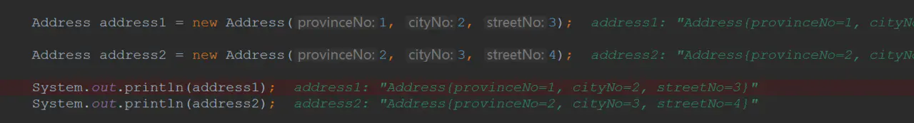

## 一.Object对象简介

我们学Java的知道，Java是一门面向对象的语言。无论在Java中出现什么，都可以认为它是对象(**除了**八大基本数据类型。当然了，八大基本数据类型也能**装箱**成为对象)：

- 而Object就是这些对象的最高级别的，所有的Java对象都**隐式**地继承了Object对象(不用显示写`extends`继承)
- 所有的Java对象都**拥有Object默认的方法**。

那么我们看看Object有什么方法：


其实就可以归纳成几个：

- `registerNatives()`【底层实现、不研究】
- `hashCode()`
- `equals(Object obj)`
- `clone()`
- `toString()`
- `notify()`
- `notifyAll()`
- `wait(long timeout)`【还有重载了两个】
- `finalize()`

Object一共有**11**个方法，其中一个为底层的实现`registerNatives()`，其中两个`wait()`和`wait(long timeout, int nanos)`重载方法。

- 所以我们真正需要看的就是**8个**方法

还有**一个属性**：

```java
 public final native Class<?> getClass();
```


## 二、equals和hashCode方法

equals和hashCode方法可以说是面试的重点题了，配合着String可以说在面试题中**哪都有它们的存在**。

首先，我们来看看equals和hashCode在Object中**原生**的实现吧：

hashCode：

```java
public native int hashCode();
```

equals：

```java
public boolean equals(Object obj) {
    return (this == obj);
}
```

看上去都非常简单：

- `hashCode()`由native方法底层实现了。
- `equals()`就直接`==`判断是否相等了。

想要更加清晰它们究竟是做什么的，我们来读读它的注释：


根据注释我们可以**总结以下的要点**：

- 重写`equals()`方法，就必须重写`hashCode()`的方法

- `equals()`方法默认是比较对象的地址，使用的是`==`等值运算符

- `hashCode()`方法对底层是散列表的对象有提升性能的功能

- 同一个对象(如果该对象没有被修改)：那么重复调用`hashCode()`那么返回的int是相同的！

- `hashCode()`方法默认是由对象的地址转换而来的

- equals()方法还有5个默认的原则：
  - 自反性--->调用`equals()`返回的是true，无论这两个对象谁调用`equals()`都好，返回的都是true
  - 一致性--->只要对象没有被修改，那么多次调用还是返回对应的结果！
  - 传递性--->`x.equals(y)`和`y.equals(z)`都返回true，那么可以得出：`x.equals(z)`返回true
  - 对称性--->`x.equals(y)`和`y.equals(x)`结果应该是相等的。
  - 传入的参数为null，返回的是false

为啥说`hashCode()`以散列表为底层带来性能的提升是很容易理解的。我们再来**回顾**一下HashMap的插入：


如果hash值都不相等，那么可以直接判断该key是不相等的了！

### 2.1equals和hashCode方法重写

`equals()`方法默认是比较对象的地址，使用的是`==`等值运算符。但是按我们正常开发来说，**比较的是对象地址是没有意义的**。

- 一般地，如果我们有两个Address对象，只要这两个对象的**省号、城市号、街道号相等**，我们就认为这两个对象相等了！


### 2.2String实现的equals和hashCode方法

我们在初学的时候可能就听过了：String**已经**实现了equals和hashCode方法了。

- 这也就是为什么，我们可以**直接**使用String.equals()来**判断两个字符串**是否相等！

下面我们就来看看它的实现吧：


# 三、toString方法

接下来我们看看toString方法，也十分简单：


toString方法主要是用来**标识**该对象的：


从上面的结果我们都可以看出来：**得出的结果并不能直观的展示这个对象**~

于是我们一般都重写toString()，那么**打印出的结果就很方便我们调试了**！

```java
@Override
public String toString() {
    return "Address{" +
        "provinceNo=" + provinceNo +
        ", cityNo=" + cityNo +
        ", streetNo=" + streetNo +
        '}';
}
```

下面的结果看起来就好多了：



# 四、clone方法

我们也来看看它的顶部注释：


看了上面的注释我们可以**总结以下的要点**：

- clone方法用于对象的克隆，一般想要克隆出的对象是**独立**的(与原有的对象是分开的)
- 深拷贝指的是该对象的成员变量(如果是可变引用)都应该克隆一份，浅拷贝指的是成员变量没有被克隆一份

下面我们来看一下浅拷贝：**拷贝了Employee对象，但是其成员变量hireday没有被克隆出去，所以指向的还是同一个Date对象**！

## 4.1clone用法

那么我们如何克隆对象呢？无论是浅拷贝还是深拷贝都是这两步：

1. 克隆的对象要**实现Cloneable接口**
2. **重写clone方法**，最好修饰成public

**浅拷贝**：仅仅拷贝了Person对象，而date没有拷贝！

```java
public class Person implements Cloneable {

    private Date date;

    @Override
    public Object clone() throws CloneNotSupportedException {
        return super.clone();
    }
}
```

**深拷贝**：不仅拷贝了Person对象，也拷贝了date成员变量

```java
public class Person implements Cloneable {

    public  Date date;

    @Override
    public Object clone() throws CloneNotSupportedException {
        // 拷贝Person对象
        Person person = (Person) super.clone();
        
        // 将可变的成员变量也拷贝
        person.date = (Date) date.clone();

        // 返回拷贝的对象
        return person;
    }

}
```

## 4.2clone疑问进一步学习protected

不知道有没有人跟我有相同的**疑问**：

- 我只想要**浅拷贝**，能不能**直接调用该对象.clone()来实现**？

比如我现在有个Address对象：

```java
public class Address  {

    private int provinceNo;
    private int cityNo;
    private int streetNo;

    public Address() {
    }

    public Address(int provinceNo, int cityNo, int streetNo) {
        this.provinceNo = provinceNo;
        this.cityNo = cityNo;
        this.streetNo = streetNo;
    }
}
```

下面的代码你们**认为如何**？

```java
    Address address = new Address(1, 2, 3);
    address.clone();
```

我们都知道：

- **protected修饰的类和属性,对于自己、本包和其子类可见**

**可能会想**：`clone()`方法是定义在Object类上的(以protected来修饰)，而我们自定义的Address对象**隐式**继承着Object(所有的对象都是Object的子类)，那么子类调用Object以protected来修饰`clone()`是完全没问题的

- 但是，IDE现实告诉我，这**编译就不通过了**！


出现错误的原因我立马就想到：**是不是我对protected修饰符出现了偏差？**

protected修饰的类和属性,对于自己、本包和其子类可见，这句话本身是没有错的。但是**还需要补充**：对于protected的成员或方法，要分子类和超类**是否在同一个包中**。与基类**不在同一个包中的子类**，只能**访问自身从基类继承而来的受保护成员，而不能访问基类实例本身的受保护成员**。

- 上面的代码就错在：Address与Object**不是在同一个包下**的，而Address直接访问了Object的clone方法。这是不行的。

# 五、wait和notify方法

wait和notify方法其实就是Java给我们提供让**线程之间通信**的API。

按照惯例我们还是来看注释怎么说吧：

wait方法：


notify方法：


notifyAll()方法：


看完上面的注释我们可以**总结以下的要点**：

- 无论是wait、notify还是notifyAll()都需要**由监听器对象(锁对象)来进行调用**

  - 简单来说：**他们都是在同步代码块中调用的**，否则会抛出异常！

- `notify()`唤醒的是在等待队列的**某个**线程(不确定会唤醒哪个)，`notifyAll()`唤醒的是等待队列**所有**线程

- 导致wait()的线程被唤醒可以有4种情况

  - 该线程被中断
  - `wait()`时间到了
  - 被`notify()`唤醒
  - 被`notifyAll()`唤醒

- 调用`wait()`的线程会**释放掉锁**

其实总结完上面的并不会有比较深刻的印象，可以尝试着回答几个问题来加深对`wait()`和`notify()`的理解。

## 5.1为什么wait和notify在Object方法上？

从一开始我们就说了：`wait()`和`notify()`是Java给我们提供线程之间通信的API，既然是线程的东西，那为什么是在Object类上定义，而不是在Thread类上定义呢？

因为我们的锁是对象锁，每个对象都可以成为锁。让当前线程等待某个对象的锁，当然应该通过这个对象来操作了。

- 锁对象是**任意**的，所以这些方法必须定义在Object类中

## 5.2notify方法调用后，会发生什么？

上面已经说了，notify会唤醒某个处于等待队列的线程。

但是要**注意**的是：

- notify方法调用后，被唤醒的线程**不会立马获得到锁对象**。而是等待notify的synchronized代码块**执行完之后**才会获得锁对象

## 5.3sleep和wait有什么区别？

`Thread.sleep()`与`Object.wait()`二者都可以暂停当前线程，释放CPU控制权。

- 主要的区别在于`Object.wait()`在释放CPU同时，**释放了对象锁的控制**。
- 而`Thread.sleep()`没有对锁释放

# 六、finalize()方法

`finalize()`方法将在**垃圾回收器清除对象之前调用**，但该方法不知道何时调用，具有**不定性**

- 一般我们都不会重写它~

> 一个对象的finalize()方法**只会被调用一次**，而且finalize()被调用不意味着gc会立即回收该对象，所以有可能调用finalize()后，该对象又不需要被回收了，然后到了真正要被回收的时候，因为前面调用过一次，所以不会调用finalize()，产生问题。

