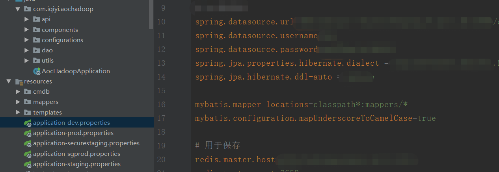
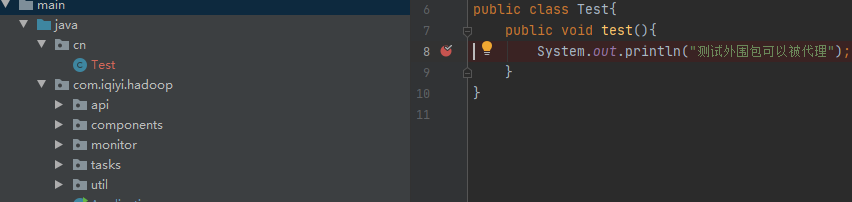

**①Failed to configure a DataSource: 'url' attribute is not specified and no embedded datasource could be configured.Reason: Failed to determine a suitable driver class**

### 问题记录解决

今天小组长让我加入一个新的工程项目,开开心心的把项目从公司内部gitlab上面clone下来,经过一段长时间处理maven依赖以后消除了idea里面所有的红线(感觉每次clone项目下来之后maven总是要出点幺蛾子然后解决掉才行),然后就开开心心的启动,刚启动就报如下错误:

```shell
***************************
APPLICATION FAILED TO START
***************************
 
Description:
 
Failed to configure a DataSource: 'url' attribute is not specified and no embedded datasource could be configured.
 
Reason: Failed to determine a suitable driver class
 
 
Action:
 
Consider the following:
	If you want an embedded database (H2, HSQL or Derby), please put it on the classpath.
	If you have database settings to be loaded from a particular profile you may need to activate it (no profiles are currently active).
 
 
Process finished with exit code 1
```

然后就去网上搜索,很多说没有在springboot的配置文件中配置spring.datasource.url,而且好多都是这样的,正对这个找了很多解决办法,但是对我来说都是没啥用的.其中比较典型的一个博客是这么说的:

问题原因: Mybatis没有找到合适的加载类,其实是大部分**spring - datasource - url**没有加载成功,分析原因如下所示.

1. **DataSourceAutoConfiguration**会自动加载.

2. 没有配置**spring - datasource - url** 属性.

3. **spring - datasource - url** 配置的地址格式有问题.

4. 配置 **spring - datasource - url**的文件没有加载.

5. profiles文件夹名称冲突

   ​

感觉这应该是是分析得比较全面的了,但是按照他的来并没有解决我的困境.当然还有大佬便是重新clone项目下来操作一遍问题就没了,但是我还是想找到问题的根源.我的配置文件内容是这样的:

首先我确定这个没有问题,我在里面怎么改动都没有影响,我开始觉得我根本就没有读取这个配置文件,后来去网上找了springboot项目怎么加载properties配置文件,才知道我这里有两个配置文件,一个开发的,一个测试的,但是一个都没有用,在启动参数上面加入-Dspring.profiles.active=dev就好了.

### 总结

经过一年多时间的反复学习,在解决错误上已经具备了一定的能力,一般的问题通过谷歌就能直接解决,这次问题给我的最大感触就是,我们解决问题的时候还是要具体问题具体分析,不要这个csdn不行我就换那个掘金或者StackOverflow,网上的东西很多时候只能让你知道大致问题出在了什么地方,具体的处理还是要靠自己.

②对jdk源码做动态代理没有起作用

今天上面给我一个任务,让我统计项目中方法的运行时间和调用成功与失败次数,我一想挺简单的,这个直接动态代理就可以做,spring注解用起来不是轻轻松松吗?计算方法调用时间的时候确实是这样,但是当我统计方法运行失败与成功次数的时候就遇到了问题,项目本身方法基本都是在方法整体一个try catch,成功就返回,失败就被catch打印错误日志,这就有点难办了,spring的注解@AfterThrowing只能处理方法把异常抛出去了的情况,后来我就发现他只有在失败的时候会去打印日志,打印日志的时候如下:

```java
logger.error("方法对应任务",e)
```

不难发现在调用这个方法的时候一定会执行Throwable类的getMessage()方法获取信息,我就想着设置一个该方法的代理,作为失败统计代码如下

```java
@Before("exceution(java.lang.Throwable.getMessage(..))")
puhlic void calculationFailCall(JoinPoint joinpoint){
    ....
}
```

但是出乎意料的是代理并没有起到作用,看过很多遍动态代理的我有点不明所以,这个类没有final,就算JDK动态代理代理不了,应该也还有Cglib可以兜底呀,没道理呀,难道是jdk源码有权限,Spring操作不了?我就另辟蹊径,决定在Logger类的error上做代理,但是结果还是不行,后来苦思冥想发现,这些类应该都没有被spring扫描包的时候扫描到,所以不可以代理,于是我就在启动类加上如下注解

```java
@ComponentScan(basePackages={"com.iqiyi.hadoop","ch.qos.logback.classic"})
```

我以为这次妥妥的,但是想不到还是不行,我就在AppLication的字包外面建了一个测试类,加上包扫描,对它做代理,看行不行

```java
@ComponentScan(basePackages={"com.iqiyi.hadoop","ch.qos.logback.classic","cn"})

@Before("exceution(cn.Test.test(..))")
puhlic void calculationFailCall(JoinPoint joinpoint){
    ....
}

//在Controller做如下调用
new Test().test();
```



结果还是不行,我想着是不是这个类没有注入进去,于是我加上@Component注解,发现依然不可以,最后我想着这个类还是原生类,不是经过代理产生的类,会不会是因为这个原因,我就把调用方式改了一下:

```java
@Autowired
Test test

test.test();
```

这次终于成功了,进了代理的逻辑里面.总结一下SpringAOP的代理逻辑应该是在Bean类经过容器创建的时候加上去的,所以没有经过Spring容器的类,你对他设置了代理最后也用不上.