<div align = "middle"><iframe frameborder="no" border="0" marginwidth="0" marginheight="0" width=330 height=86 src="//music.163.com/outchain/player?type=2&id=552192975&auto=0&height=66"></iframe></div>

# 使用VMware安装linux虚拟机

### 使用背景

*Linux是一种自由和开放源码的操作系统，存在着许多不同的Linux发行版本，但它们都使用了Linux内核。现在的服务器基本都是使用linux,其中CentOS使用广泛,还有ubuntu也是linux中的佼佼者.业内也说,凡是**java开发,不懂linux均是扯淡.**本文主要为后面搭建基于Hadoop集群的大数据大数据平台打下基础。*

#### linux具有如下优点

- 开源
- 多用户，多任务，丰富的网络功能，可靠的系统安全，良好的可移植性，具有标准兼容性
- 良好的用户界面，出色的速度性能
- 服务器不使用图形化界面(图形界面占用资源)
- 机房部署方便，无需配置操作界面

**下载地址**[:http://www.centos.org/](http://www.centos.org/)

### 安装环境

- Windows10
- VMware Workstation12
- CentOS7

#### VMware Workstation12安装

①双击VMware-workstation-full-版本号.exe

②点击next

③选择Typical(你要是想自己配置也可以选custom 不推荐)

④选择安装目录

⑤想检查升级就勾上(check for product updates on startup),否则直接下一步

⑥选择创建快捷方式的位置,然后下一步

⑦点击continue完成

⑧Finish完成

**注意:如果你不熟悉就按部就班来,不要有什么骚操作,我记得我开始安装的时候禁用了哪两个网卡,后来哪两个网卡找不到了,我就把这个卸载了重新装,还是不行,这个问题的解决还是因为我一个月后重装了电脑**

#### CentOS7安装

①安装VMware Workstation

②打开VM,点击创建新的虚拟机

③选择 典型（推荐）→ 下一步 

④选择稍后安装操作系统再点击下一步

⑤选择操作系统和版本(linux 64)

⑥输入虚拟机名称和安装路径

⑦设置磁盘大小并选中将虚拟磁盘拆成多个文件

⑧自定义硬件

⑨选择CentOS安装镜像文件

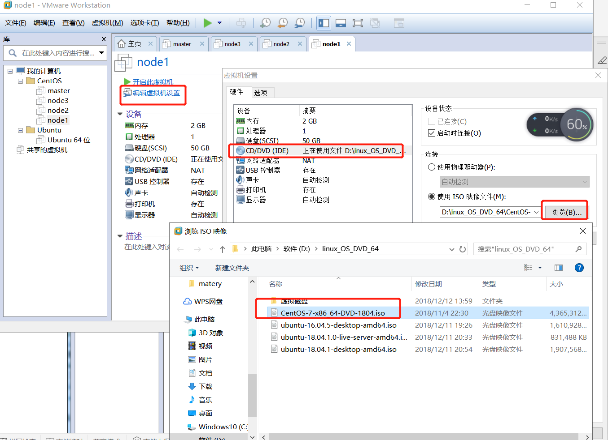

⑩开机启动后选择Install CentOS 7并enter

- 弹出如下图形化的安装界面：

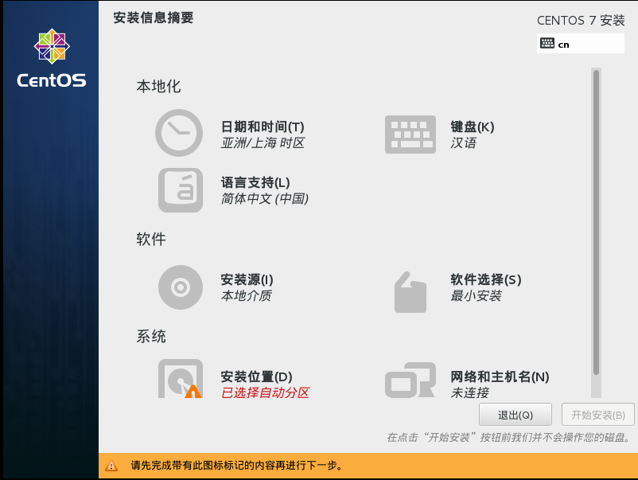

- 日期和时间：

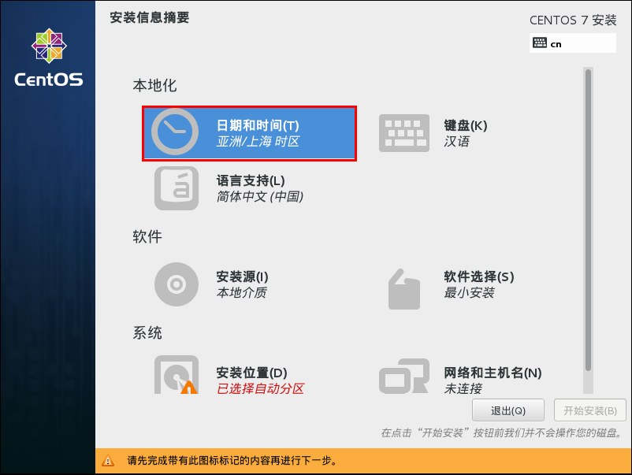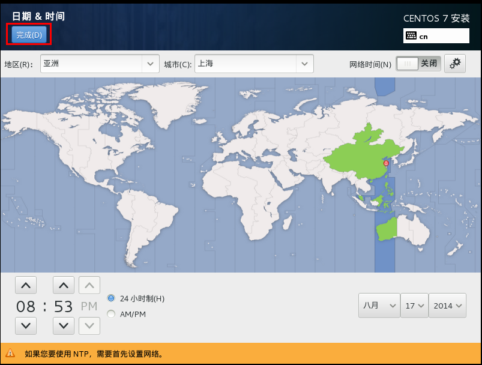

- 如果你安装的是英文版，需要将时区改为上海。

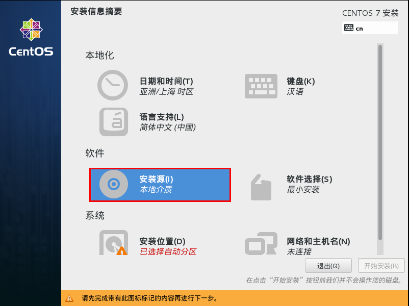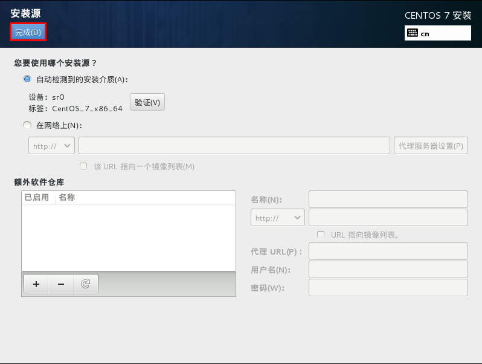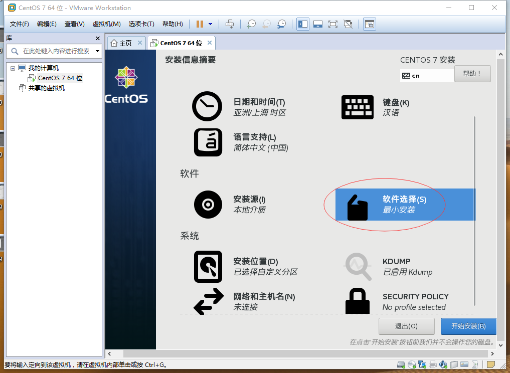


- **网络和主机名**

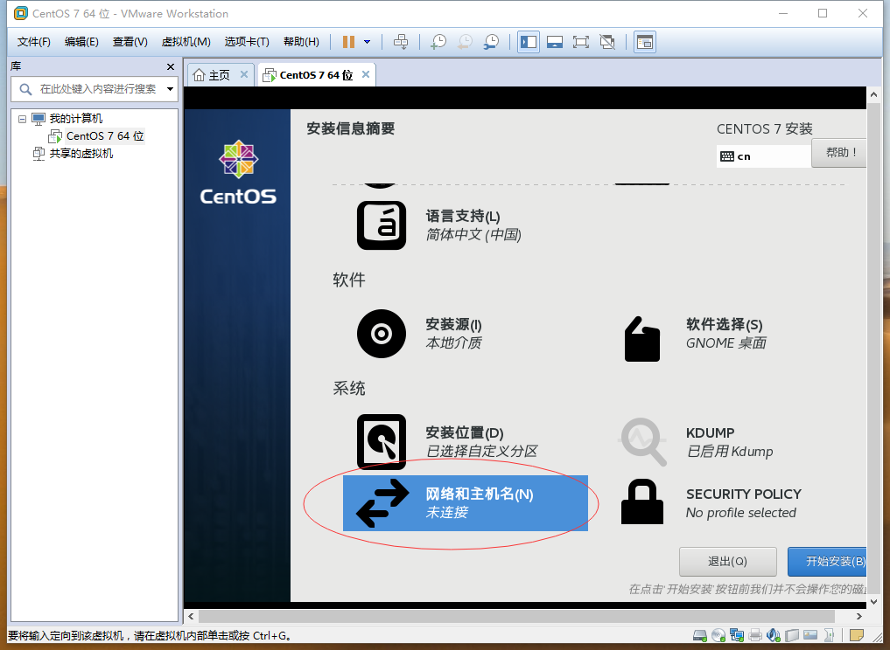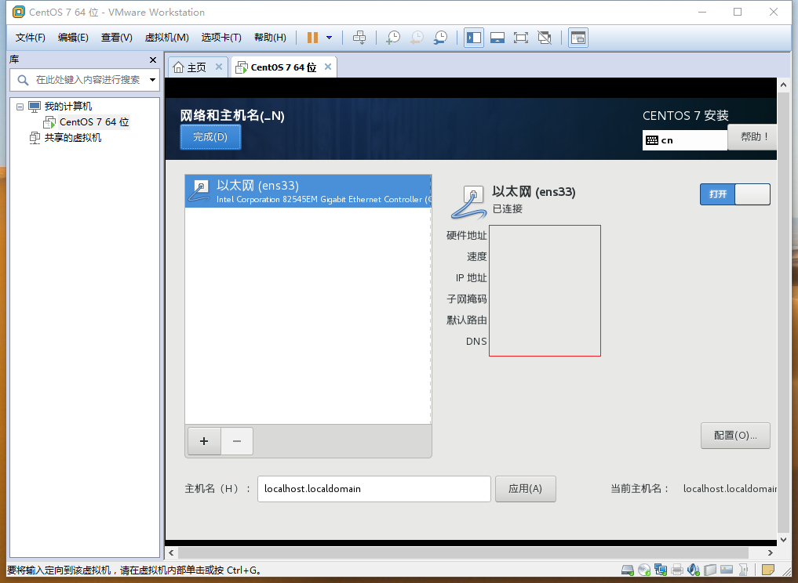

- 然后选择开始安装**

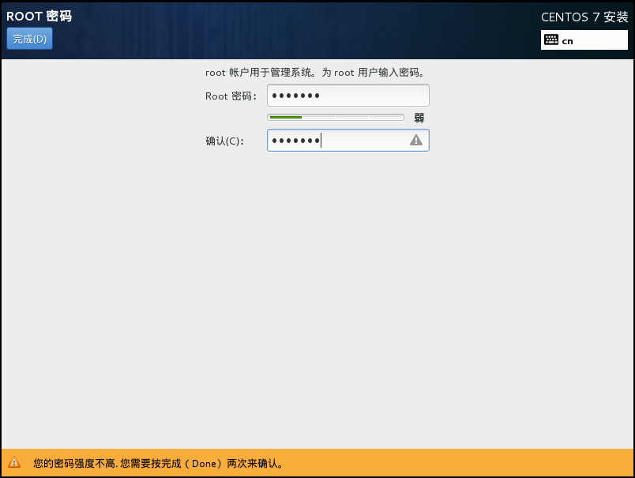基本的系统就安装好了

### 配置网络

- linu有三种网络模式,分别是Host-Only、NAT、桥接。一般安装好以后会默认选择NAT。


- 进入之后修改ip地址信息

```shell
vi /etc/ sysconfig/network-scripts/ifcfg-eth0

DEVICE=eth0 #网卡名称
HWADDR=08:00:27:8E:9D:25 #MAC地址
TYPE=Ethernet #网络类型,这里是以太网
UUID=5f2d815e-bd3b-4995-9009-823542e77304
ONBOOT=yes 
NM_CONTROLLED=yes
BOOTPROTO=static
STATIC=true
IPADDR=192.168.1.21 #ip地址
NETMASK=255.255.255.0 #子网掩码
GATEWAY=192.168.1.1 #网管
DNS1=202.202.0.33 #域名解析地址
DNS2=114.114.114.114
DNS3=8.8.8.8
```

- 配置好以后重启网络服务

```shell
services network restart
```

- ifconfig查看IP地址

```shell
ifconfig

eth0      Link encap:Ethernet  HWaddr 08:00:27:8E:9D:25  
          inet addr:192.168.1.21  Bcast:192.168.1.255  Mask:255.255.255.0
          inet6 addr: fe80::a00:27ff:fe8e:9d25/64 Scope:Link
          UP BROADCAST RUNNING MULTICAST  MTU:1500  Metric:1
          RX packets:1756623 errors:0 dropped:0 overruns:0 frame:0
          TX packets:1952463 errors:0 dropped:0 overruns:0 carrier:0
          collisions:0 txqueuelen:1000 
          RX bytes:1445482120 (1.3 GiB)  TX bytes:1626059931 (1.5 GiB)

lo        Link encap:Local Loopback  
          inet addr:127.0.0.1  Mask:255.0.0.0
          inet6 addr: ::1/128 Scope:Host
          UP LOOPBACK RUNNING  MTU:65536  Metric:1
          RX packets:2258 errors:0 dropped:0 overruns:0 frame:0
          TX packets:2258 errors:0 dropped:0 overruns:0 carrier:0
          collisions:0 txqueuelen:0 
          RX bytes:590708 (576.8 KiB)  TX bytes:590708 (576.8 KiB)
```


- ping ip地址测试网络是否配置好

```shell
ping www.baidu.com
```

**按照以上操作完成安装以后可以直接克隆改虚拟机，然后修改配置就可以生成多台**

**在每个主机的/etc/hosts文件设置上每个主机的ip和名字的映射关系**

```shell
vi /etc/hosts

192.168.1.21 master
192.168.1.23 slave1
192.168.1.24 slave2
192.168.1.25 slave3
```


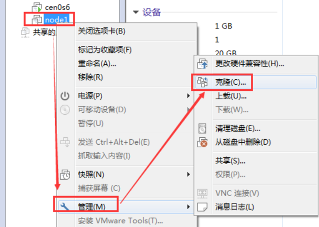

#### 配置免密登录

- 主要用于两个机器之间相互登录不需要验证

①在第一台机器使用命令ssh-keygen -t rsa生成私钥和秘钥

```shell
ssh-keygen -t rsa
```

②复制到另一台机器

```shell
ssh-copy-id root@slave1
```

**如此就可以实现slave登录master免密,按照这个做法,每两台机器都配置上。**

##### 科普：免密登录原理

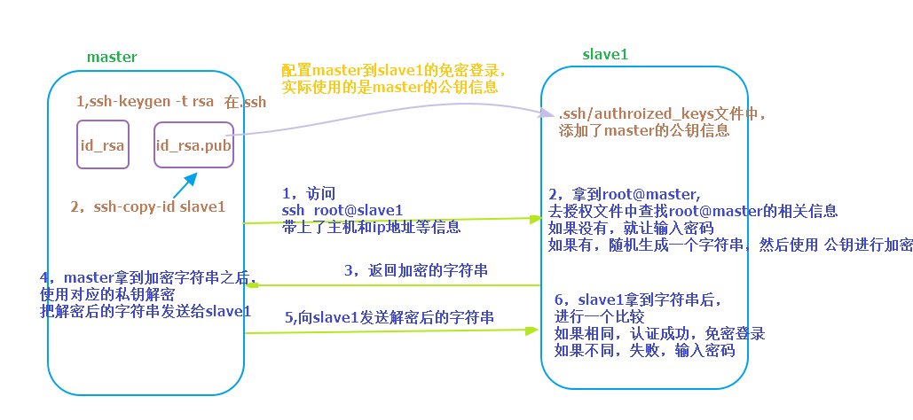