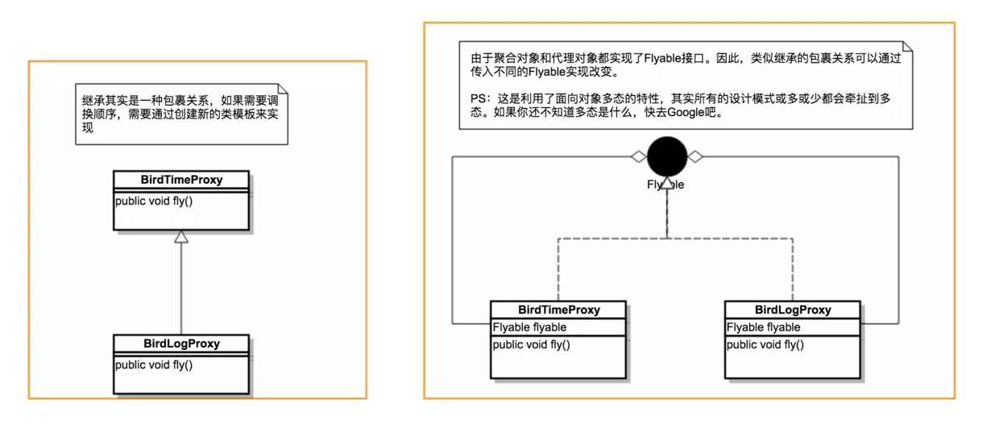

### 什么是代理

我个人理解代理就是让A类可以去调用B类的方法,从而可以在调用前后加上一些逻辑

理解了代理的意思，你脑海中恐怕还有两个巨大的疑问：

- 怎么实现代理模式
- 代理模式有什么实际用途

要理解这两个问题，看一个简单的例子：

```java
public interface Flyable {
    void fly();
}

public class Bird implements Flyable {

    @Override
    public void fly() {
        System.out.println("Bird is flying...");
        try {
            Thread.sleep(new Random().nextInt(1000));
        } catch (InterruptedException e) {
            e.printStackTrace();
        }
    }
}
```

很简单的一个例子，用一个随机睡眠时间模拟小鸟在空中的飞行时间。接下来问题来了，如果我要知道小鸟在天空中飞行了多久，怎么办？

有人说，很简单，在Bird->fly()方法的开头记录起始时间，在方法结束记录完成时间，两个时间相减就得到了飞行时间。

```java
   @Override
    public void fly() {
        long start = System.currentTimeMillis();
        System.out.println("Bird is flying...");
        try {
            Thread.sleep(new Random().nextInt(1000));
        } catch (InterruptedException e) {
            e.printStackTrace();
        }
        long end = System.currentTimeMillis();
        System.out.println("Fly time = " + (end - start));
    }
```

的确，这个方法没有任何问题，接下来加大问题的难度。如果Bird这个类来自于某个SDK（或者说Jar包）提供，你无法改动源码，怎么办？

一定会有人说，我可以在调用的地方这样写：

```java
public static void main(String[] args) {
        Bird bird = new Bird();
        long start = System.currentTimeMillis();
        bird.fly();
        long end = System.currentTimeMillis();
        System.out.println("Fly time = " + (end - start));
}
```

这个方案看起来似乎没有问题，但其实你忽略了准备这些方法所需要的时间，执行一个方法，需要开辟栈内存、压栈、出栈等操作，这部分时间也是不可以忽略的。因此，这个解决方案不可行。那么，还有什么方法可以做到呢？

**使用继承**

继承是最直观的解决方案，相信你已经想到了，至少我最开始想到的解决方案就是继承。为此，我们重新创建一个类Bird2，在Bird2中我们只做一件事情，就是调用父类的fly方法，在前后记录时间，并打印时间差：

```java
public class Bird2 extends Bird {

    @Override
    public void fly() {
        long start = System.currentTimeMillis();
        
        super.fly();
        
        long end = System.currentTimeMillis();
        System.out.println("Fly time = " + (end - start));
    }
}
```

这是一种解决方案，还有一种解决方案叫做：**聚合**，其实也是比较容易想到的。我们再次创建新类Bird3，在Bird3的构造方法中传入Bird实例。同时，让Bird3也实现Flyable接口，并在fly方法中调用传入的Bird实例的fly方法：

```java
public class Bird3 implements Flyable {
    private Bird bird;

    public Bird3(Bird bird) {
        this.bird = bird;
    }

    @Override
    public void fly() {
        long start = System.currentTimeMillis();

        bird.fly();

        long end = System.currentTimeMillis();
        System.out.println("Fly time = " + (end - start));
    }
}
```

为了记录Bird->fly()方法的执行时间，我们在前后添加了记录时间的代码。同样地，通过这种方法我们也可以获得小鸟的飞行时间。那么，这两种方法孰优孰劣呢？咋一看，不好评判！

继续深入思考，用问题推导来解答这个问题：

**问题一**：如果我还需要在fly方法前后打印日志，记录飞行开始和飞行结束，怎么办？有人说，很简单！继承Bird2并在在前后添加打印语句即可。那么，问题来了，请看问题二。

**问题二**：如果我需要调换执行顺序，先打印日志，再获取飞行时间，怎么办？有人说，再新建一个类Bird4继承Bird，打印日志。再新建一个类Bird5继承Bird4，获取方法执行时间。

问题显而易见：使用继承将导致类无限制扩展，同时灵活性也无法获得保障。那么，使用 [聚合](https://stackoverflow.com/questions/885937/what-is-the-difference-between-association-aggregation-and-composition) 是否可以避免这个问题呢？答案是：可以！但我们的类需要稍微改造一下。修改Bird3类，将聚合对象Bird类型修改为Flyable

```java
public class Bird3 implements Flyable {
    private Flyable flyable;

    public Bird3(Flyable flyable) {
        this.flyable = flyable;
    }

    @Override
    public void fly() {
        long start = System.currentTimeMillis();

        flyable.fly();

        long end = System.currentTimeMillis();
        System.out.println("Fly time = " + (end - start));
    }
}
```

为了让你看的更清楚，我将Bird3更名为BirdTimeProxy，即用于获取方法执行时间的代理的意思。同时我们新建BirdLogProxy代理类用于打印日志：

```java
public class BirdLogProxy implements Flyable {
    private Flyable flyable;

    public BirdLogProxy(Flyable flyable) {
        this.flyable = flyable;
    }

    @Override
    public void fly() {
        System.out.println("Bird fly start...");

        flyable.fly();

        System.out.println("Bird fly end...");
    }
}
```

接下来神奇的事情发生了，如果我们需要先记录日志，再获取飞行时间，可以在调用的地方这么做：

```
    public static void main(String[] args) {
        Bird bird = new Bird();
        BirdLogProxy p1 = new BirdLogProxy(bird);
        BirdTimeProxy p2 = new BirdTimeProxy(p1);

        p2.fly();
    }
```

反过来，可以这么做：

```java
 public static void main(String[] args) {
        Bird bird = new Bird();
        BirdTimeProxy p2 = new BirdTimeProxy(bird);
        BirdLogProxy p1 = new BirdLogProxy(p2);

        p1.fly();
 }
```

看到这里，有同学可能会有疑问了。虽然现象看起来，聚合可以灵活调换执行顺序。可是，为什么 [聚合](https://stackoverflow.com/questions/885937/what-is-the-difference-between-association-aggregation-and-composition) 可以做到，而继承不行呢。我们用一张图来解释一下：



### 静态代理

接下来，观察上面的类BirdTimeProxy，在它的fly方法中我们直接调用了flyable->fly()方法。换而言之，BirdTimeProxy其实代理了传入的Flyable对象，这就是典型的静态代理实现。

从表面上看，静态代理已经完美解决了我们的问题。可是，试想一下，如果我们需要计算SDK中100个方法的运行时间，同样的代码至少需要重复100次，并且创建至少100个代理类。往小了说，如果Bird类有多个方法，我们需要知道其他方法的运行时间，同样的代码也至少需要重复多次。因此，静态代理至少有以下两个局限性问题：

- 如果同时代理多个类，依然会导致类无限制扩展
- 如果类中有多个方法，同样的逻辑需要反复实现

那么，我们是否可以使用同一个代理类来代理任意对象呢？我们以获取方法运行时间为例，是否可以使用同一个类（例如：TimeProxy）来计算任意对象的任一方法的执行时间呢？甚至再大胆一点，代理的逻辑也可以自己指定。比如，获取方法的执行时间，打印日志，这类逻辑都可以自己指定。这就是本文重点探讨的问题，也是最难理解的部分：**动态代理**。

### 使用动态代理

### 2.1 InvocationHandler接口

在使用动态代理时，我们需要定义一个位于代理类与委托类之间的中介类，这个中介类被要求实现InvocationHandler接口，这个接口的定义如下：

```java
/**
 * 调用处理程序
 */
public interface InvocationHandler { 
    Object invoke(Object proxy, Method method, Object[] args); 
} 
```

从InvocationHandler这个名称我们就可以知道，实现了这个接口的中介类用做“调用处理器”。当我们调用代理类对象的方法时，这个“调用”会转送到invoke方法中，代理类对象作为proxy参数传入，参数method标识了我们具体调用的是代理类的哪个方法，args为这个方法的参数。这样一来，我们对代理类中的所有方法的调用都会变为对invoke的调用，这样我们可以在invoke方法中添加统一的处理逻辑(也可以根据method参数对不同的代理类方法做不同的处理)。因此我们只需在中介类的invoke方法实现中输出“before”，然后调用委托类的invoke方法，再输出“after”。下面我们来一步一步具体实现它。

### 2.2 委托类的定义

动态代理方式下，要求委托类必须实现某个接口，这里我们实现的是Flyable接口。委托类Bird类的定义如下：

```java
public interface Flyable {
    void fly();
}

public class Bird implements Flyable {

    @Override
    public void fly() {
        System.out.println("Bird is flying...");
        try {
            Thread.sleep(new Random().nextInt(1000));
        } catch (InterruptedException e) {
            e.printStackTrace();
        }
    }
}
```

### 2.3中介类

上面我们提到过，中介类必须实现InvocationHandler接口，作为调用处理器”拦截“对代理类方法的调用。中介类的定义如下：

```java
public class DynamicProxy implements InvocationHandler { 
    //obj为委托类对象; 
    private Object obj; 
 
    public DynamicProxy(Object obj) {
        this.obj = obj;
    } 
 
    @Override 
    public Object invoke(Object proxy, Method method, Object[] args) throws Throwable { 
        System.out.println("Bird fly start...");
        Object result = method.invoke(obj, args); 
        System.out.println("Bird fly end...");
        return result; 
    }
} 
```

从以上代码中我们可以看到，中介类持有一个委托类对象引用，在invoke方法中调用了委托类对象的相应方法，看到这里是不是觉得似曾相识?

通过聚合方式持有委托类对象引用，把外部对invoke的调用最终都转为对委托类对象的调用。这不就是我们上面介绍的静态代理的一种实现方式吗?

实际上，中介类与委托类构成了静态代理关系，在这个关系中，中介类是代理类，委托类就是委托类;

代理类与中介类也构成一个静态代理关系，在这个关系中，中介类是委托类，代理类是代理类。

也就是说，**动态代理关系由两组静态代理关系组成，这就是动态代理的原理**。下面我们来介绍一下如何”指示“以动态生成代理类。

### 2.4动态生成代理类

动态生成代理类的相关代码如下：

```java
public class Main { 
    public static void main(String[] args) {
   		Bird bird =  Proxy.newProxyInstance(Flyable.class,Bird.getClass().getClassLoader(), new MyInvocationHandler(new Bird()));
        bird.fly();
    }
} 
```

在以上代码中，我们调用Proxy类的newProxyInstance方法来获取一个代理类实例。这个代理类实现了我们指定的接口并且会把方法调用分发到指定的调用处理器。这个方法的声明如下：

```java
public static Object newProxyInstance(ClassLoader loader, Class<?>[] interfaces, InvocationHandler h) throws IllegalArgumentException 
```

方法的三个参数含义分别如下：

loader：定义了代理类的ClassLoder;interfaces：代理类实现的接口列表：调用处理器，也就是我们上面定义的实现了InvocationHandler接口的类实例


**上面我们已经简单提到过动态代理的原理，这里再简单的总结下：首先通过newProxyInstance方法获取代理类实例，而后我们便可以通过这个代理类实例调用代理类的方法，对代理类的方法的调用实际上都会调用中介类(调用处理器)的invoke方法，在invoke方法中我们调用委托类的相应方法，并且可以添加自己的处理逻辑。**

想象一下，到此为止，如果我们还需要对其它任意对象进行代理，是否还需要改动newProxyInstance方法的源码，答案是：完全不需要！

只要你在newProxyInstance方法中指定代理需要实现的接口，指定用于自定义处理的InvocationHandler对象，整个代理的逻辑处理都在你自定义的InvocationHandler实现类中进行处理。至此，而我们终于可以从不断地写代理类用于实现自定义逻辑的重复工作中解放出来了，从此需要做什么，交给InvocationHandler。

事实上，我们之前给自己定下的目标“使用同一个类来计算任意对象的任一方法的执行时间”已经实现了。严格来说，是我们超额完成了任务，TimeProxy不仅可以计算方法执行的时间，也可以打印方法执行日志，这完全取决于你的InvocationHandler接口实现。因此，这里取名为TimeProxy其实已经不合适了。

#### 动态代理的实现方式与区别

##### jDK代理

 JDK的动态代理主要涉及到java.lang.reflect包中的两个类：Proxy和InvocationHandler。其中 InvocationHandler是一个接口就是拦截器的接口。，可以通过实现该接口定义横切逻辑，并通过反射机制调用目标类的代码，动态将横切逻辑和业务逻辑编织在一起，上面的实现就是通过JDK代理。

**InvocationHandler的作用**

在动态代理中InvocationHandler是核心，每个代理实例都具有一个关联的调用处理程序(InvocationHandler)。对代理实例调用方法时，将对方法调用进行编码并将其指派到它的调用处理程序(InvocationHandler)的 invoke 方法。所以对代理方法的调用都是通InvocationHadler的invoke来实现中，而invoke方法根据传入的代理对象，方法和参数来决定调用代理的哪个方法

##### **代理模式**

使用代理模式必须要让代理类和目标类实现相同的接口，客户端通过代理类来调用目标方法，代理类会将所有的方法调用分派到目标对象上反射执行，还可以在分派过程中添加"前置通知"和后置处理（如在调用目标方法前校验权限，在调用完目标方法后打印日志等）等功能。

具体有如下四步骤：

1.通过实现 InvocationHandler 接口创建自己的调用处理器；

2.通过为 Proxy 类指定 ClassLoader 对象和一组 interface 来创建动态代理类；

3.通过反射机制获得动态代理类的构造函数，其唯一参数类型是调用处理器接口类型；

4.通过构造函数创建动态代理类实例，构造时调用处理器对象作为参数被传入。

#### cglib代理

CGlib是一个强大的,高性能,高质量的Code生成类库。cglib封装了asm，可以在运行期动态生成新的class，它可以在运行期扩展Java类与实现Java接口。 CGLIB是**针对类实现代理**的，主要对指定的类生成一个子类，并覆盖其中的方法， 因为是继承，所以不能使用final来修饰类或方法。和jdk代理实现不同的是，cglib不要求类实现接口。

JDK动态代理和CGLIB字节码生成的区别？

CGLib所创建的动态代理对象的性能比JDK的高大概10倍，但CGLib在创建代理对象的时间比JDK大概多8倍，所以对于singleton的代理对象或者具有实例池的代理，因为无需重复的创建代理对象，所以比较适合CGLib动态代理技术，反之选择JDK代理

- JDK动态代理只能对实现了接口的类生成代理，而不能针对类

- CGLIB是针对类实现代理，主要是对指定的类生成一个子类，覆盖其中的方法

  因为是继承，所以该类或方法最好不要声明成final 

### 答疑解惑

#### invoke方法的第一个参数proxy到底有什么作用？

这个问题其实也好理解，如果你的接口中有方法需要返回自身，如果在invoke中没有传入这个参数，将导致实例无法正常返回。在这种场景中，proxy的用途就表现出来了。简单来说，这其实就是最近非常火的链式编程的一种应用实现。

#### 动态代理到底有什么用？

学习任何一门技术，一定要问一问自己，这到底有什么用。其实，在这篇文章的讲解过程中，我们已经说出了它的主要用途。你发现没，使用动态代理我们居然可以在不改变源码的情况下，直接在方法中插入自定义逻辑。这有点不太符合我们的一条线走到底的编程逻辑，这种编程模型有一个专业名称叫 [AOP](https://baike.baidu.com/item/AOP/1332219)。所谓的AOP，就像刀一样，抓住时机，趁机插入。

基于这样一种动态特性，我们可以用它做很多事情，例如：

- 事务提交或回退（Web开发中很常见）
- 权限管理
- 自定义缓存逻辑处理

