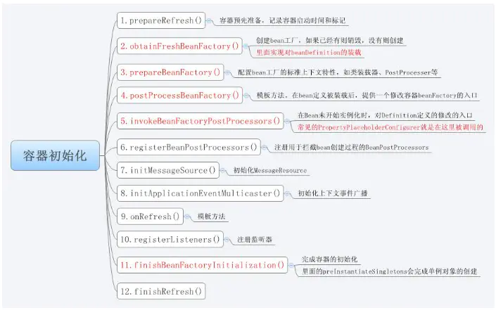
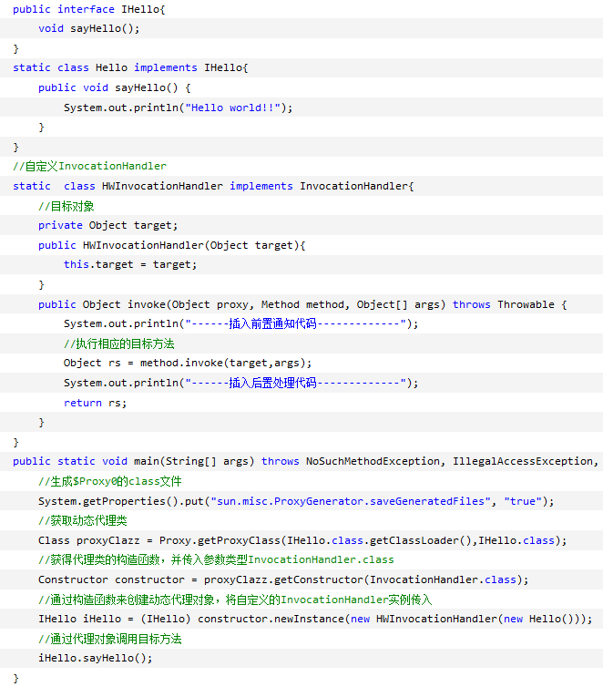

## 回头再看Spring

### 什么是Spring

Spring是个包含一系列功能的合集，如快速构建微服务的Spring Boot，管理一系列微服务的Spring Cloud，支持认证与鉴权的Spring Security，基于MVC的Web框架Spring MVC。但IOC与AOP依然是核心。

### Spring Bean

**IOC的底层原理：文档解析xml文件，反射动态创建对象，然后保存name和Object，然后对每个对象属性进行属性注入**

##### 加载Bean的主要逻辑

​	1.获取配置文件资源

​	2.对获取的xml资源进行一定的处理检验

​	3.处理包装资源

​	4.解析处理包装过后的资源

​	5.加载提取bean并注册(添加到beanDefinitionMap中

##### Bean的生命周期

- Bean的建立，由BeanFactory读取Bean定义文件，并创建Bean实例；
- 执行Bean的属性注入,Setter注入；
- 如果Bean类实现了org.springframework.beans.factory.BeanNameAware接口,则执行其setBeanName方法；
- 如果Bean类实现了org.springframework.beans.factory.BeanFactoryAware接口,则执行其setBeanFactory方法；
- 如果容器中有实现org.springframework.beans.factory.BeanPostProcessors接口的实例，则任何Bean在初始化之前都会执行这个实例的processBeforeInitialization()方法；
- 如果Bean类实现了org.springframework.beans.factory.InitializingBean接口，则执行其afterPropertiesSet()方法；
- 调用Bean的初始化方法”init-method” (！！注意，init-method方法没有参数)；
- 如果容器中有实现org.springframework.beans.factory.BeanPostProcessors接口的实例，则任何Bean在初始化之后都会执行这个实例的processAfterInitialization()方法；
- 使用Bean做一些业务逻辑….
- 使用完，容器关闭，如果Bean类实现了org.springframework.beans.factory.DisposableBean接口，则执行它的destroy()方法；
- 在容器关闭时，可以在Bean定义文件中使用“destory-method”定义的方法，销毁Bean (！！注意，destory-method方法没有参数)；

#####  Bean的作用域

- Singleton: 这是默认的作用域，这种范围确保不管接受多少个请求，每个容器中只有一个bean的实例，单例模式有BeanFactory自身维护；
- Prototype: 原形范围与单例范围相反，为每一个bean请求提供一个实例；

- Request: 在请求bean范围内会为每一个来自客户端的网络请求创建一个实例，在请求完成以后，bean会失效并被垃圾回收器回收；
- Session: 与请求范围类似，确保每个session中有一个bean的实例，在session过期后，bean会随之失效；
- global-session: global-session和Portlet应用相关。当你的应用部署在Portlet容器中工作时，它包含很多portlet。如果你想要声明让所有的portlet共用全局的存储变量的话，那么这全局变量需要存储在global-session中。

### Spring IOC

IOC(控制反转):本质就是自己的信息(全类名等)配置在文件中或者加上注解,让容器可以通过反射的方式来创建对象,从而接管对象,代替了自己通过new创建对象.其实就是讲对象的管理创建交给了容器来做.

依赖注入:在运行过程中,会在需要这个对象的位置坐上一个标记,容器会负责创建对象实例并注入其中;

#### Spring IOC容器的初始化过程

IoC容器的初始化就是含有BeanDefinition信息的Resource的定位、载入、解析、注册四个过程，最终我们配置的bean，以beanDefinition的数据结构存在于IoC容器即内存中。

##### Resource定位过程

这个Resource定位指的是BeanDefinition的资源定位，它由ResourceLoader通过统一的Resource接口来完成，这个Resource对各种形式的BeanDefinition的使用提供了统一接口。

##### BeanDefinition的载入

该载入过程把用户定义好的Bean表示成IoC容器内部的数据结构，而这个容器内部的数据结构就BeanDefinition.

##### 向IoC容器注册这些BeanDefinition

这个过程是通过调用BeanDefinitionRegistry接口的实现来完成的，这个注册过程把载入过程中解析得到的BeanDefinition向IoC容器进行注册,在IoC容器内部将BeanDefinition注入到一个HashMap中去，Ioc容器是通过这个HashMap来持有这些BeanDefinition数据的。

容器的初始化是通过AbstractApplicationContext的refresh()实现的。

整个过程如下图:

### Spring AOP

面向切面的编程，是一种编程技术，**是OOP（面向对象编程）的补充和完善**。OOP的执行是一种从上往下的流程，并没有从左到右的关系。因此在OOP编程中，会有大量的重复代码。而**AOP则是将这些与业务无关的重复代码抽取出来，然后再嵌入到业务代码当中**。常见的应用有：权限管理、日志、事务管理等。

AOP有三种植入切面的方法：其一是编译期织入，这要求使用特殊的Java编译器，AspectJ是其中的代表者；其二是类装载期织入，而这要求使用特殊的类装载器，AspectJ和AspectWerkz是其中的代表者；其三为动态代理织入，在运行期为目标类添加增强生成子类的方式，**Spring AOP采用动态代理织入切面**。

AspectJ是静态代理的增强，所谓的静态代理就是AOP框架会在编译阶段生成AOP代理类，因此也称为编译时增强。

它会在**编译阶段**将Aspect织入Java字节码中， 运行的时候就是经过增强之后的AOP对象。

AspectJ在编译时就增强了目标对象，Spring AOP的动态代理则是在每次运行时动态的增强，生成AOP代理对象，区别在于生成AOP代理对象的时机不同，相对来说**AspectJ的静态代理方式具有更好的性能**，但是AspectJ**需要特定的编译器**进行处理，而Spring AOP则无需特定的编译器处理。

Spring AOP中的动态代理主要有两种方式，**JDK动态代理**和**CGLIB动态代理**。JDK动态代理通过反射来接收被代理的类，并且要求被代理的类必须实现一个接口。**JDK动态代理的核心是InvocationHandler接口和Proxy类**。

如果目标类没有实现接口，那么Spring AOP会选择使用CGLIB来动态代理目标类。CGLIB（Code Generation Library），是一个代码生成的类库，可以在运行时动态地生成某个类的子类，注意，**CGLIB是通过继承的方式做的动态代理**，因此如果某个类被标记为final，那么它是无法使用CGLIB做动态代理的

####  jDK代理

 JDK的动态代理主要涉及到java.lang.reflect包中的两个类：Proxy和InvocationHandler。其中 InvocationHandler是一个接口就是拦截器的接口。，可以通过实现该接口定义横切逻辑，并通过反射机制调用目标类的代码，动态将横切逻辑和业务逻辑编织在一起。

##### InvocationHandler的作用

在动态代理中InvocationHandler是核心，每个代理实例都具有一个关联的调用处理程序(InvocationHandler)。对代理实例调用方法时，将对方法调用进行编码并将其指派到它的调用处理程序(InvocationHandler)的 invoke 方法。所以对代理方法的调用都是通InvocationHadler的invoke来实现中，而invoke方法根据传入的代理对象，方法和参数来决定调用代理的哪个方法

##### 代理模式

使用代理模式必须要让代理类和目标类实现相同的接口，客户端通过代理类来调用目标方法，代理类会将所有的方法调用分派到目标对象上反射执行，还可以在分派过程中添加"前置通知"和后置处理（如在调用目标方法前校验权限，在调用完目标方法后打印日志等）等功能。

具体有如下四步骤：

1.通过实现 InvocationHandler 接口创建自己的调用处理器；

2.通过为 Proxy 类指定 ClassLoader 对象和一组 interface 来创建动态代理类；

3.通过反射机制获得动态代理类的构造函数，其唯一参数类型是调用处理器接口类型；

4.通过构造函数创建动态代理类实例，构造时调用处理器对象作为参数被传入。

####  利用cglib代理实现AOP

CGlib是一个强大的,高性能,高质量的Code生成类库。cglib封装了asm，可以在运行期动态生成新的class，它可以在运行期扩展Java类与实现Java接口。 CGLIB是**针对类实现代理**的，主要对指定的类生成一个子类，并覆盖其中的方法， 因为是继承，所以不能使用final来修饰类或方法。和jdk代理实现不同的是，cglib不要求类实现接口。

JDK动态代理和CGLIB字节码生成的区别？

CGLib所创建的动态代理对象的性能比JDK的高大概10倍，但CGLib在创建代理对象的时间比JDK大概多8倍，所以对于singleton的代理对象或者具有实例池的代理，因为无需重复的创建代理对象，所以比较适合CGLib动态代理技术，反之选择JDK代理

 * JDK动态代理只能对实现了接口的类生成代理，而不能针对类

 * CGLIB是针对类实现代理，主要是对指定的类生成一个子类，覆盖其中的方法

   因为是继承，所以该类或方法最好不要声明成final 

1、如果目标对象实现了接口，默认情况下会采用JDK的动态代理实现AOP

2、如果目标对象实现了接口，可以强制使用CGLIB实现AOP

3、如果目标对象没有实现了接口，必须采用CGLIB库，spring会自动在JDK动态代理和CGLIB之间转换