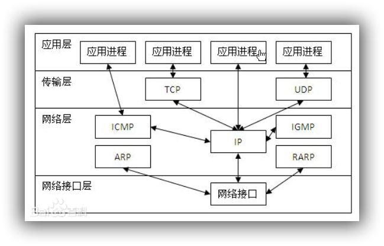

#### 概述

TCP/IP 协议不是 TCP 和 IP 这两个协议的合称，而是指因特网整个 TCP/IP 协议族。从协议分层模型方面来讲， **TCP/IP 由四个层次组成：网络接口层、网络层、传输层、应用层(因特网没有对链路层和物理层有任何规定,统一为为网络层提供服务的更底层)**。

#### 网络接口层

网络访问层(Network Access Layer)在 TCP/IP 参考模型中并没有详细描述,(**这也是为什么会有因特网是四层架构还是五层架构机构的问题,严格来说他的实现是五层,规定只有四层**) **只是指出主机必须使用某种协议与网络相连**。

#### 网络层

网络层(Internet Layer)是整个体系结构的关键部分，其功能是使主机可以把分组发往任何网络，并使分组独立地传向目标。这些分组可能经由不同的网络，到达的顺序和发送的顺序也可能不同。高层如果需要顺序收发，那么就必须自行处理对分组的排序。 一些书上也把网络层分开为控制平面和数据平面两个层面去讲解。**互联网层使用因特网协议(IP， Internet Protocol)**。

#### 传输层

传输层(Tramsport Layer)使源端和目的端机器上的对等实体可以进行会话。 **在这一层定义了两个端到端的协议**：传输控制协议(**TCP**， Transmission Control Protocol)和用户数据报协议(**UDP**， User Datagram Protocol)。 TCP 是面向连接的协议，它提供可靠的报文传输和对上层应用的连接服务。为此，除了基本的数据传输外，它还有可靠性保证、流量控制、多路复用、优先权和安全性控制等功能。 UDP 是面向无连接的不可靠传输的协议，主要用于实时性要求高但是对数据丢失可容忍的应用程序（微信视频等）。

#### 应用层

应用层为操作系统或网络应用程序提供访问网络服务的接口只要通过调用底层功能配合自身协议实现特定功能（如文件传输，域名解析,邮件传输）。

#### 各层常见协议

**应用层 文件传输，电子邮件，文件服务，虚拟终端 TFTP，HTTP，SNMP，FTP，SMTP，DNS，Telnet** 
**传输层 提供端对端的接口 TCP，UDP** 
**网络层 为数据包选择路由 IP，ICMP，RIP，OSPF，BGP，IGMP** 
**数据链路层 传输有地址的帧以及错误检测功能 SLIP，CSLIP，PPP，ARP，RARP，MTU** 
**物理层 以二进制数据形式在物理媒体上传输数据 ISO2110，IEEE802，IEEE802.2**