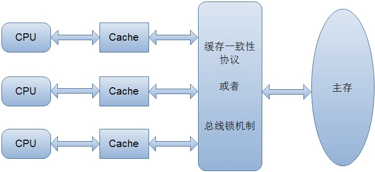

## 一、总线锁定和缓存一致性

### 基本概念

这是两个操作系统层面的概念。随着多核时代的到来，并发操作已经成了很正常的现象，操作系统必须要有一些机制和原语，以保证某些基本操作的原子性，比如处理器需要保证读一个字节或写一个字节是原子的，那么它是如何实现的呢?有两种机制：总线锁定和缓存一致性。

我们知道，CPU和物理内存之间的通信速度远慢于CPU的处理速度，所以CPU有自己的内部缓存，根据一些规则将内存中的数据读取到内部缓存中来，以加快频繁读取的速度。我们假设在一台PC上只有一个CPU和一份内部缓存，那么所有进程和线程看到的数都是缓存里的数，不会存在问题;但现在服务器通常是多 CPU，更普遍的是，每块CPU里有多个内核，而每个内核都维护了自己的缓存，那么这时候多线程并发就会存在缓存不一致性，这会导致严重问题。

以 i++为例，i的初始值是0.那么在开始每块缓存都存储了i的值0，当第一块内核做i++的时候，其缓存中的值变成了1，即使马上回写到主内存，那么在回写之后第二块内核缓存中的i值依然是0，其执行i++，回写到内存就会覆盖第一块内核的操作，使得最终的结果是1，而不是预期中的2.

那么怎么解决整个问题呢?操作系统提供了总线锁定的机制。前端总线(也叫CPU总线)是所有CPU与芯片组连接的主干道，负责CPU与外界所有部件的通信，包括高速缓存、内存、北桥，其控制总线向各个部件发送控制信号、通过地址总线发送地址信号指定其要访问的部件、通过数据总线双向传输。在CPU1要做 i++操作的时候，其在总线上发出一个LOCK#信号，其他处理器就不能操作缓存了该共享变量内存地址的缓存，也就是阻塞了其他CPU，使该处理器可以独享此共享内存。

但我们只需要对此共享变量的操作是原子就可以了，而总线锁定把CPU和内存的通信给锁住了，使得在锁定期间，其他处理器不能操作其他内存地址的数据，从而开销较大，所以后来的CPU都提供了缓存一致性机制，Intel的奔腾486之后就提供了这种优化。

缓存一致性机制整体来说，是当某块CPU对缓存中的数据进行操作了之后，就通知其他CPU放弃储存在它们内部的缓存，或者从主内存中重新读取，如下图：



这里以在Intel系列中广泛使用的MESI协议详细阐述下其原理。

### MESI协议

MESI 协议是以缓存行(缓存的基本数据单位，在Intel的CPU上一般是64字节)的几个状态来命名的(全名是Modified、Exclusive、 Share or Invalid)。该协议要求在每个缓存行上维护两个状态位，使得每个数据单位可能处于M、E、S和I这四种状态之一，各种状态含义如下：

M：被修改的。处于这一状态的数据，只在本CPU中有缓存数据，而其他CPU中没有。同时其状态相对于内存中的值来说，是已经被修改的，且没有更新到内存中。

E：独占的。处于这一状态的数据，只有在本CPU中有缓存，且其数据没有修改，即与内存中一致。

S：共享的。处于这一状态的数据在多个CPU中都有缓存，且与内存一致。

I：无效的。本CPU中的这份缓存已经无效。

这里首先介绍该协议约定的缓存上对应的监听：

一个处于M状态的缓存行，必须时刻监听所有试图读取该缓存行对应的主存地址的操作，如果监听到，则必须在此操作执行前把其缓存行中的数据写回CPU。

一个处于S状态的缓存行，必须时刻监听使该缓存行无效或者独享该缓存行的请求，如果监听到，则必须把其缓存行状态设置为I。

一个处于E状态的缓存行，必须时刻监听其他试图读取该缓存行对应的主存地址的操作，如果监听到，则必须把其缓存行状态设置为S。

当CPU需要读取数据时，如果其缓存行的状态是I的，则需要从内存中读取，并把自己状态变成S，如果不是I，则可以直接读取缓存中的值，但在此之前，必须要等待其他CPU的监听结果，如其他CPU也有该数据的缓存且状态是M，则需要等待其把缓存更新到内存之后，再读取。

当CPU需要写数据时，只有在其缓存行是M或者E的时候才能执行，否则需要发出特殊的RFO指令(Read Or Ownership，这是一种总线事务)，通知其他CPU置缓存无效(I)，这种情况下会性能开销是相对较大的。在写入完成后，修改其缓存状态为M。

所以如果一个变量在某段时间只被一个线程频繁地修改，则使用其内部缓存就完全可以办到，不涉及到总线事务，如果缓存一会被这个CPU独占、一会被那个CPU 独占，这时才会不断产生RFO指令影响到并发性能。这里说的缓存频繁被独占并不是指线程越多越容易触发，而是这里的CPU协调机制，这有点类似于有时多线程并不一定提高效率，原因是线程挂起、调度的开销比执行任务的开销还要大，这里的多CPU也是一样，如果在CPU间调度不合理，也会形成RFO指令的开销比任务开销还要大。当然，这不是编程者需要考虑的事，操作系统会有相应的内存地址的相关判断，这不在本文的讨论范围之内。

并非所有情况都会使用缓存一致性的，如被操作的数据不能被缓存在CPU内部或操作数据跨越多个缓存行(状态无法标识)，则处理器会调用总线锁定;另外当CPU不支持缓存锁定时，自然也只能用总线锁定了，比如说奔腾486以及更老的CPU。

## 二、CAS(Compare and Swap)

有了上一章的总线锁定和缓存一致性的介绍，对CAS就比较好理解了，这不是java特有的，而是操作系统需要保证的。CAS指令在Intel CPU上称为CMPXCHG指令，它的作用是将指定内存地址的内容与所给的某个值相比，如果相等，则将其内容替换为指令中提供的新值，如果不相等，则更新失败。这一比较并交换的操作是原子的，不可以被中断，而其保证原子性的原理就是上一节提到的“总线锁定和缓存一致性”。初一看，CAS也包含了读取、比较 (这也是种操作)和写入这三个操作，和之前的i++并没有太大区别，是的，的确在操作上没有区别，但CAS是通过硬件命令保证了原子性，而i++没有，且硬件级别的原子性比i++这样高级语言的软件级别的运行速度要快地多。虽然CAS也包含了多个操作，但其的运算是固定的(就是个比较)，这样的锁定性能开销很小。

随着互联网行业的兴起和硬件多CPU/多内核的进步，高并发已经成为越来越普遍的现象，CAS已经被越来越广泛地使用，在Java领域也是如此。JDK1.4是2002年2月发布的，当时的硬件设备远没有如今这么先进，多CPU和多核还没有普及，所以在JDK1.5之前的synchronized是使用挂起线程、等待调度的方式来实现线程同步，开销较大;而随着硬件的不断升级，在2004年9月发布的JDK5中引入了CAS机制——比较并交换——来彻底解决此问题，在一般情况下不再需要挂起(参考后文对锁级别的描述，只有进入重量级锁的时候才会使用挂起)，而是多次尝试，其利用底层CPU命令实现的乐观锁机制。从内存领域来说这是乐观锁，因为它在对共享变量更新之前会先比较当前值是否与更新前的值一致，如果是，则更新，如果不是，则无限循环执行(称为自旋)，直到当前值与更新前的值一致为止，才执行更新。

以concurrent中的AtomicInteger的代码为例，其的getAndIncrement()方法(获得并且自增，即i++)源代码如下：


```java
   /**
      * Atomically increments by one the current value.
      *
      * @return the previous value
      */
     public final int getAndIncrement() {
         for (;;) {
             int current = get();
             int next = current + 1 ;
             if (compareAndSet(current, next))
                 return current;
         }
     }

 /**
  * Atomically sets the value to the given updated value
  * if the current value {@code ==} the expected value.
  *
  * @param expect the expected value
  * @param update the new value
  * @return true if successful. False return indicates that
  * the actual value was not equal to the expected value.
  */
 public final boolean compareAndSet( int expect, int update) {
     return unsafe.compareAndSwapInt( this , valueOffset, expect, update);
 }
```
其调用了compareAndSet(int expect,int update)方法，其中expect是期望值，即操作前的原始值，而update是操作后的值，以i=2为例，则这里的 expect=2，update=3，它调用了sun.misc.Unsafe的compareAndSwapInt方法来执行，此方法代码如下：

```java
/***
    * Compares the value of the integer field at the specified offset
    * in the supplied object with the given expected value, and updates
    * it if they match.  The operation of this method should be atomic,
    * thus providing an uninterruptible way of updating an integer field.
    *
    * @param obj the object containing the field to modify.
    * @param offset the offset of the integer field within <code>obj</code>.
    * @param expect the expected value of the field.
    * @param update the new value of the field if it equals <code>expect</code>.
    * @return true if the field was changed.
    */
   public native boolean compareAndSwapInt(Object obj, long offset,
                                           int expect, int update);
```

这是一个本地方法，即利用CAS保证其原子性，同时如果失败了则通过循环不断地进行运算直到成功为止，这是和JDK5以前最大的区别，失败的线程不再需要被挂起、重新调度，而是可以无障碍地再度执行，这又极大减少了挂起调度的开销(当然如果CAS长时间不成功，也会造成耗费CPU，这取决于具体应用场景)。

CAS策略有如下需要注意的事项：

在线程抢占资源特别频繁的时候(相对于CPU执行效率而言)，会造成长时间的自旋，耗费CPU性能。

有ABA问题(即在更新前的值是A，但在操作过程中被其他线程更新为B，又更新为 A)，这时当前线程认为是可以执行的，其实是发生了不一致现象，如果这种不一致对程序有影响(真正有这种影响的场景很少，除非是在变量操作过程中以此变量为标识位做一些其他的事，比如初始化配置)，则需要使用AtomicStampedReference(除了对更新前的原值进行比较，也需要用更新前的 stamp标志位来进行比较)。

只能对一个变量进行原子性操作。如果需要把多个变量作为一个整体来做原子性操作，则应该使用AtomicReference来把这些变量放在一个对象里，针对这个对象做原子性操作。

CAS在JDK5中被J.U.C包广泛使用，在JDK6中被应用到synchronized的 JVM实现中，因此在JDK5中J.U.C的效率是比synchronized高不少的，而到了JDK6，两者效率相差无几，而synchronized 使用更简单、更不容易出错，所以其是专家组推荐的首选，除非需要用到J.U.C的特殊功能(如阻塞一段时间后放弃，而不是继续等待)。
