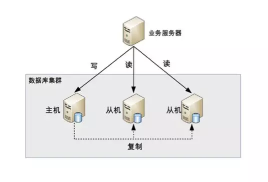
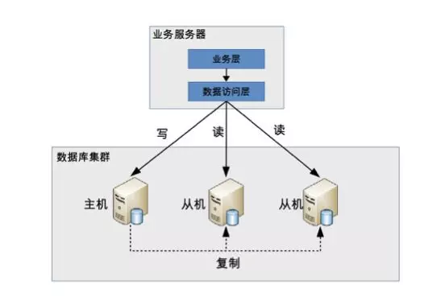
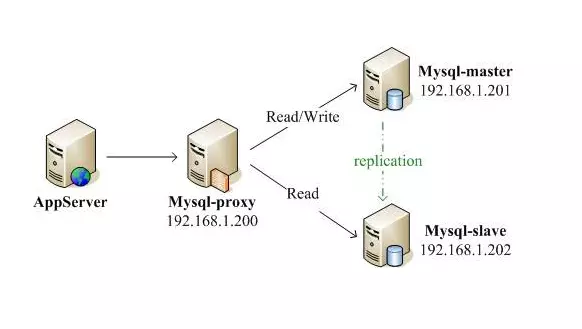

### 读写分离应用场景

因为用户的增多，数据的增多，单机的数据库往往支撑不住快速发展的业务，所以数据库集群就产生了！今天来说说读写分离的数据库集群方式！读写分离顾名思义就是读和写分离了，对应到数据库集群一般都是一主一从(一个主库，一个从库)或者一主多从(一个主库，多个从库)，业务服务器把需要写的操作都写到主数据库中，读的操作都去从库查询。主库会同步数据到从库保证数据的一致性。

把访问的压力从主库转移到从库

写的操作很多的话不适合这种集群方式

在单机的情况下，一般我们做数据库优化都会加索引，但是加了索引对查询有优化，但是会影响写入，因为写入数据会更新索引。所以做了**主从之后，我们可以单独的针对从库(读库)做索引上的优化，而主库(写库)可以减少索引而提高写的效率。**

看起来还是很简单的，但是有两点要注意：**主从同步延迟、分配机制的考虑**；

### 主从同步延迟

主库有数据写入之后，同时也写入在binlog(二进制日志文件)中，从库是通过binlog文件来同步数据的，这期间会有一定时间的延迟，可能是1秒，如果同时有大量数据写入的话，时间可能更长。

这会导致什么问题呢？比如有一个付款操作，你付款了，主库是已经写入数据，但是查询是到从库查，从库里还没有你的付款记录，所以页面上查询的时候你还没付款。那可不急眼了啊，吞钱了这还了得！打电话给客服投诉！

所以为了解决主从同步延迟的问题有以下几个方法：

#### 1、二次读取

二次读取的意思就是读从库没读到之后再去主库读一下，只要通过对数据库访问的API进行封装就能实现这个功能。很简单，并且和业务之间没有耦合。但是有个问题，如果有很多二次读取相当于压力还是回到了主库身上，等于读写分离白分了。而且如有人恶意攻击，就一直访问没有的数据，那主库就可能爆了。

#### 2、写之后的马上的读操作访问主库

也就是写操作之后，立马的读操作指定访问主库，之后的读操作采取访问从库。这就等于写死了，和业务强耦合了。

#### 3、关键业务读写都由主库承担，非关键业务读写分离

类似付钱的这种业务，读写都到主库，避免延迟的问题，但是例如改个头像啊，个人签名这种比较不重要的就读写分离，查询都去从库查，毕竟延迟一下影响也不大，不会立马打客服电话哈哈。

### 分配机制的考虑

分配机制的考虑也就是怎么制定写操作是去主库写，读操作是去从库读。

一般有两种方式：**代码封装、数据库中间件**。

1、代码封装代码封装的实现很简单，就是抽出一个中间层，让这个中间层来实现读写分离和数据库连接。讲白点就是搞个provider封装了save,select等通常数据库操作，内部save操作的dataSource是主库的，select操作的dataSource是从库的。

优点：就是实现简单，并且可以根据业务定制化变化，随心所欲。

缺点：就是是如果哪个数据库宕机了，发生主从切换了之后，就得修改配置重启。并且如果你的系统很大，一个业务可能包含多个子系统，一个子系统是java写的一个子系统用go写的，这样的话得分别为不同语言实现一套中间层，重复开发。

2、数据库中间件就是有一个独立的系统，专门来实现读写分离和数据库连接管理，业务服务器和数据库中间件之间是通过标准的SQL协议交流的，所以在业务服务器看来数据库中间件其实就是个数据库。

优点：因为是通过sql协议的所以可以兼容不同的语言不需要单独写一套，并且有中间件来实现主从切换，业务服务器不需要关心这点。

缺点：多了一个系统其实就等于多了一个关心。。如果数据库中间件挂了的话对吧，而且多了一个系统就等于多了一个瓶颈，所以对中间件的性能要求也高，并且所有的数据库操作都要经过它。并且中间件实现很复杂，难度比代码封装高多了。

但是有开源的数据库中间件例如Mysql Proxy,Mysql Route,Atlas。

#### 总结

读写分离相对而言是比较简单的，比分表分库简单，但是它只能分担访问的压力，分担不了存储的压力，也就是你的数据库表的数据逐渐增多，但是面对一张表海量的数据，查询还是很慢的，所以如果业务发展的快数据暴增，到一定时间还是得分库分表。

但是正常情况下，只要当单机真的顶不住压力了才会集群，**不要一上来就集群**，没这个必要。有关于软件的东西都是越简单越好，复杂都是形势所迫。

**一般我们是先优化，优化一些慢查询，优化业务逻辑的调用或者加入缓存等，如果真的优化到没东西优化了然后才上集群，先读写分离，读写分离之后顶不住就再分库分表。**