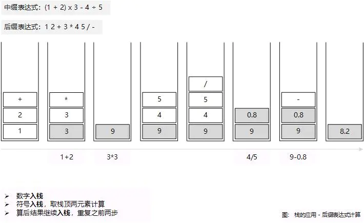

## 性质

栈和队列其实是一个工具，他们传统的工具方法 工具类不同，他们是“思想”工具，**栈是后进先出**。


## 常见的使用栈的场景

### 递归

> 从前山上有座庙，庙里有个老和尚和小和尚，老和尚给小和尚讲故事：“从前山上有座庙......”

有名的斐波那契数列，手动地计算相当困难，即便有计算器在手。而在编程语言中，使用递归可以很好地解决这个难题：

```java
function F(n) {
  return F(n-1) + F(n-2);
}
```

重点来了，计算机如何实现递归？这是一个很笼统的概念，因为等于这个加那个，那个再加这个...... 知其所以然而不知其然。**应用栈的结构，我们可以把未知的结果推入栈内，在弹出的时候逐个计算。** 如下图


代码解释：

```java
function recursion() {
  // 调用栈
  const stack = [];

  // 解析时
  // 推入栈
  // 一般来说，栈有大小限制，如果自己写了个无限递归的函数，那调用栈一直增加，最后溢出
  for (let i = n; i > 0; i--) {
    stack.push(F(i));
  }

  // 执行时
  // 后入先出，弹出
  for (let i = 3; i <= n; i++) {
    F(n-2) = stack.pop();
    F(n-1) = stack.pop();

    F(n) = F(n-1) + F(n-2)
    
    // 计算完成后再推入栈内
    stack.push(F(n))
  }

  // 执行完成，栈内剩下最终结果，弹出并返回
  if (n) return stack.pop()
}
```

### 四则运算

> 数学老师：“先乘除，后加减，有括号先算括号。”

分析下计算机四则运算的步骤：

1. 定义运算符功能
2. 优先级：乘除 >> 加减
3. 有括号优先计算括号

示例：`(1 + 2) x 3 - 4 ÷ 5`

括号内优先计算，立马得出结果，咋一想还蛮符合队列的规则，先入先出嘛。但在有多个括号的情况下，优先计算最里面的括号，这样就只能推入栈中慢慢计算了。

但是怎么优雅地推入栈内计算，有个伟大的科学家解决了这个难题，波兰逻辑学家想到了一种**不需要括号的后缀表达式，称之为逆波兰**。

示例后缀表达式：`12+3*45/-`

后缀表达式计算过程：



转化后的计算简直不要太简单，来看看又是如何利用栈来转的：


# 