# Flink简介

## 初识Flink

Apache Flink是一个框架和分布式处理引擎，用于对无界和有界数据流进行有状态计算。Flink被设计在所有常见的集群环境中运行，以内存执行速度和任意规模来执行计算。

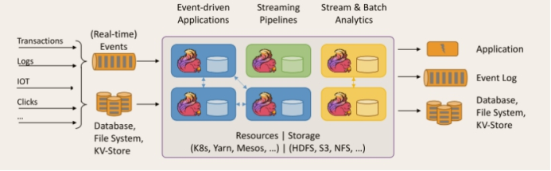 

Flink起源于Stratosphere项目，Stratosphere是在2010~2014年由3所地处柏林的大学和欧洲的一些其他的大学共同进行的研究项目，2014年4月Stratosphere的代码被复制并捐赠给了Apache软件基金会，参加这个孵化项目的初始成员是Stratosphere系统的核心开发人员，2014年12月，Flink一跃成为Apache软件基金会的顶级项目。

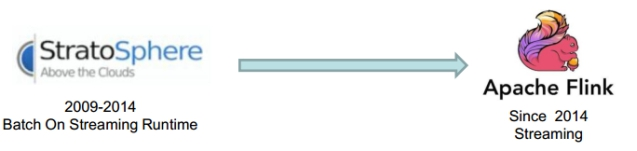 

 

在德语中，Flink一词表示快速和灵巧，项目采用一只松鼠的彩色图案作为logo，这不仅是因为松鼠具有快速和灵巧的特点，还因为柏林的松鼠有一种迷人的红棕色，而Flink的松鼠logo拥有可爱的尾巴，尾巴的颜色与Apache软件基金会的logo颜色相呼应，也就是说，这是一只Apache风格的松鼠。


Flink虽然诞生的早(2010年)，但是其实是起大早赶晚集，直到2015年才开始突然爆发热度。 

在Flink被apache提升为顶级项目之后，阿里实时计算团队决定在阿里内部建立一个 Flink 分支 Blink，并对 Flink 进行大量的修改和完善，让其适应阿里巴巴这种超大规模的业务场景。

Blink由2016年上线，服务于阿里集团内部搜索、推荐、广告和蚂蚁等大量核心实时业务。与2019年1月Blink正式开源，目前阿里70%的技术部门都有使用该版本。

Blink比起Flink的优势就是对SQL语法的更完善的支持以及执行SQL的性能提升。

 

## **Flink**的重要特点

### 事件驱动型(Event-driven)

事件驱动型应用是一类具有状态的应用，它从一个或多个事件流提取数据，并根据到来的事件触发计算、状态更新或其他外部动作。比较典型的就是以kafka为代表的消息队列几乎都是事件驱动型应用。

与之不同的就是SparkStreaming微批次，如图：

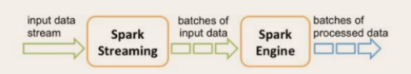 

   事件驱动型：

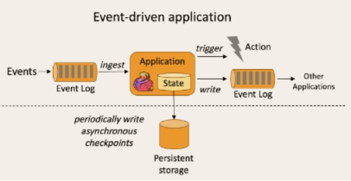 

 

### 流与批的世界观

​     **批处理**的特点是有界、持久、大量，非常适合需要访问全套记录才能完成的计算工作，一般用于离线统计。

**流处理**的特点是无界、实时,  无需针对整个数据集执行操作，而是对通过系统传输的每个数据项执行操作，一般用于实时统计。

在**spark**的世界观中，一切都是由批次组成的，离线数据是一个大批次，而实时数据是由一个一个无限的小批次组成的。

 而在**flink**的世界观中，一切都是由流组成的，离线数据是有界限的流，实时数据是一个没有界限的流，这就是所谓的有界流和无界流。

**无界数据流**：**无界数据流有一个开始但是没有结束**，它们不会在生成时终止并提供数据，必须连续处理无界流，也就是说必须在获取后立即处理event。对于无界数据流我们无法等待所有数据都到达，因为输入是无界的，并且在任何时间点都不会完成。处理无界数据通常要求以特定顺序（例如事件发生的顺序）获取event，以便能够推断结果完整性。

**有界数据流**：**有界数据流有明确定义的开始和结束**，可以在执行任何计算之前通过获取所有数据来处理有界流，处理有界流不需要有序获取，因为可以始终对有界数据集进行排序，有界流的处理也称为批处理。

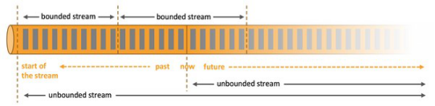

​    这种以流为世界观的架构，获得的最大好处就是具有极低的延迟。

###  分层api

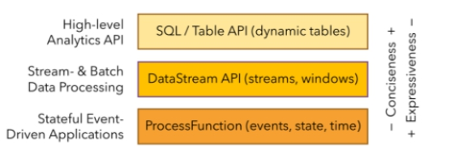 

最底层级的抽象仅仅提供了有状态流，它将通过过程函数（Process Function）被嵌入到DataStream API中。底层过程函数（Process Function） 与 DataStream API 相集成，使其可以对某些特定的操作进行底层的抽象，它允许用户可以自由地处理来自一个或多个数据流的事件，并使用一致的容错的状态。除此之外，用户可以注册事件时间并处理时间回调，从而使程序可以处理复杂的计算。

实际上，**大多数应用并不需要上述的底层抽象，而是针对核心API（Core APIs） 进行编程，比如DataStream API（有界或无界流数据）以及DataSet API（有界数据集）**。这些API为数据处理提供了通用的构建模块，比如由用户定义的多种形式的转换（transformations），连接（joins），聚合（aggregations），窗口操作（windows）等等。DataSet API 为有界数据集提供了额外的支持，例如循环与迭代。这些API处理的数据类型以类（classes）的形式由各自的编程语言所表示。

Table API 是以表为中心的声明式编程，其中表可能会动态变化（在表达流数据时）。Table API遵循（扩展的）关系模型：表有二维数据结构（schema）（类似于关系数据库中的表），同时API提供可比较的操作，例如select、project、join、group-by、aggregate等。Table API程序声明式地定义了什么逻辑操作应该执行，而不是准确地确定这些操作代码的看上去如何 。 尽管Table API可以通过多种类型的用户自定义函数（UDF）进行扩展，其仍不如核心API更具表达能力，但是使用起来却更加简洁（代码量更少）。除此之外，Table API程序在执行之前会经过内置优化器进行优化。

**你可以在表与 DataStream/DataSet 之间无缝切换，以允许程序将 Table API 与 DataStream 以及 DataSet 混合使用**。

Flink提供的最高层级的抽象是 SQL 。这一层抽象在语法与表达能力上与 Table API 类似，但是是以SQL查询表达式的形式表现程序。SQL抽象与Table API交互密切，同时SQL查询可以直接在Table API定义的表上执行。

### 支持有状态计算

Flink在1.4版本中实现了状态管理，所谓状态管理就是在流失计算过程中将算子的中间结果保存在内存或者文件系统中，等下一个事件进入算子后可以让当前事件的值与历史值进行汇总累计。

### 支持exactly-once语义

在分布式系统中，组成系统的各个计算机是独立的。这些计算机有可能fail。

一个sender发送一条message到receiver。根据receiver出现fail时sender如何处理fail，可以将message delivery分为三种语义:

**At Most once:** 对于一条message,receiver最多收到一次(0次或1次).

可以达成At Most Once的策略:

sender把message发送给receiver.无论receiver是否收到message,sender都不再重发message.

**At Least once:** 对于一条message,receiver最少收到一次(1次及以上).

可以达成At Least Once的策略:

sender把message发送给receiver.当receiver在规定时间内没有回复ACK或回复了error信息,那么sender重发这条message给receiver,直到sender收到receiver的ACK.

**Exactly once:** 对于一条message,receiver确保只收到一次

### 支持事件时间（EventTime)

目前大多数框架时间窗口计算，都是采用当前系统时间，以时间为单位进行的聚合计算只能反应数据到达计算引擎的时间，而并不是实际业务时间

# Flink实战入门

## **批处理wordcount编程实战**

**添加依赖**

```xml
        <dependency>
            <groupId>org.apache.flink</groupId>
            <artifactId>flink-scala_2.11</artifactId>
            <version>1.7.0</version>
        </dependency>
```

**编写程序**

```scala
def main(args: Array[String]): Unit = {

  //构造执行环境
  val env: ExecutionEnvironment = ExecutionEnvironment.getExecutionEnvironment
  //读取文件
  val input = "file:///d:/temp/hello.txt"
  val ds: DataSet[String] = env.readTextFile(input)
  // 其中flatMap 和Map 中  需要引入隐式转换
  import org.apache.flink.api.scala.createTypeInformation
  //经过groupby进行分组，sum进行聚合
  val aggDs: AggregateDataSet[(String, Int)] = ds.flatMap(_.split(" ")).map((_, 1)).groupBy(0).sum(1)
  // 打印
  aggDs.print()

}
```

## 流处理wordcount编程

**导入依赖**

```xml
<dependency>
    <groupId>org.apache.flink</groupId>
    <artifactId>flink-scala_2.11</artifactId>
    <version>1.7.0</version>
</dependency>

<!-- https://mvnrepository.com/artifact/org.apache.flink/flink-streaming-scala -->
<dependency>
    <groupId>org.apache.flink</groupId>
    <artifactId>flink-streaming-scala_2.11</artifactId>
    <version>1.7.0</version>
</dependency>
```

**编写程序**

```scala
import org.apache.flink.api.java.utils.ParameterTool
import org.apache.flink.streaming.api.scala.{DataStream, StreamExecutionEnvironment}

object StreamWcApp {

  def main(args: Array[String]): Unit = {
    //从外部命令中获取参数
    val tool: ParameterTool = ParameterTool.fromArgs(args)
    val host: String = tool.get("host")
    val port: Int = tool.get("port").toInt

    //创建流处理环境
    val env: StreamExecutionEnvironment = StreamExecutionEnvironment.getExecutionEnvironment
    //接收socket文本流
    val textDstream: DataStream[String] = env.socketTextStream(host,port)
   // flatMap和Map需要引用的隐式转换
    import org.apache.flink.api.scala._
   //处理 分组并且sum聚合
    val dStream: DataStream[(String, Int)] = textDstream.flatMap(_.split(" ")).filter(_.nonEmpty).map((_,1)).keyBy(0).sum(1)
   //打印
    dStream.print()
    
    env.execute()
  }
```


# Flink部署

## standalone模式

###  **安装**

解压缩  flink-1.7.0-bin-hadoop27-scala_2.11.tgz

**修改 flink/conf/flink-conf.yaml 文件**

```yaml
jobmanager.rpc.address:master
```

**修改/conf/slave文件,添加上集群主机**

```html
slave1
slave2
slave3
```

**分发给 另外两台机子([分发脚本可通过如下地址获取]())**

```shell
xsync flink-1.7.0
```

**启动**

 ```shell
start-cluster.sh
 ```

###  提交任务

**准备数据文件** 

**把含数据文件的文件夹，分发到taskmanage 机器中** 

**注:**由于读取数据是从本地磁盘读取，实际任务会被分发到taskmanage的机器中，所以要把目标文件分发。

**执行程序** 

 ```shell
..flink run -c 全类名 /jar包位置 --input 输入文件位置 --output 输出文件位置
 ```

 **到目标文件夹中查看计算结果**

**注：**计算结果根据会保存到taskmanage的机器下，不会再jobmanage下。

在**web控制台**查看计算过程

 ```html
在浏览器打开
http://master:8081 
 ```

 

## yarn模式

**启动hadoop集群**

**启动yarn-session**

```shell
./yarn-sessin.sh -n 2 -s 6 -jm 1024 -tm test -d
```

其中：

* -n(--container)：TaskManager的数量。
	 -s(--slots)：	每个TaskManager的slot数量，默认一个slot一个core，默认每个taskmanager的slot的个数为1，有时可以多一些taskmanager，做冗余。
* -jm：JobManager的内存（单位MB)。
* -tm：每个taskmanager的内存（单位MB)。
* -nm：yarn 的appName(现在yarn的ui上的名字)。 
* -d：后台执行。

 **执行任务**

```shell
./flink run -m yarn-cluster -c 主类名 jar包位置 --input 输入文件位置 --output 输出文件位置 
```

**去yarn控制台查看任务状态**

```html
去浏览器打开
http://slave1:8088
```

# Flink架构介绍

## 基本组件栈

了解Spark的朋友会发现Flink的架构和Spark是非常类似的，在整个软件架构体系中，同样遵循着分层的架构设计理念，在降低系统耦合度的同时，也为上层用户构建Flink应用提供了丰富且友好的接口。

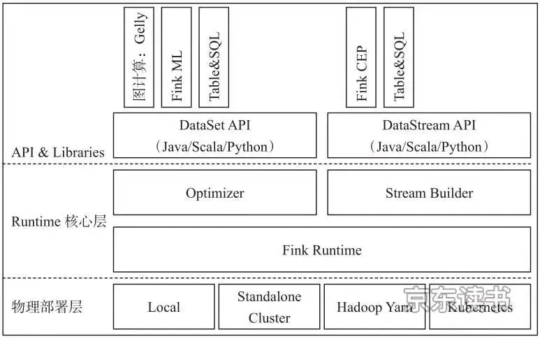

Flink分为架构分为三层，由上往下依次是API&Libraries层、Runtime核心层以及物理部署层

​        **API&Libraries层**

作为分布式数据处理框架，Flink同时提供了支撑计算和批计算的接口，同时在此基础上抽象出不同的应用类型的组件库，如基于流处理的CEP(复杂事件处理库)、SQL&Table库和基于批处理的FlinkML(机器学习库)等、Gelly(图处理库)等。API层包括构建流计算应用的DataStream API和批计算应用的DataSet API，两者都提供给用户丰富的数据处理高级API，例如Map、FlatMap操作等，同时也提供比较低级的Process Function API，用户可以直接操作状态和时间等底层数据。

　　**Runtime核心层**

　　该层主要负责对上层不同接口提供基础服务，也是Flink分布式计算框架的核心实现层，支持分布式Stream作业的执行、JobGraph到ExecutionGraph的映射转换、任务调度等。将DataSteam和DataSet转成统一的可执行的Task Operator，达到在流式引擎下同时处理批量计算和流式计算的目的。

　　**物理部署层**

　　该层主要涉及Flink的部署模式，目前Flink支持多种部署模式：本地、集群(Standalone、YARN)、云(GCE/EC2)、Kubenetes。Flink能够通过该层能够支持不同平台的部署，用户可以根据需要选择使用对应的部署模式。

## 运行架构

## 任务提交流程（yarn模式）

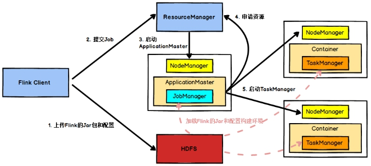 

Flink任务提交后，Client向HDFS上传Flink的Jar包和配置，之后向Yarn ResourceManager提交任务，ResourceManager分配Container资源并通知对应的NodeManager启动ApplicationMaster，ApplicationMaster启动后加载Flink的Jar包和配置构建环境，然后启动JobManager，之后ApplicationMaster向ResourceManager申请资源启动TaskManager，ResourceManager分配Container资源后，由ApplicationMaster通知资源所在节点的NodeManager启动TaskManager，NodeManager加载Flink的Jar包和配置构建环境并启动TaskManager，TaskManager启动后向JobManager发送心跳包，并等待JobManager向其分配任务。

## **2** **任务调度原理**

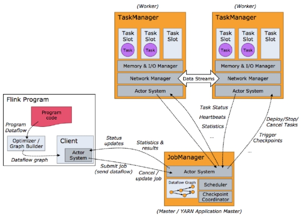

客户端不是运行时和程序执行的一部分，但它用于准备并发送dataflow(JobGraph)给Master(JobManager)，然后，客户端断开连接或者维持连接以等待接收计算结果。

当 Flink 集群启动后，首先会启动一个 JobManger 和一个或多个的 TaskManager。由 Client 提交任务给 JobManager，JobManager 再调度任务到各个 TaskManager 去执行，然后 TaskManager 将心跳和统计信息汇报给 JobManager。TaskManager 之间以流的形式进行数据的传输。上述三者均为独立的 JVM 进程。

**Client** 为提交 Job 的客户端，可以是运行在任何机器上（与 JobManager 环境连通即可）。提交 Job 后，Client 可以结束进程（Streaming的任务），也可以不结束并等待结果返回。

**JobManager** 主要负责调度 Job 并协调 Task 做 checkpoint，职责上很像 Storm 的 Nimbus。从 Client 处接收到 Job 和 JAR 包等资源后，会生成优化后的执行计划，并以 Task 的单元调度到各个 TaskManager 去执行。

**TaskManager** 在启动的时候就设置好了槽位数（Slot），每个 slot 能启动一个 Task，Task 为线程。从 JobManager 处接收需要部署的 Task，部署启动后，与自己的上游建立 Netty 连接，接收数据并处理。

**关于执行图**

Flink 中的执行图可以分成四层：**StreamGraph** -> **JobGraph** -> **ExecutionGraph** -> **物理执行图**。

**StreamGraph**：是根据用户通过 Stream API 编写的代码生成的最初的图。用来表示程序的拓扑结构。

**JobGraph**：StreamGraph经过优化后生成了 JobGraph，提交给 JobManager 的数据结构。主要的优化为，将多个符合条件的节点 chain 在一起作为一个节点，这样可以减少数据在节点之间流动所需要的序列化/反序列化/传输消耗。

**ExecutionGraph**：JobManager 根据 JobGraph 生成ExecutionGraph。ExecutionGraph是JobGraph的并行化版本，是调度层最核心的数据结构。

**物理执行图**：JobManager 根据 ExecutionGraph 对 Job 进行调度后，在各个TaskManager 上部署 Task 后形成的“图”，并不是一个具体的数据结构。

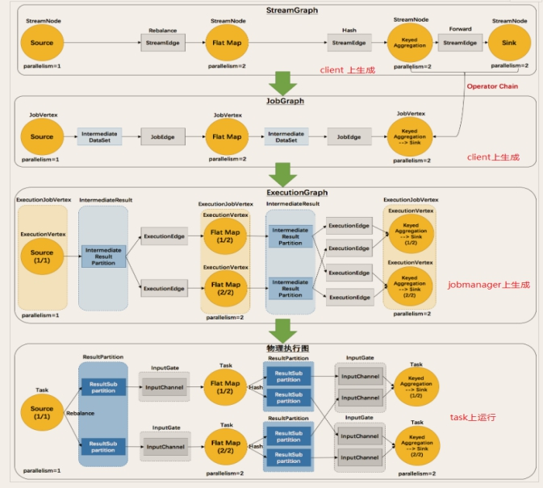

## **3** **Worker与Slots** 

**每一个worker(TaskManager)是一个JVM进程，它可能会在独立的线程上执行一个或多个subtask**。为了控制一个worker能接收多少个task，worker通过task slot来进行控制（一个worker至少有一个task slot）。·

每个task slot表示TaskManager拥有资源的一个固定大小的子集。假如一个TaskManager有三个slot，那么它会将其管理的内存分成三份给各个slot。**资源slot化意味着一个subtask将不需要跟来自其他job的subtask竞争被管理的内存，取而代之的是它将拥有一定数量的内存储备**。需要注意的是，这里不会涉及到CPU的隔离，slot目前仅仅用来隔离task的受管理的内存。

**通过调整task slot的数量，允许用户定义subtask之间如何互相隔离**。如果一个TaskManager一个slot，那将意味着每个task group运行在独立的JVM中（该JVM可能是通过一个特定的容器启动的），而一个TaskManager多个slot意味着更多的subtask可以共享同一个JVM。而在同一个JVM进程中的task将共享TCP连接（基于多路复用）和心跳消息。它们也可能共享数据集和数据结构，因此这减少了每个task的负载。

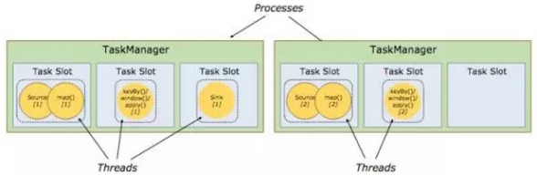

**Task **Slot是静态的概念，是指TaskManager具有的并发执行能力**，可以通过参数taskmanager.numberOfTaskSlots进行配置，而**并行度parallelism是动态概念，即TaskManager运行程序时实际使用的并发能力**，可以通过参数parallelism.default进行配置。

也就是说，假设一共有3个TaskManager，每一个TaskManager中的分配3个TaskSlot，也就是每个TaskManager可以接收3个task，一共9个TaskSlot，如果我们设置parallelism.default=1，即运行程序默认的并行度为1，9个TaskSlot只用了1个，有8个空闲，因此，设置合适的并行度才能提高效率。

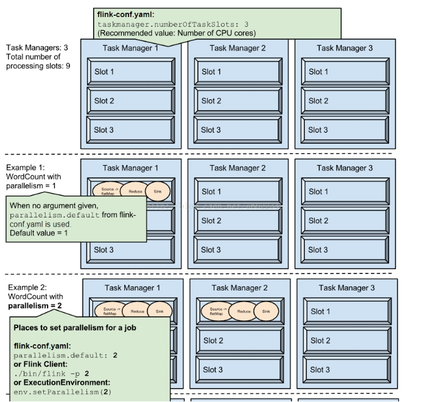 

 

 

## **4** **并行数据流**

**Flink程序的执行具有并行、分布式的特性**。在执行过程中，一个 stream 包含一个或多个 stream partition ，而每一个 operator 包含一个或多个 operator subtask，这些operator subtasks在不同的线程、不同的物理机或不同的容器中彼此互不依赖得执行。

**一个特定operator的subtask的个数被称之为其parallelism(并行度)**。一个stream的并行度总是等同于其producing operator的并行度。一个程序中，不同的operator可能具有不同的并行度。

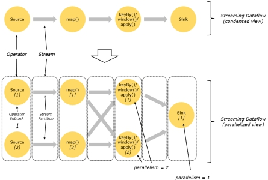

Stream在operator之间传输数据的形式可以是one-to-one(forwarding)的模式也可以是redistributing的模式，具体是哪一种形式，取决于operator的种类。

**One-to-one**：**stream(比如在source和map operator之间)维护着分区以及元素的顺序**。那意味着map operator的subtask看到的元素的个数以及顺序跟source operator的subtask生产的元素的个数、顺序相同，map、fliter、flatMap等算子都是one-to-one的对应关系。

Ø **类似于s****park****中的窄依赖**

**Redistributing**：**stream(map()跟keyBy/window之间或者keyBy/window跟sink之间)的分区会发生改变**。每一个operator subtask依据所选择的transformation发送数据到不同的目标subtask。例如，keyBy() 基于hashCode重分区、broadcast和rebalance会随机重新分区，这些算子都会引起redistribute过程，而redistribute过程就类似于Spark中的shuffle过程。

Ø **类似于s****park****中的宽依赖**

## **5** **task与operator** **chains**

相同并行度的one to one操作，Flink这样相连的operator 链接在一起形成一个task，原来的operator成为里面的subtask。将operators链接成task是非常有效的优化：**它能减少线程之间的切换和基于缓存区的数据交换，在减少时延的同时提升吞吐量**。链接的行为可以在编程API中进行指定。

 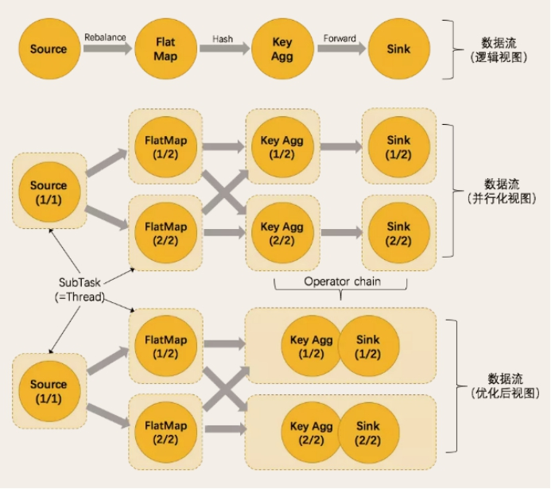

**OperatorChain的优点**

- 减少线程切换
- 减少序列化与反序列化
- 减少延迟并且提高吞吐能力

**OperatorChain 组成条件**

- 上下游算子并行度一致
- 上下游算子之间没有数据shuffle

# 流计算框架Flink与Storm 的性能对比

|          | Storm                                                        | Flink                                                        |
| -------- | ------------------------------------------------------------ | ------------------------------------------------------------ |
| 状态管理 | 无状态，需用户自行进行状态管理                               | 有状态                                                       |
| 窗口支持 | 对事件窗口支持较弱，缓存整个窗口的所有 数据，窗口结束时一起计算 | 窗口支持较为完善，自带一些窗口聚合方法，并 且会自动管理窗口状态。 |
| 消息投递 | At Most Once At Least Once                                   | At Most Once At Least Once Exactly Once                      |
| 容错方式 | ACK机制：对每个消息进行全链路跟踪，失败 或超时进行重发。     | 检查点机制：通过分布式一致性快照机制，对数 据流和算子状态进行保存。在发生错误时，使系 统能够进行回滚。 |
| 应用现状 | 在美团点评实时计算业务中已有较为成熟的 运用，有管理平台、常用 API 和相应的文档， 大量实时作业基于 Storm 构建。 | 在美团点评实时计算业务中已有一定应用，但 是管理平台、API 及文档等仍需进一步完善。 |

##  框架本身性能

- Storm 单线程吞吐约为 **8.7 万条/秒**，Flink 单线程吞吐 可达 **35 万条/秒**。Flink 吞吐约为 Storm 的 3-5 倍。
- Storm QPS 接近吞吐时延迟（含 Kafka 读写时间）中位 数约 100 毫秒，99 线约 700 毫秒，Flink 中位数约 50 毫秒，99 线约 300 毫秒。Flink 在 满吞吐时的延迟约为 Storm 的一半，且随着 QPS 逐渐增大，Flink 在延迟上的优势开始体现出来。
- 综上可得，**Flink 框架本身性能优于 Storm**。

##  复杂用户逻辑对框架差异的削弱

- 单个 Bolt Sleep 时长达到 1 毫秒时， Flink 的延迟仍低于 Storm，但吞吐优势已基本无法体现。
- 因此，用户逻辑越复杂，本身耗时越长，针对该逻辑的测试体现出来的框架的差异越小。

## 不同消息投递语义的差异

- Flink Exactly Once 的吞吐较 At Least Once 而 言下降 6.3%，延迟差异不大；Storm At Most Once 语义下的吞吐较 At Least Once 提升 16.8%，延迟稍有下降。
- 由于 Storm 会对每条消息进行 ACK，Flink 是基于一批消息做的检查点，不同的实现原理导 致两者在 At Least Once 语义的花费差异较大，从而影响了性能。而 Flink 实现 Exactly Once 语义仅增加了对齐操作，因此在算子并发量不大、没有出现慢节点的情况下对 Flink 性能的 影响不大。Storm At Most Once 语义下的性能仍然低于 Flink。

## Flink 状态存储后端选择

• Flink 提供了内存、文件系统、RocksDB 三种 StateBackends，三者的对比如下：

StateBackend 过程状态存储 检查点存储 吞吐 推荐使用场景 Memory TM Memory JM Memory 高（3-5 倍 Storm） 调试、无状态或对数据是否 丢失重复无要求 FileSystem TM Memory FS/HDFS 高（3-5 倍 Storm） 普通状态、窗口、KV 结构 （建议作为默认 Backend）

```html
    RocksDB RocksDB on TM FS/HDFS 低（0.3-0.5 倍 Storm） 超大状态、超长窗口、大型 KV 结构 
```

## 推荐使用 Flink 的场景

综合上述测试结果，以下实时计算场景建议考虑使用 Flink 框架进行计算：

- 要求消息投递语义为Exactly Once的场景；
- 数据量较大，要求高吞吐低延迟的场景；
- 需要进行状态管理或窗口统计的场景。