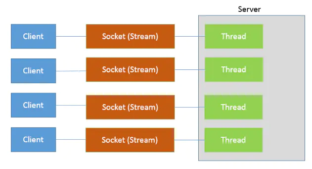
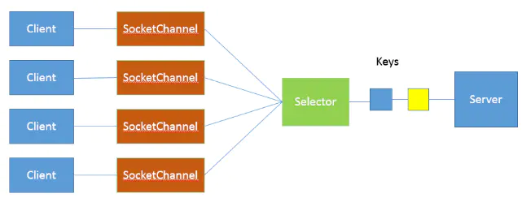

# IO 介绍

我们通常所说的 BIO 是相对于 NIO 来说的，BIO 也就是 Java 开始之初推出的 IO 操作模块，BIO 是 BlockingIO 的缩写，顾名思义就是阻塞 IO 的意思。

##  BIO、NIO、AIO的区别

1. BIO 就是传统的 [java.io](http://java.io) 包，它是基于流模型实现的，交互的方式是同步、阻塞方式，也就是说在读入输入流或者输出流时，在读写动作完成之前，线程会一直阻塞在那里，它们之间的调用是可靠的线性顺序。它的优点就是代码比较简单、直观；缺点就是 IO 的效率和扩展性很低，容易成为应用性能瓶颈。
2. NIO 是 Java 1.4 引入的 java.nio 包，提供了 Channel、Selector、Buffer 等新的抽象，可以构建多路复用的、同步非阻塞 IO 程序，同时提供了更接近操作系统底层高性能的数据操作方式。
3. AIO 是 Java 1.7 之后引入的包，是 NIO 的升级版本，提供了异步非堵塞的 IO 操作方式，所以人们叫它 AIO（Asynchronous IO），异步 IO 是基于事件和回调机制实现的，也就是应用操作之后会直接返回，不会堵塞在那里，当后台处理完成，操作系统会通知相应的线程进行后续的操作。

**在JAVA NIO框架中，我们说到了一个重要概念“selector”（选择器）。它负责代替应用查询中所有已注册的通道到操作系统中进行IO事件轮询、管理当前注册的通道集合，定位发生事件的通道等操操作；但是在JAVA AIO框架中，由于应用程序不是“轮询”方式，而是订阅-通知方式，所以不再需要“selector”（选择器）了，改由channel通道直接到操作系统注册监听。** 

**JAVA AIO框架中，只实现了两种网络IO通道“AsynchronousServerSocketChannel”（服务器监听通道）、“AsynchronousSocketChannel”（socket套接字通道）。但是无论哪种通道他们都有独立的fileDescriptor（文件标识符）、attachment（附件，附件可以使任意对象，类似“通道上下文”），并被独立的SocketChannelReadHandle类实例引用。** 

# 同步、异步、阻塞、非阻塞

上面说了很多关于同步、异步、阻塞和非阻塞的概念，接下来就具体聊一下它们4个的含义，以及组合之后形成的性能分析。

##  同步与异步

同步就是一个任务的完成需要依赖另外一个任务时，只有等待被依赖的任务完成后，依赖的任务才能算完成，这是一种可靠的任务序列。要么成功都成功，失败都失败，两个任务的状态可以保持一致。而异步是不需要等待被依赖的任务完成，只是通知被依赖的任务要完成什么工作，依赖的任务也立即执行，只要自己完成了整个任务就算完成了。至于被依赖的任务最终是否真正完成，依赖它的任务无法确定，所以它是不可靠的任务序列。我们可以用打电话和发短信来很好的比喻同步与异步操作。

##  阻塞与非阻塞

阻塞与非阻塞主要是从 CPU 的消耗上来说的，阻塞就是 CPU 停下来等待一个慢的操作完成 CPU 才接着完成其它的事。非阻塞就是在这个慢的操作在执行时 CPU 去干其它别的事，等这个慢的操作完成时，CPU 再接着完成后续的操作。虽然表面上看非阻塞的方式可以明显的提高 CPU 的利用率，但是也带了另外一种后果就是系统的线程切换增加。增加的 CPU 使用时间能不能补偿系统的切换成本需要好好评估。

## 同/异、阻/非堵塞 组合

同/异、阻/非堵塞的组合，有四种类型，如下表：

| 组合方式   | 性能分析                                                     |
| ---------- | ------------------------------------------------------------ |
| 同步阻塞   | 最常用的一种用法，使用也是最简单的，但是 I/O 性能一般很差，CPU 大部分在空闲状态。 |
| 同步非阻塞 | 提升 I/O 性能的常用手段，就是将 I/O 的阻塞改成非阻塞方式，尤其在网络 I/O 是长连接，同时传输数据也不是很多的情况下，提升性能非常有效。 这种方式通常能提升 I/O 性能，但是会增加CPU 消耗，要考虑增加的 I/O 性能能不能补偿 CPU 的消耗，也就是系统的瓶颈是在 I/O 还是在 CPU 上。 |
| 异步阻塞   | 这种方式在分布式数据库中经常用到，例如在网一个分布式数据库中写一条记录，通常会有一份是同步阻塞的记录，而还有两至三份是备份记录会写到其它机器上，这些备份记录通常都是采用异步阻塞的方式写 I/O。异步阻塞对网络 I/O 能够提升效率，尤其像上面这种同时写多份相同数据的情况。 |
| 异步非阻塞 | 这种组合方式用起来比较复杂，只有在一些非常复杂的分布式情况下使用，像集群之间的消息同步机制一般用这种 I/O 组合方式。如 Cassandra 的 Gossip 通信机制就是采用异步非阻塞的方式。它适合同时要传多份相同的数据到集群中不同的机器，同时数据的传输量虽然不大，但是却非常频繁。这种网络 I/O 用这个方式性能能达到最高。 |

# Socket 和 NIO 的多路复用

本节带你实现最基础的 Socket 的同时，同时会实现 NIO 多路复用，还有 AIO 中 Socket 的实现。

## 传统的 Socket 实现

接下来我们将会实现一个简单的 Socket，服务器端只发给客户端信息，再由客户端打印出来的例子，代码如下：

```java
int port = 4343; //端口号
// Socket 服务器端（简单的发送信息）
Thread sThread = new Thread(new Runnable() {
    @Override
    public void run() {
        try {
            ServerSocket serverSocket = new ServerSocket(port);
            while (true) {
                // 等待连接
                Socket socket = serverSocket.accept();
                Thread sHandlerThread = new Thread(new Runnable() {
                    @Override
                    public void run() {
                        try (PrintWriter printWriter = new PrintWriter(socket.getOutputStream())) {
                            printWriter.println("hello world！");
                            printWriter.flush();
                        } catch (IOException e) {
                            e.printStackTrace();
                        }
                    }
                });
                sHandlerThread.start();
            }
        } catch (IOException e) {
            e.printStackTrace();
        }
    }
});
sThread.start();

// Socket 客户端（接收信息并打印）
try (Socket cSocket = new Socket(InetAddress.getLocalHost(), port)) {
    BufferedReader bufferedReader = new BufferedReader(new InputStreamReader(cSocket.getInputStream()));
    bufferedReader.lines().forEach(s -> System.out.println("客户端：" + s));
} catch (UnknownHostException e) {
    e.printStackTrace();
} catch (IOException e) {
    e.printStackTrace();
}
```

- 调用 accept 方法，阻塞等待客户端连接；
- 利用 Socket 模拟了一个简单的客户端，只进行连接、读取和打印；

在 Java 中，线程的实现是比较重量级的，所以线程的启动或者销毁是很消耗服务器的资源的，即使使用线程池来实现，使用上述传统的 Socket 方式，当连接数极具上升也会带来性能瓶颈，原因是线程的上线文切换开销会在高并发的时候体现的很明显，并且以上操作方式还是同步阻塞式的编程，性能问题在高并发的时候就会体现的尤为明显。

以上的流程，如下图：



##  NIO 多路复用

介于以上高并发的问题，NIO 的多路复用功能就显得意义非凡了。

NIO 是利用了单线程轮询事件的机制，通过高效地定位就绪的 Channel，来决定做什么，仅仅 select 阶段是阻塞的，可以有效避免大量客户端连接时，频繁线程切换带来的问题，应用的扩展能力有了非常大的提高。

```java
// NIO 多路复用
ThreadPoolExecutor threadPool = new ThreadPoolExecutor(4, 4,
        60L, TimeUnit.SECONDS, new LinkedBlockingQueue<Runnable>());
threadPool.execute(new Runnable() {
    @Override
    public void run() {
        try (Selector selector = Selector.open();
             ServerSocketChannel serverSocketChannel = ServerSocketChannel.open();) {
            serverSocketChannel.bind(new InetSocketAddress(InetAddress.getLocalHost(), port));
            serverSocketChannel.configureBlocking(false);
            serverSocketChannel.register(selector, SelectionKey.OP_ACCEPT);
            while (true) {
                selector.select(); // 阻塞等待就绪的Channel
                Set<SelectionKey> selectionKeys = selector.selectedKeys();
                Iterator<SelectionKey> iterator = selectionKeys.iterator();
                while (iterator.hasNext()) {
                    SelectionKey key = iterator.next();
                    try (SocketChannel channel = ((ServerSocketChannel) key.channel()).accept()) {
                        channel.write(Charset.defaultCharset().encode("你好，世界"));
                    }
                    iterator.remove();
                }
            }
        } catch (IOException e) {
            e.printStackTrace();
        }
    }
});

// Socket 客户端（接收信息并打印）
try (Socket cSocket = new Socket(InetAddress.getLocalHost(), port)) {
    BufferedReader bufferedReader = new BufferedReader(new InputStreamReader(cSocket.getInputStream()));
    bufferedReader.lines().forEach(s -> System.out.println("NIO 客户端：" + s));
} catch (IOException e) {
    e.printStackTrace();
}
```

- 首先，通过 Selector.open() 创建一个 Selector，作为类似调度员的角色；
- 然后，创建一个 ServerSocketChannel，并且向 Selector 注册，通过指定 SelectionKey.OP_ACCEPT，告诉调度员，它关注的是新的连接请求；
- 为什么我们要明确配置非阻塞模式呢？这是因为阻塞模式下，注册操作是不允许的，会抛出 IllegalBlockingModeException 异常；
- Selector 阻塞在 select 操作，当有 Channel 发生接入请求，就会被唤醒；

下面的图，可以有效的说明 NIO 复用的流程：



就这样 NIO 的多路复用就大大提升了服务器端响应高并发的能力。

## AIO 版 Socket 实现

Java 1.7 提供了 AIO 实现的 Socket 是这样的，如下代码：

```java
// AIO线程复用版
Thread sThread = new Thread(new Runnable() {
    @Override
    public void run() {
        AsynchronousChannelGroup group = null;
        try {
            group = AsynchronousChannelGroup.withThreadPool(Executors.newFixedThreadPool(4));
            AsynchronousServerSocketChannel server = AsynchronousServerSocketChannel.open(group).bind(new InetSocketAddress(InetAddress.getLocalHost(), port));
            server.accept(null, new CompletionHandler<AsynchronousSocketChannel, AsynchronousServerSocketChannel>() {
                @Override
                public void completed(AsynchronousSocketChannel result, AsynchronousServerSocketChannel attachment) {
                    server.accept(null, this); // 接收下一个请求
                    try {
                        Future<Integer> f = result.write(Charset.defaultCharset().encode("你好，世界"));
                        f.get();
                        System.out.println("服务端发送时间：" + new SimpleDateFormat("yyyy-MM-dd HH:mm:ss").format(new Date()));
                        result.close();
                    } catch (InterruptedException | ExecutionException | IOException e) {
                        e.printStackTrace();
                    }
                }

                @Override
                public void failed(Throwable exc, AsynchronousServerSocketChannel attachment) {
                }
            });
            group.awaitTermination(Long.MAX_VALUE, TimeUnit.SECONDS);
        } catch (IOException | InterruptedException e) {
            e.printStackTrace();
        }
    }
});
sThread.start();

// Socket 客户端
AsynchronousSocketChannel client = AsynchronousSocketChannel.open();
Future<Void> future = client.connect(new InetSocketAddress(InetAddress.getLocalHost(), port));
future.get();
ByteBuffer buffer = ByteBuffer.allocate(100);
client.read(buffer, null, new CompletionHandler<Integer, Void>() {
    @Override
    public void completed(Integer result, Void attachment) {
        System.out.println("客户端打印：" + new String(buffer.array()));
    }

    @Override
    public void failed(Throwable exc, Void attachment) {
        exc.printStackTrace();
        try {
            client.close();
        } catch (IOException e) {
            e.printStackTrace();
        }
    }
});
Thread.sleep(10 * 1000);
```

