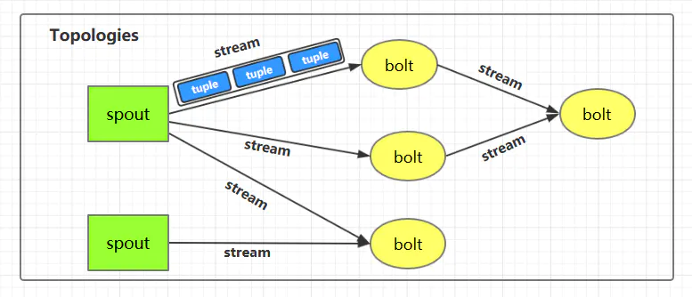
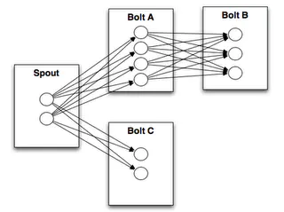
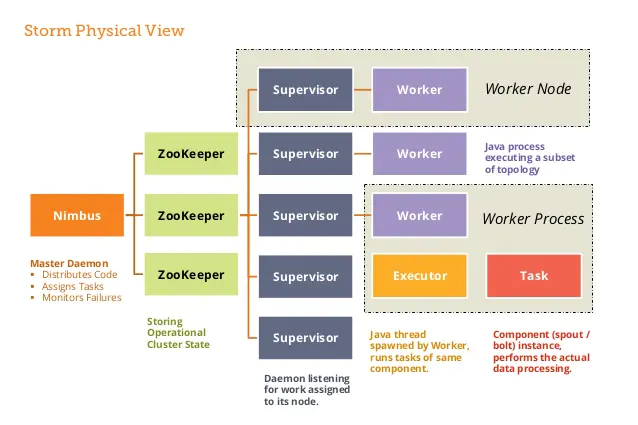
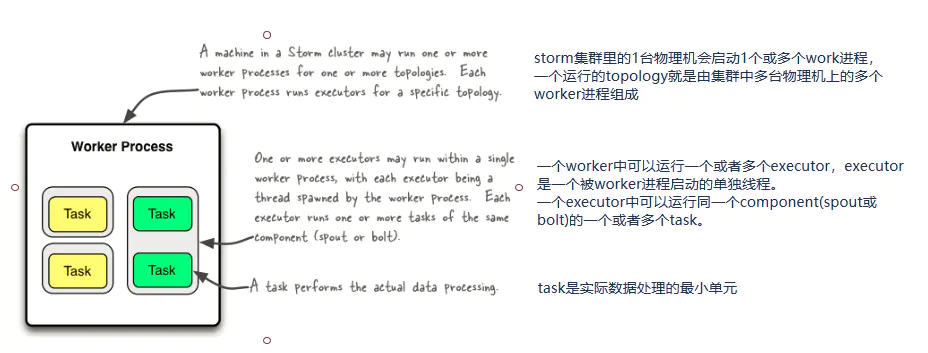

# Storm基础入门

- Apache Storm是一个分布式实时大数据处理系统。Storm设计用于在容错和水平可扩展方法中处理大量数据。它是一个流数据框架，具有最高的摄取率。

## Storm的核心组件

- Nimbus：即Storm的Master，负责资源分配和任务调度。一个Storm集群只有一个Nimbus。
- Supervisor：即Storm的Slave，负责接收Nimbus分配的任务，管理所有Worker，一个Supervisor节点中包含多个Worker进程。
- Worker：工作进程，每个工作进程中都有多个Task。 Task：任务，在 Storm 集群中每个 Spout 和 Bolt 都由若干个任务（tasks）来执行。每个任务都与一个执行线程相对应。
- Topology：计算拓扑，Storm 的拓扑是对实时计算应用逻辑的封装，它的作用与 MapReduce 的任务（Job）很相似，区别在于 MapReduce 的一个 Job 在得到结果之后总会结束，而拓扑会一直在集群中运行，直到你手动去终止它。拓扑还可以理解成由一系列通过数据流（Stream Grouping）相互关联的 Spout 和 Bolt 组成的的拓扑结构。
- Stream：数据流（Streams）是 Storm 中最核心的抽象概念。一个数据流指的是在分布式环境中并行创建、处理的一组元组（tuple）的无界序列。数据流可以由一种能够表述数据流中元组的域（fields）的模式来定义。
- Spout：数据源（Spout）是拓扑中数据流的来源。一般 Spout 会从一个外部的数据源读取元组然后将他们发送到拓扑中。根据需求的不同，Spout 既可以定义为可靠的数据源，也可以定义为不可靠的数据源。一个可靠的 Spout能够在它发送的元组处理失败时重新发送该元组，以确保所有的元组都能得到正确的处理；相对应的，不可靠的 Spout 就不会在元组发送之后对元组进行任何其他的处理。一个 Spout可以发送多个数据流。
- Bolt：拓扑中所有的数据处理均是由 Bolt 完成的。通过数据过滤（filtering）、函数处理（functions）、聚合（aggregations）、联结（joins）、数据库交互等功能，Bolt 几乎能够完成任何一种数据处理需求。一个 Bolt 可以实现简单的数据流转换，而更复杂的数据流变换通常需要使用多个 Bolt 并通过多个步骤完成。
- Stream grouping：为拓扑中的每个 Bolt 的确定输入数据流是定义一个拓扑的重要环节。数据流分组定义了在 Bolt 的不同任务（tasks）中划分数据流的方式。在 Storm 中有八种内置的数据流分组方式。
- Reliability：可靠性。Storm 可以通过拓扑来确保每个发送的元组都能得到正确处理。通过跟踪由 Spout 发出的每个元组构成的元组树可以确定元组是否已经完成处理。每个拓扑都有一个“消息延时”参数，如果 Storm 在延时时间内没有检测到元组是否处理完成，就会将该元组标记为处理失败，并会在稍后重新发送该元组。

## storm Linux安装

首先需要3台虚拟机,并且安装好JDK1.8,python2.6.6以上版本,还要在3台虚拟机上安装好zookeeper. 下载地址:

- Zookeeper：[zookeeper.apache.org/releases.ht…](https://zookeeper.apache.org/releases.html#download)
- Storm: [storm.apache.org/downloads.h…](http://storm.apache.org/downloads.html)
- 将下载下来的storm保存到/usr/local/目录,将apache-storm-1.2.2.tar.gz文件进行解压 在linux上输入:

```shell
tar -zxvf apache-storm-1.2.2.tar.gz
```

- 得到apache-storm-1.2.2。配置环境变量编辑 /etc/profile 文件

```shell
export STORM_HOME=/opt/storm/storm1.1
export PATH=.:${JAVA_HOME}/bin:${ZK_HOME}/bin:${STORM_HOME}/bin:$PATH
```

编辑 /usr/local/apache-storm-1.2.2/conf 的 storm.yarm

```html
 storm.zookeeper.servers:
     - "192.168.1.21"
     - "192.168.1.23"
     - "192.168.1.24"
 storm.local.dir: "/usr/local/apache-storm-1.2.2/data"
 nimbus.host: "192.168.70.68"
 ui.port: 10088
 supervisor.slots.ports:
     - 6700
     - 6701
     - 6702
     - 6703
```

注意的是每个参数前面必须有空格，-的后面也需要

- storm.zookeeper.servers是指定zookeeper的服务地址。
- storm.local.dir 表示存储目录。
- nimbus.host 表示主机节点。
- ui.port 主机端口
- supervisor.slots.ports 表示worker 端口。

## 启动Storm

进入到/usr/local/apache-storm-1.2.2/bin 目录下 首先启动主节点

```shell
nohup ./strom nimbus & 
```

启动图形界面

```shell
nohup ./storm ui &
```

启动其他节点

```shell
nohup ./storm supervisor &
```

在浏览器访问主节点[http://192.168.70.68:10088](https://juejin.im/post/5c9aeb95f265da610849b2b8) 看到界面表示成功。

# Storm 核心概念详解

## 一、Storm核心概念



### 1.1 Topologies（拓扑）

一个完整的 Storm 流处理程序被称为 Storm topology(拓扑)。它是一个是由 `Spouts` 和 `Bolts`通过 `Stream` 连接起来的有向无环图，Storm 会保持每个提交到集群的 topology 持续地运行，从而处理源源不断的数据流，直到你将主动其杀死 (kill) 为止。

### 1.2 Streams（流）

`Stream` 是 Storm 中的核心概念。一个 `Stream` 是一个无界的、以分布式方式并行创建和处理的 `Tuple` 序列。Tuple 可以包含大多数基本类型以及自定义类型的数据。简单来说，Tuple 就是流数据的实际载体，而 Stream 就是一系列 Tuple。

### 1.3 Spouts

`Spouts` 是流数据的源头，一个 Spout 可以向不止一个 `Streams` 中发送数据。`Spout` 通常分为**可靠**和**不可靠**两种：可靠的 `Spout` 能够在失败时重新发送 Tuple, 不可靠的 `Spout` 一旦把 Tuple 发送出去就置之不理了。

### 1.4 Bolts

`Bolts` 是流数据的处理单元，它可以从一个或者多个 `Streams` 中接收数据，处理完成后再发射到新的 `Streams` 中。`Bolts` 可以执行过滤 (filtering)，聚合 (aggregations)，连接 (joins) 等操作，并能与文件系统或数据库进行交互。

### 1.5 Stream groupings（分组策略）



`spouts` 和 `bolts` 在集群上执行任务时，是由多个 Task 并行执行 (如上图，每一个圆圈代表一个 Task)。当一个 Tuple 需要从 Bolt A 发送给 Bolt B 执行的时候，程序如何知道应该发送给 Bolt B 的哪一个 Task 执行呢？

这是由 Stream groupings 分组策略来决定的，Storm 中一共有如下 8 个内置的 Stream Grouping。当然你也可以通过实现 `CustomStreamGrouping` 接口来实现自定义 Stream 分组策略。

1. **Shuffle grouping**

   Tuples 随机的分发到每个 Bolt 的每个 Task 上，每个 Bolt 获取到等量的 Tuples。

2. **Fields grouping**

   Streams 通过 grouping 指定的字段 (field) 来分组。假设通过 `user-id` 字段进行分区，那么具有相同 `user-id` 的 Tuples 就会发送到同一个 Task。

3. **Partial Key grouping**

   Streams 通过 grouping 中指定的字段 (field) 来分组，与 `Fields Grouping` 相似。但是对于两个下游的 Bolt 来说是负载均衡的，可以在输入数据不平均的情况下提供更好的优化。

4. **All grouping**

   Streams 会被所有的 Bolt 的 Tasks 进行复制。由于存在数据重复处理，所以需要谨慎使用。

5. **Global grouping**

   整个 Streams 会进入 Bolt 的其中一个 Task，通常会进入 id 最小的 Task。

6. **None grouping**

   当前 None grouping 和 Shuffle grouping 等价，都是进行随机分发。

7. **Direct grouping**

   Direct grouping 只能被用于 direct streams 。使用这种方式需要由 Tuple 的生产者直接指定由哪个 Task 进行处理。

8. **Local or shuffle grouping**

   如果目标 Bolt 有 Tasks 和当前 Bolt 的 Tasks 处在同一个 Worker 进程中，那么则优先将 Tuple Shuffled 到处于同一个进程的目标 Bolt 的 Tasks 上，这样可以最大限度地减少网络传输。否则，就和普通的 `Shuffle Grouping` 行为一致。

## 二、Storm架构详解



### 2.1 Nimbus进程

也叫做 Master Node，是 Storm 集群工作的全局指挥官。主要功能如下：

1. 通过 Thrift 接口，监听并接收 Client 提交的 Topology；
2. 根据集群 Workers 的资源情况，将 Client 提交的 Topology 进行任务分配，分配结果写入 Zookeeper;
3. 通过 Thrift 接口，监听 Supervisor 的下载 Topology 代码的请求，并提供下载 ;
4. 通过 Thrift 接口，监听 UI 对统计信息的读取，从 Zookeeper 上读取统计信息，返回给 UI;
5. 若进程退出后，立即在本机重启，则不影响集群运行。

### 2.2 Supervisor进程

也叫做 Worker Node , 是 Storm 集群的资源管理者，按需启动 Worker 进程。主要功能如下：

1. 定时从 Zookeeper 检查是否有新 Topology 代码未下载到本地 ，并定时删除旧 Topology 代码 ;
2. 根据 Nimbus 的任务分配计划，在本机按需启动 1 个或多个 Worker 进程，并监控所有的 Worker 进程的情况；
3. 若进程退出，立即在本机重启，则不影响集群运行。

### 2.3 zookeeper的作用

Nimbus 和 Supervisor 进程都被设计为**快速失败**（遇到任何意外情况时进程自毁）和**无状态**（所有状态保存在 Zookeeper 或磁盘上）。 这样设计的好处就是如果它们的进程被意外销毁，那么在重新启动后，就只需要从 Zookeeper 上获取之前的状态数据即可，并不会造成任何数据丢失。

### 2.4 Worker进程

Storm 集群的任务构造者 ，构造 Spoult 或 Bolt 的 Task 实例，启动 Executor 线程。主要功能如下：

1. 根据 Zookeeper 上分配的 Task，在本进程中启动 1 个或多个 Executor 线程，将构造好的 Task 实例交给 Executor 去运行；
2. 向 Zookeeper 写入心跳 ；
3. 维持传输队列，发送 Tuple 到其他的 Worker ；
4. 若进程退出，立即在本机重启，则不影响集群运行。

### 2.5 Executor线程

Storm 集群的任务执行者 ，循环执行 Task 代码。主要功能如下：

1. 执行 1 个或多个 Task；
2. 执行 Acker 机制，负责发送 Task 处理状态给对应 Spout 所在的 worker。

### 2.6 并行度



1 个 Worker 进程执行的是 1 个 Topology 的子集，不会出现 1 个 Worker 为多个 Topology 服务的情况，因此 1 个运行中的 Topology 就是由集群中多台物理机上的多个 Worker 进程组成的。1 个 Worker 进程会启动 1 个或多个 Executor 线程来执行 1 个 Topology 的 Component(组件，即 Spout 或 Bolt)。

Executor 是 1 个被 Worker 进程启动的单独线程。每个 Executor 会运行 1 个 Component 中的一个或者多个 Task。

Task 是组成 Component 的代码单元。Topology 启动后，1 个 Component 的 Task 数目是固定不变的，但该 Component 使用的 Executor 线程数可以动态调整（例如：1 个 Executor 线程可以执行该 Component 的 1 个或多个 Task 实例）。这意味着，对于 1 个 Component 来说，`#threads<=#tasks`（线程数小于等于 Task 数目）这样的情况是存在的。默认情况下 Task 的数目等于 Executor 线程数，即 1 个 Executor 线程只运行 1 个 Task。

**总结如下：**

- 一个运行中的 Topology 由集群中的多个 Worker 进程组成的；
- 在默认情况下，每个 Worker 进程默认启动一个 Executor 线程；
- 在默认情况下，每个 Executor 默认启动一个 Task 线程；
- Task 是组成 Component 的代码单元。

# Strom实战入门

**第一步引入依赖**

```xml
<--使用storm有这个就够了-->
    <dependency>
        <groupId>org.apache.storm</groupId>
        <artifactId>storm-client</artifactId>
        <version>2.0.0</version>
    </dependency>
    <dependency>
        <groupId>org.apache.storm</groupId>
        <artifactId>storm-hbase</artifactId>
        <version>2.0.0</version>
    </dependency>
```


**第二步编写Spout获取从HBase中获取数据,类实现IRichSpout接口(也可以继承BaseRichSpout,里面实现了一些基础功能)**

```java
public class EventSpout implements IRichSpout {

    private SpoutOutputCollector spoutOutputCollector;

    private HBaseDao hBaseDao = null;

    private Long startRowKey = 1566377894517L;

    private Long endRowKey = startRowKey + 300000L;

    private List<Result> result = null;

    public void open(Map map, TopologyContext topologyContext, SpoutOutputCollector spoutOutputCollector) {
        this.spoutOutputCollector = spoutOutputCollector;
        hBaseDao = new HBaseDaoImpl();
    }

    public void nextTuple() {
        if (result == null || result.size() <= 0){
            result = hBaseDao.getRows("mjw:tb_event", startRowKey.toString(),endRowKey.toString());

            startRowKey = endRowKey + 1;
            long current = System.currentTimeMillis();
            endRowKey = endRowKey + 300000 > current ? current : endRowKey + 300000;

        }
        if (result != null && result.size() >0){
            Result result = this.result.remove(0);
            Cell[] cells = result.rawCells();
            for (Cell cell : cells) {
                if (Bytes.toString(CellUtil.cloneQualifier(cell)).equals("name")){
                    String name = Bytes.toString(CellUtil.cloneValue(cell));
                    spoutOutputCollector.emit(new Values(name));
                }
            }
        }
 }
```

**第三步编写Bolt获取处理数据,编写类实现IRichBolt接口**

```java
public class SelectEventBlot implements IRichBolt {

    private OutputCollector outputCollector;

    private HBaseDaoImpl hBaseDao;

    private String event = null;

    private String type = null;

    public void prepare(Map map, TopologyContext topologyContext, OutputCollector outputCollector) {
        this.outputCollector = outputCollector;
        hBaseDao = new HBaseDaoImpl();
    }

    public void execute(Tuple tuple) {
        String name = tuple.getString(0);
        hBaseDao.insert("mjw:tb_event_count1","test","track","test",name);
        try{
            traveseJson(new JSONObject(name));
            hBaseDao.insert("mjw:tb_event_count1",type,"track",type,type);
            outputCollector.emit(new Values(event,type));
        }catch (Exception e){
            e.printStackTrace();
        }
    }
    public void declareOutputFields(OutputFieldsDeclarer outputFieldsDeclarer) {
        outputFieldsDeclarer.declare(new Fields("event","type"));
    }

    public void traveseJson(Object json){

        if(json == null){
            return;
        }
        if(json instanceof JSONObject){//json 是一个map
            //将json转换为JsonObject对象
            JSONObject jsonStr = (JSONObject) json;
            //迭代器迭代 map集合所有的keys
            Iterator it = jsonStr.keys();
            while(it.hasNext()){
                //获取map的key
                String key = (String) it.next();
                //得到value的值
                Object value = jsonStr.get(key);
                if (key.equals("type")){
                    type = (String) value;
                }
                if (key.equals("event")){
                    event = (String) value;
                }
                //递归遍历
               traveseJson(value);
            }
        }else if(json instanceof JSONArray){// if  json 是 数组
            JSONArray jsonStr = (JSONArray) json;
            //获取Array 的长度
            int length = jsonStr.length();
            for (int i = 0; i <length; i++) {
                traveseJson(jsonStr.get(i));
            }
        }else {//其他类型
            return ;
        }
    }
}
```

**第四步编写Bolt保存数据(如果逻辑简单,一个bolt就可以了)**

```java
public class SaveEventBlot implements IRichBolt {

    private Map eventMap = new HashMap<String,Integer>();

    private Map typeMap = new HashMap<String,String>();

    private Long beginTime = 0L;

    private Long endTime = 0L;

    private HBaseDao hBaseDao = null;

    public void execute(Tuple tuple) {
        if (tuple != null){
            String event = tuple.getString(0);
            if (eventMap.containsKey(event)){
                eventMap.put(event,(Integer)eventMap.get(event) + 1);
            }else {
                eventMap.put(event,1);
            }
            String type = tuple.getString(1);
            if (!typeMap.containsKey(event)){
                typeMap.put(event,type);
            }
            endTime = System.currentTimeMillis();
            if (endTime - beginTime >= 5000) {
                // 5s 写一次库
                for (Object key : eventMap.keySet()) {
                    Result result = hBaseDao.getOneRow("mjw:tb_event_count1", typeMap.get(key) + "" + key.toString());
                    Integer value = null;
                    if (result != null) {
                        Cell[] cells = result.rawCells();
                        int add_value = 0;
                        for (Cell cell : cells) {
                            add_value = Integer.parseInt(Bytes.toString(CellUtil.cloneValue(cell)));
                        }
                         value = add_value +(Integer) eventMap.get(key);
                    }
                    hBaseDao.insert("mjw:tb_event_count1",typeMap.get(key) + "" + key.toString(),(String) typeMap.get(key),key.toString(),value.toString());
                }

                //重置时间map
                eventMap = new HashMap<String,Integer>();
                // 需要重置初始时间
                beginTime = System.currentTimeMillis();
            }
        }
    }

    public Map<String, Object> getComponentConfiguration() {
        return null;
    }

    public void prepare(Map<String, Object> map, TopologyContext topologyContext, OutputCollector outputCollector) {
        hBaseDao = new HBaseDaoImpl();
        beginTime = System.currentTimeMillis();
    }
}
```

**第五步编写启动类,构建整个拓扑结构,然后提交任务**

```java
public class EventTopology {
    public static void main(String[] args) {
        TopologyBuilder builder = new TopologyBuilder();
        builder.setSpout("spout",new EventSpout());
        builder.setBolt("select_blot", new SelectEventBlot()).shuffleGrouping("spout");
        builder.setBolt("save_blot", new SaveEventBlot()).shuffleGrouping("select_blot");
        Config config = new Config();
        if (args.length > 0){
            try {
                StormSubmitter.submitTopology(args[0],config,builder.createTopology());
            } catch (Exception e) {
                e.printStackTrace();
            }
        }
    }
}
```
