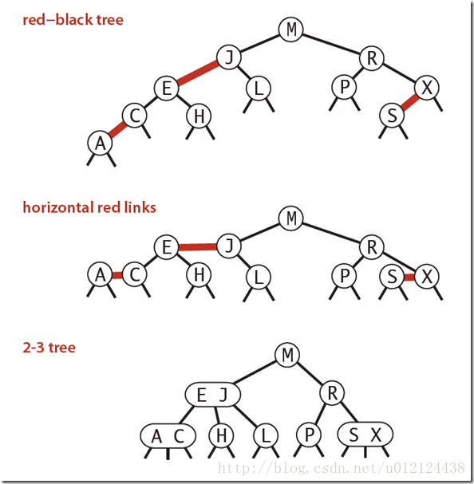

### 红黑树介绍

红黑树(Red-Black Tree，简称R-B Tree)，它一种特殊的二叉查找树。 
红黑树是特殊的二叉查找树，意味着它满足二叉查找树的特征：任意一个节点所包含的键值，大于等于左孩子的键值，小于等于右孩子的键值。 
除了具备该特性之外，红黑树还包括许多额外的信息。

红黑树的每个节点上都有存储位表示节点的颜色，颜色是红(Red)或黑(Black)。

红黑树的特性: 
(1) 每个节点或者是黑色，或者是红色。 
(2) 根节点是黑色。 
(3) 每个叶子节点是黑色。 [注意：这里叶子节点，是指为空的叶子节点！] 
(4) 如果一个节点是红色的，则它的子节点必须是黑色的。 
(5) 从一个节点到该节点的子孙节点的所有路径上包含相同数目的黑节点。

关于它的特性，需要注意的是： 
第一，特性(3)中的叶子节点，是只为空(NIL或null)的节点。 
第二，特性(5)，确保没有一条路径会比其他路径长出俩倍。因而，红黑树是相对是接近平衡的二叉树。

红黑树的主要是想对2-3查找树进行编码，尤其是对2-3查找树中的3-nodes节点添加额外的信息。红黑树中将节点之间的链接分为两种不同类型，红色链接，他用来链接两个2-nodes节点来表示一个3-nodes节点。黑色链接用来链接普通的2-3节点。特别的，使用红色链接的两个2-nodes来表示一个3-nodes节点，并且向左倾斜，即一个2-node是另一个2-node的左子节点。这种做法的好处是查找的时候不用做任何修改，和普通的二叉查找树相同。

根据以上描述，红黑树定义如下：

红黑树是一种具有红色和黑色链接的平衡查找树，同时满足：

1.红色节点向左倾斜 
2.一个节点不可能有两个红色链接 
3.整个树完全黑色平衡，即从根节点到所以叶子结点的路径上，黑色链接的个数都相同。

下图可以看到红黑树其实是2-3树的另外一种表现形式：如果我们将红色的连线水平绘制，那么他链接的两个2-node节点就是2-3树中的一个3-node节点了。



### 红黑树java代码实现

```java
import java.util.ArrayList;

public class RBTree<K extends Comparable<K>, V> {

    private static final boolean RED = true;
    private static final boolean BLACK = false;

    private class Node{
        public K key;
        public V value;
        public Node left, right;
        public boolean color;

        public Node(K key, V value){
            this.key = key;
            this.value = value;
            left = null;
            right = null;
            color = RED;
        }
    }

    private Node root;
    private int size;

    public RBTree(){
        root = null;
        size = 0;
    }

    public int getSize(){
        return size;
    }

    public boolean isEmpty(){
        return size == 0;
    }

    // 判断节点node的颜色
    private boolean isRed(Node node){
        if(node == null)
            return BLACK;
        return node.color;
    }

    //   node                     x
    //  /   \     左旋转         /  \
    // T1   x   --------->   node   T3
    //     / \              /   \
    //    T2 T3            T1   T2
    private Node leftRotate(Node node){

        Node x = node.right;

        // 左旋转
        node.right = x.left;
        x.left = node;

        x.color = node.color;
        node.color = RED;

        return x;
    }

    //     node                   x
    //    /   \     右旋转       /  \
    //   x    T2   ------->   y   node
    //  / \                       /  \
    // y  T1                     T1  T2
    private Node rightRotate(Node node){

        Node x = node.left;

        // 右旋转
        node.left = x.right;
        x.right = node;

        x.color = node.color;
        node.color = RED;

        return x;
    }

    // 颜色翻转
    private void flipColors(Node node){

        node.color = RED;
        node.left.color = BLACK;
        node.right.color = BLACK;
    }

    // 向红黑树中添加新的元素(key, value)
    public void add(K key, V value){
        root = add(root, key, value);
        root.color = BLACK; // 最终根节点为黑色节点
    }

    // 向以node为根的红黑树中插入元素(key, value)，递归算法
    // 返回插入新节点后红黑树的根
    private Node add(Node node, K key, V value){

        if(node == null){
            size ++;
            return new Node(key, value); // 默认插入红色节点
        }

        if(key.compareTo(node.key) < 0)
            node.left = add(node.left, key, value);
        else if(key.compareTo(node.key) > 0)
            node.right = add(node.right, key, value);
        else // key.compareTo(node.key) == 0
            node.value = value;

        if (isRed(node.right) && !isRed(node.left))
            node = leftRotate(node);

        if (isRed(node.left) && isRed(node.left.left))
            node = rightRotate(node);

        if (isRed(node.left) && isRed(node.right))
            flipColors(node);

        return node;
    }

    // 返回以node为根节点的二分搜索树中，key所在的节点
    private Node getNode(Node node, K key){

        if(node == null)
            return null;

        if(key.equals(node.key))
            return node;
        else if(key.compareTo(node.key) < 0)
            return getNode(node.left, key);
        else // if(key.compareTo(node.key) > 0)
            return getNode(node.right, key);
    }

    public boolean contains(K key){
        return getNode(root, key) != null;
    }

    public V get(K key){

        Node node = getNode(root, key);
        return node == null ? null : node.value;
    }

    public void set(K key, V newValue){
        Node node = getNode(root, key);
        if(node == null)
            throw new IllegalArgumentException(key + " doesn't exist!");

        node.value = newValue;
    }

    // 返回以node为根的二分搜索树的最小值所在的节点
    private Node minimum(Node node){
        if(node.left == null)
            return node;
        return minimum(node.left);
    }

    // 删除掉以node为根的二分搜索树中的最小节点
    // 返回删除节点后新的二分搜索树的根
    private Node removeMin(Node node){

        if(node.left == null){
            Node rightNode = node.right;
            node.right = null;
            size --;
            return rightNode;
        }

        node.left = removeMin(node.left);
        return node;
    }

    // 从二分搜索树中删除键为key的节点
    public V remove(K key){

        Node node = getNode(root, key);
        if(node != null){
            root = remove(root, key);
            return node.value;
        }
        return null;
    }

    private Node remove(Node node, K key){

        if( node == null )
            return null;

        if( key.compareTo(node.key) < 0 ){
            node.left = remove(node.left , key);
            return node;
        }
        else if(key.compareTo(node.key) > 0 ){
            node.right = remove(node.right, key);
            return node;
        }
        else{   // key.compareTo(node.key) == 0

            // 待删除节点左子树为空的情况
            if(node.left == null){
                Node rightNode = node.right;
                node.right = null;
                size --;
                return rightNode;
            }

            // 待删除节点右子树为空的情况
            if(node.right == null){
                Node leftNode = node.left;
                node.left = null;
                size --;
                return leftNode;
            }

            // 待删除节点左右子树均不为空的情况

            // 找到比待删除节点大的最小节点, 即待删除节点右子树的最小节点
            // 用这个节点顶替待删除节点的位置
            Node successor = minimum(node.right);
            successor.right = removeMin(node.right);
            successor.left = node.left;

            node.left = node.right = null;

            return successor;
        }
    }

    public static void main(String[] args){

        System.out.println("Pride and Prejudice");

        ArrayList<String> words = new ArrayList<>();
        if(FileOperation.readFile("pride-and-prejudice.txt", words)) {
            System.out.println("Total words: " + words.size());

            RBTree<String, Integer> map = new RBTree<>();
            for (String word : words) {
                if (map.contains(word))
                    map.set(word, map.get(word) + 1);
                else
                    map.add(word, 1);
            }

            System.out.println("Total different words: " + map.getSize());
            System.out.println("Frequency of PRIDE: " + map.get("pride"));
            System.out.println("Frequency of PREJUDICE: " + map.get("prejudice"));
        }

        System.out.println();
	}
}
```
### 红黑树优点与使用场景

红黑树并不追求“完全平衡”——它只要求部分地达到平衡要求，降低了对旋转的要求，从而提高了性能。

红黑树能够以O(log2 n) 的时间复杂度进行搜索、插入、删除操作。此外，由于它的设计，任何不平衡都会在三次旋转之内解决。当然，还有一些更好的，但实现起来更复杂的数据结构 能够做到一步旋转之内达到平衡，但红黑树能够给我们一个比较“便宜”的解决方案。红黑树的算法时间复杂度和AVL相同，但统计性能比AVL树更高。

当然，红黑树并不适应所有应用树的领域。如果数据基本上是静态的，那么让他们待在他们能够插入，并且不影响平衡的地方会具有更好的性能。如果数据完全是静态的，例如，做一个哈希表，性能可能会更好一些。

在实际的系统中，例如，需要使用动态规则的防火墙系统，使用红黑树而不是散列表被实践证明具有更好的伸缩性。

在jDK1.8以后HashMap结构就引入了红黑树,在链表长度达到八的时候将链表转化为红黑树.