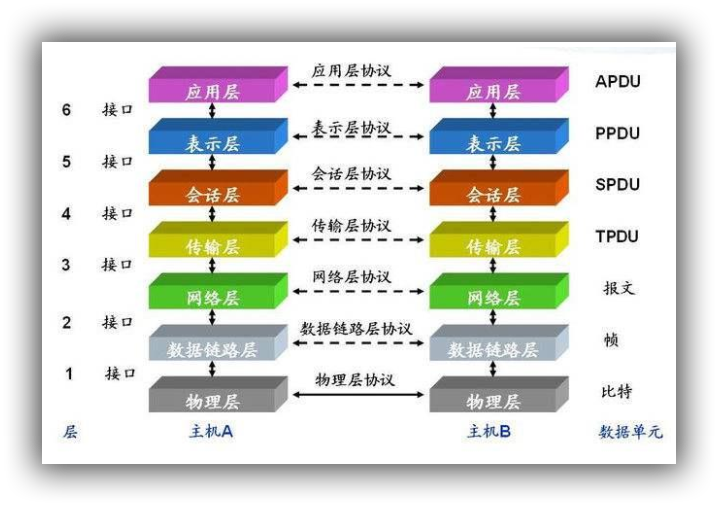

### 网络七层架构

7 层模型主要包括：

#### 物理层

主要定义物理设备标准，如网线的接口类型、光纤的接口类型、各种传输介质的传输速率等。 它的主要作用是传输比特流（就是由 1、 0 转化为电流强弱来进行传输,到达目的地后在转化为1、 0，也就是我们常说的**模数转换与数模转换**）。**这一层的数据叫做比特**。

#### 数据链路层

主要将从物理层接收的数据进行 MAC 地址（网卡的地址）的封装与解封装。**常把这一层的数据叫做帧(Frame)**。在这一层工作的设备是交换机，**数据通过交换机来传输**,有一些书本也将改层细分为LLC(逻辑链路控制)和MAC(媒体访问控制)。

#### 网络层

主要将从下层接收到的数据进行 IP 地址（例 192.168.0.1)的封装与解封装。**在这一层工作的设备是路由器**，**常把这一层的数据叫做数据包(Packet)**,其又可以细分控制层面和数据层面.

#### 传输层

定义了一些**传输数据的协议和端口号**（WWW 端口 80 等），如： **TCP**（传输控制协议，传输效率低，可靠性强，用于传输可靠性要求高，数据量大的数据）， **UDP**（用户数据报协议，与 TCP 特性恰恰相反，用于传输可靠性要求不高，数据量小的数据，如 QQ 聊天数据就是通过这种方式传输的）。 主要是将从下层接收的数据进行分段进行传输，到达目的地址后在进行重组。**常常把这一层数据叫做段(Segment)**

#### 会话层

通过传输层（端口号：传输端口与接收端口） **建立数据传输的通路**。主要在你的系统之间发起会话或或者接受会话请求（设备之间需要互相认识可以是 IP 也可以是 MAC 或者是主机名）

#### 表示层

主要是进行对接收的数据进行**解释、加密与解密、压缩与解压缩**等（也就是把计算机能够识别的东西转换成人能够能识别的东西（如图片、声音等））

#### 应用层

主要是一些终端的应用，比如说FTP（各种文件下载）， HTTP（浏览器请求内容），DNS(域名解析为ip地址),SMTP(邮件传输)

