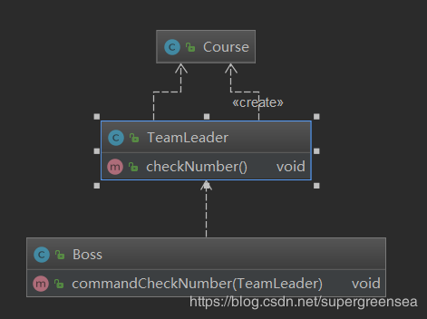

# 开闭原则
定义：软件实体如类、模块和函数应该对扩展开放，对修改关闭。
优点：可提高软件系统的可复用性及可维护性
举例：一开始需要获取课程的价格，面向接口的开发原则如下

```java
public interface Course {
    Double getPrice();
}

public class JavaCourse implements Course {
    private Double price;
    public JavaCourse() {
    }
    public JavaCourse(Integer id, String name, Double price) {
        this.price = price;
    }
    @Override
    public Double getPrice() {
        return this.price;
    }
public class Test {
    public static void main(String[] args) {
        Course course = new JavaCourse(1,"java",15.25);
        System.out.println("课程价格"+course.getPrice());
    }
}
}
```
后来需求变动，需要显示课程打折后的价格。
需要做如下变动：

```java
public class JavaDiscountCourse extends JavaCourse {
    public JavaDiscountCourse(Integer id, String name, Double price) {
        super(id, name, price);
    }
    public Double getDiscountPrice(){
        return this.getPrice()*0.8;
    }
}

public class Test {
    public static void main(String[] args) {
        Course course = new JavaDiscountCourse(1,"java",15.25);
        System.out.println("课程价格"+course.getPrice()+"\r\n课程折后价格"+((JavaDiscountCourse) course).getDiscountPrice());
    }
}
```
# 依赖倒置原则
定义：高层模块不应该依赖底层模块，二者都应该依赖其抽象
优点：可以减少类之间的耦合性、提高系统稳定性、提高代码可读性和可维护性，可降低修改程序所造成的风险
代码举例：

```java
public interface Course {
    void study();
}

public class PythonCourse implements Course {
    @Override
    public void study() {
        System.out.println("学习Python课程");
    }
}

public class Alice {
     Course course;
     public Alice(Course course){
         this.course = course;
     }
     public void studyCourse(){
         course.study();
     }
}

public class Test {
    public static void main(String[] args) {
        Alice alice = new Alice(new PythonCourse());
        alice.studyCourse();
    }
}
```
以上代码通过将PythonCourse的抽象注入Alice中实现了Alice和Course的具体实现的解耦，实现了依赖倒置。
# 单一职责原则
定义：不要存在多于一个导致类变更的原因
优点：降低类的复杂度，提高类的可读性，提高系统的可维护性、降低变更引起的风险
理解：一个类只需要实现一类功能，不要有几类功能同时在一个类中，这个微服务的思想有些相似，只是一个微服务需要实现的是一大类功能，目的都是使系统细粒度化，便于开发新功能时写更少的代码（用原有的功能通过不同的调用步骤或顺序或传入不同的参数即可组合出新的功能），也就是便于扩展。
# 接口隔离原则
定义：用多个专门的接口，而不使用单一的总接口，客户端不应该依赖他不需要的接口。
优点：符合我们常说的高内聚低耦合的设计思想从而使得类具有很好的可读性、可扩展性和可维护性。
# 迪米特法则（最少知道原则）
定义：一个对象应该对其他对象保持最少的了解。
优点：降低类之间的耦合。
举例：如下类图并不遵循迪米特原则，因为Boss只需要和TeamLeader交互，而不需要和Course产生依赖。


改进后满足迪米特原则类关系如下


# 里斯替换原则


定义1：如果对每一个类型为 T1的对象 o1，都有类型为 T2 的对象o2，使得以 T1定义的所有程序 P 在所有的对象 o1 都代换成 o2 时，程序 P 的行为没有发生变化，那么类型 T2 是类型 T1 的子类型。

定义2：所有引用基类的地方必须能透明地使用其子类的对象。

问题由来：有一功能P1，由类A完成。现需要将功能P1进行扩展，扩展后的功能为P，其中P由原有功能P1与新功能P2组成。新功能P由类A的子类B来完成，则子类B在完成新功能P2的同时，有可能会导致原有功能P1发生故障。

解决方案：当使用继承时，遵循里氏替换原则。类B继承类A时，除添加新的方法完成新增功能P2外，尽量不要重写父类A的方法，也尽量不要重载父类A的方法.
