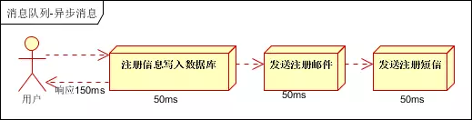
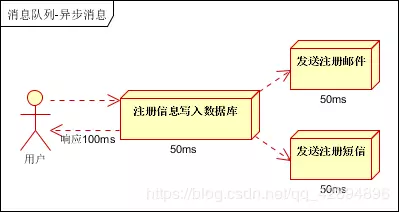
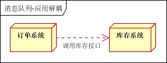
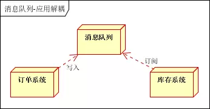
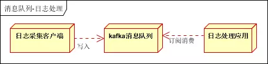
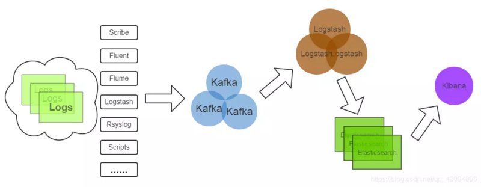
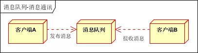
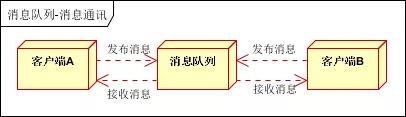

### **1、队列的基本概念**

队列（queue）是一种特殊的线性表，特殊之处在于它只允许在表的前端（front）进行删除操作，而在表的后端（rear）进行插入操作，和栈一样，队列是一种操作受限制的线性表。进行插入操作的端称为队尾，进行删除操作的端称为队头。队列中没有元素时，称为空队列。队列的数据元素又称为队列元素。在队列中插入一个队列元素称为入队，从队列中删除一个队列元素称为出队。因为队列只允许在一端插入，在另一端删除，所以只有最早进入队列的元素才能最先从队列中删除，故队列又称为先进先出（FIFO—first in first out）线性表。比如我们去电影院排队买票，第一个进入排队序列的都是第一个买到票离开队列的人，而最后进入排队序列排队的都是最后买到票的。在比如在计算机操作系统中，有各种队列在安静的工作着，比如打印机在打印列队中等待打印。

**队列分为：**

①、单向队列（Queue）：只能在一端插入数据，另一端删除数据。

②、双向队列（Deque）：每一端都可以进行插入数据和删除数据操作。

这里我们还会介绍一种队列——优先级队列，优先级队列是比栈和队列更专用的数据结构，在优先级队列中，数据项按照关键字进行排序，关键字最小（或者最大）的数据项往往在队列的最前面，而数据项在插入的时候都会插入到合适的位置以确保队列的有序。

#### Java中实现好的队列分类:

**非阻塞队列**

PriorityQueue优先级队列：线程不安全、基于数组存储构成优先级堆 添加元素为空抛出异常 每次操作，对元素进行排序，取优先级最高的元素放在队首，保证获取的元素按优先级从高到低
siftUpUsingComparator与siftDownUsingComparator ！！！！！
add、offer 添加元素 peek(获取元素不删除)、poll（获取元素并删除）

ConcurrentLinkedQueue：基于链表存储、线程安全

**阻塞队列**

在获取元素（take）时，若为空，阻塞当前线程（Lock condition的await）,当添加值进去后释放（signal）

ArrayBlockingQueue ：一个由数组支持的有界队列。LinkedBlockingQueue ：一个由链接节点支持的可选有界队列。PriorityBlockingQueue ：一个由优先级堆支持的无界优先级队列。DelayQueue ：一个由优先级堆支持的、基于时间的调度队列。

**双向队列**

可以向头跟尾放入与取出元素

ArrayDeque双向队列 基于数据 线程不安全\LinkedList基于链表

前两者属于单向队列，队尾添加元素，队头取出元素

### **2、Java模拟单向队列实现**

Java实现代码如下：

```java
public interface Queue<E> {
    int getSize();
    boolean isEmpty();
    void enqueue(E e);
    E dequeue();
    E getFront();
}

public class ArrayQueue<E> implements Queue<E> {

    private Array<E> array;

    public ArrayQueue(int capacity){
        array = new Array<>(capacity);
    }

    public ArrayQueue(){
        array = new Array<>();
    }

    @Override
    public int getSize(){
        return array.getSize();
    }

    @Override
    public boolean isEmpty(){
        return array.isEmpty();
    }

    public int getCapacity(){
        return array.getCapacity();
    }

    @Override
    public void enqueue(E e){
        array.addLast(e);
    }

    @Override
    public E dequeue(){
        return array.removeFirst();
    }

    @Override
    public E getFront(){
        return array.getFirst();
    }

    @Override
    public String toString(){
        StringBuilder res = new StringBuilder();
        res.append("Queue: ");
        res.append("front [");
        for(int i = 0 ; i < array.getSize() ; i ++){
            res.append(array.get(i));
            if(i != array.getSize() - 1)
                res.append(", ");
        }
        res.append("] tail");
        return res.toString();
    }

    public static void main(String[] args) {

        ArrayQueue<Integer> queue = new ArrayQueue<>();
        for(int i = 0 ; i < 10 ; i ++){
            queue.enqueue(i);
            System.out.println(queue);
            if(i % 3 == 2){
                queue.dequeue();
                System.out.println(queue);
            }
        }
    }
}
```

### **3、双端队列**

双端队列就是一个两端都是结尾或者开头的队列， 队列的每一端都可以进行插入数据项和移除数据项，这些方法可以叫做：

**insertRight()、insertLeft()、removeLeft()、removeRight()**

如果严格禁止调用insertLeft()和removeLeft()（或禁用右端操作），那么双端队列的功能就和前面讲的栈功能一样。如果严格禁止调用insertLeft()和removeRight(或相反的另一对方法)，那么双端队列的功能就和单向队列一样了。

### **4、优先级队列**

优先级队列（priority queue）是比栈和队列更专用的数据结构，在优先级队列中，数据项按照关键字进行排序，关键字最小（或者最大）的数据项往往在队列的最前面，而数据项在插入的时候都会插入到合适的位置以确保队列的有序。

优先级队列 是0个或多个元素的集合，每个元素都有一个优先权，对优先级队列执行的操作有：

**（1）**查找**（2）**插入一个新元素**（3）**删除

一般情况下，查找操作用来搜索优先权最大的元素，删除操作用来删除该元素 。对于优先权相同的元素，可按先进先出次序处理或按任意优先权进行。这里我们用数组实现优先级队列，这种方法插入比较慢，但是它比较简单，适用于数据量比较小并且不是特别注重插入速度的情况。后面我们会讲解堆，用堆的数据结构来实现优先级队列，可以相当快的插入数据。**数组实现优先级队列，声明为int类型的数组，关键字是数组里面的元素，在插入的时候按照从大到小的顺序排列，也就是越小的元素优先级越高。**

```java
public class PriorityQue {
    private int maxSize;
    private int[] priQueArray;
    private int nItems;
     
    public PriorityQue(int s){
        maxSize = s;
        priQueArray = new int[maxSize];
        nItems = 0;
    }
     
    //插入数据
    public void insert(int value){
        int j;
        if(nItems == 0){
            priQueArray[nItems++] = value;
        }else{
            j = nItems -1;
            //选择的排序方法是插入排序，按照从大到小的顺序排列，越小的越在队列的顶端
            while(j >=0 && value > priQueArray[j]){
                priQueArray[j+1] = priQueArray[j];
                j--;
            }
            priQueArray[j+1] = value;
            nItems++;
        }
    }
     
    //移除数据,由于是按照大小排序的，所以移除数据我们指针向下移动
    //被移除的地方由于是int类型的，不能设置为null，这里的做法是设置为 -1
    public int remove(){
        int k = nItems -1;
        int value = priQueArray[k];
        priQueArray[k] = -1;//-1表示这个位置的数据被移除了
        nItems--;
        return value;
    }
     
    //查看优先级最高的元素
    public int peekMin(){
        return priQueArray[nItems-1];
    }
     
    //判断是否为空
    public boolean isEmpty(){
        return (nItems == 0);
    }
     
    //判断是否满了
    public boolean isFull(){
        return (nItems == maxSize);
    }
}
```

insert() 方法，先检查队列中是否有数据项，如果没有，则直接插入到下标为0的单元里，否则，从数组顶部开始比较，找到比插入值小的位置进行插入，并把 nItems 加1.

remove() 方法直接获取顶部元素。

优先级队列的插入操作需要 O(N)的时间，而删除操作则需要O(1) 的时间，后面会讲解如何通过 堆 来改进插入时间。

### 5、队列的使用场景

我们熟知的消息队列就是使用队列的基本原理完成设计，使用场景如下：

**1、异步处理**

**场景说明**：用户注册后，需要发注册邮件和注册短信。传统的做法有两种：串行的方式和并行方式。

**串行方式**：将注册信息写入数据库成功后，发送注册邮件，再发送注册短信。以上三个任务全部完成后，返回给客户。



**并行方式**：将注册信息写入数据库成功后，发送注册邮件的同时，发送注册短信。以上三个任务完成后，返回给客户端。与串行的差别是，并行的方式可以提高处理的时间。



假设三个业务节点每个使用50毫秒钟，不考虑网络等其他开销，则串行方式的时间是150毫秒，并行的时间可能是100毫秒。

因为CPU在单位时间内处理的请求数是一定的，假设CPU1秒内吞吐量是100次。则串行方式1秒内CPU可处理的请求量是7次（1000/150）。并行方式处理的请求量是10次（1000/100）。

**小结**：如以上案例描述，传统的方式系统的性能（并发量，吞吐量，响应时间）会有瓶颈。如何解决这个问题呢？

引入消息队列，将不是必须的业务逻辑，异步处理。改造后的架构如下：


按照以上约定，用户的响应时间相当于是注册信息写入数据库的时间，也就是50毫秒。注册邮件，发送短信写入消息队列后，直接返回，因此写入消息队列的速度很快，基本可以忽略，因此用户的响应时间可能是50毫秒。因此架构改变后，系统的吞吐量提高到每秒20QPS。比串行提高了3倍，比并行提高了两倍！

**2、应用解耦**

**场景说明**：用户下单后，订单系统需要通知库存系统。传统的做法是，订单系统调用库存系统的接口。如下图：



**传统模式的缺点**：

假如库存系统无法访问，则订单减库存将失败，从而导致订单失败，订单系统与库存系统耦合。

如何解决以上问题呢？引入应用消息队列后的方案，如下图：



**订单系统**：用户下单后，订单系统完成持久化处理，将消息写入消息队列，返回用户订单下单成功

**库存系统**：订阅下单的消息，采用拉/推的方式，获取下单信息，库存系统根据下单信息，进行库存操作

假如：在下单时库存系统不能正常使用。也不影响正常下单，因为下单后，订单系统写入消息队列就不再关心其他的后续操作了。实现订单系统与库存系统的应用解耦。

**3、流量削锋**

流量削锋也是消息队列中的常用场景，一般在秒杀或团抢活动中使用广泛！

**应用场景**：秒杀活动，一般会因为流量过大，导致流量暴增，应用挂掉。为解决这个问题，一般需要在应用前端加入消息队列。

可以控制活动的人数，可以缓解短时间内高流量压垮应用。


用户的请求，服务器接收后，首先写入消息队列。假如消息队列长度超过最大数量，则直接抛弃用户请求或跳转到错误页面。

秒杀业务根据消息队列中的请求信息，再做后续处理。

**4、日志处理**

日志处理是指将消息队列用在日志处理中，比如Kafka的应用，解决大量日志传输的问题。架构简化如下：



日志采集客户端，负责日志数据采集，定时写受写入Kafka队列；Kafka消息队列，负责日志数据的接收，存储和转发；日志处理应用：订阅并消费kafka队列中的日志数据。

以下是新浪kafka日志处理应用案例：



**Kafka**：接收用户日志的消息队列；

**Logstash**：做日志解析，统一成JSON输出给Elasticsearch；

**Elasticsearch**：实时日志分析服务的核心技术，一个schemaless，实时的数据存储服务，通过index组织数据，兼具强大的搜索和统计功能；

**Kibana**：基于Elasticsearch的数据可视化组件，超强的数据可视化能力是众多公司选择ELK stack的重要原因。

**5、消息通讯**

消息通讯是指，消息队列一般都内置了高效的通信机制，因此也可以用在纯的消息通讯。比如实现点对点消息队列，或者聊天室等。

**点对点通讯**：



客户端A和客户端B使用同一队列，进行消息通讯。

**聊天室通讯**：



客户端A，客户端B，客户端N订阅同一主题，进行消息发布和接收。实现类似聊天室效果。

以上实际是消息队列的两种消息模式，点对点或发布订阅模式。模型为示意图，供参考。
除了这些，针对当前互联网公司的技术需求以及结合主流技术，我自己整理了一套系统的架构技术体系，当你技术过硬的时候，能够解决技术问题才会服众。不少公司都很重视高并发高可用的技术，特别是一线互联网公司，分布式、JVM、spring源码分析、微服务等知识点已是面试的必考题，这些东西可能你们平时在工作中接触过，但是缺少的全面系统的学习，加入**后端开发群：943918498**，或是关注**微信公众号：Java资讯库，回复“架构”**，免费领取架构资料。